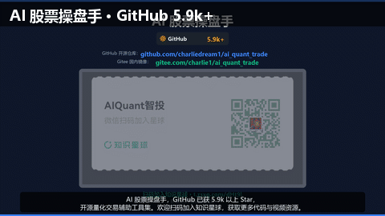
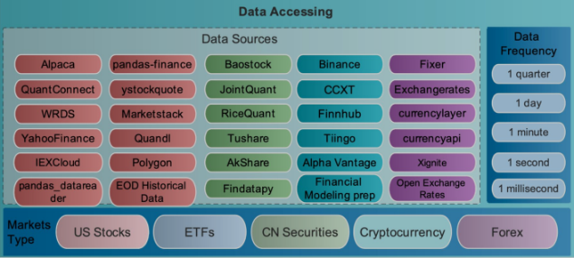

<div align="center">


# 🤖 AIクォンツトレーディングボット

**ワンストップAIクォンツトレーディングプラットフォーム · 学習・シミュレーションから実運用まで**

[**中文版**](README_ZH.md) | [**ENGLISH VERSION**](README.md)

[](https://opensource.org/licenses/Apache-2.0)
[](https://github.com/charliedream1/ai_quant_trade)
[](https://github.com/charliedream1/ai_quant_trade)

<p>
  <sub>👇 WeChat公式アカウントをフォロー · ナレッジプラネットに参加して、さらに多くの実践コンテンツと動画チュートリアルを入手</sub>
</p>

<a href="https://t.zsxq.com/dHt9l" title="AI智投星球">
  
</a>
&nbsp;&nbsp;&nbsp;&nbsp;


</div>

---

<p align="center">
  <a href="#-新機能">🔥 新機能</a> •
  <a href="#-紹介">📖 紹介</a> •
  <a href="#-クイックスタート">🚀 クイックスタート</a> •
  <a href="#-ローカル量化戦略">📊 量化戦略</a> •
  <a href="#-大規模モデル応用">🤖 大規模モデル</a> •
  <a href="#-アルファ発掘">⛏️ アルファ発掘</a> •
  <a href="#-データ処理">💾 データ</a> •
  <a href="#-補助トレーディングツール">🛠️ ツール</a> •
  <a href="#-付属リソース">🎁 リソース</a>
</p>

---

## ✨ コアハイライト

| 🎯 ポジショニング | 📌 説明 |
|:---:|:---|
| 🏦 **ワンストッププラットフォーム** | 学習・シミュレーションから実運用まで、全工程をカバー |
| 📈 **多様な戦略** | 大規模モデル、アルファ発掘、伝統的戦略、機械学習、深層学習、強化学習、グラフネットワーク、高頻度取引 |
| 📚 **リソース集約** | Web全体のリソース集約、実戦ケース、論文解説、コード実装 |
| 🛠️ **補助ツール** | 板監視、銘柄推薦など実用的なトレーディングツール |
| 🌍 **マルチマーケット対応** | 株式、投資信託、暗号通貨など複数の市場をカバー |
| 🚀 **実運用デプロイ** | Python/C++/CPU/GPUなど複数のデプロイ方法をサポート |

---

## 🔥 新機能

| **日時** | **機能** |
|:---|:---|
| 2026.07.25 | 🆕 [**「サボり株取引」神器 V2：モジュラー板監視システム + 警報モニタリング + K線チャート + マルチソースフォールバック**](egs_aide/看盘神器/v2) |
| 2025.08.09 | 🆕 [**推論型株価予測大規模モデル訓練チュートリアル（予測精度20%向上、解釈可能）**](egs_courses/01_推理型股价预测大模型训练教程.md) |
| 2025.05.17 | 🆕 [**Unsloth推論型株価予測大規模モデル（コードは本リポジトリ、詳細ガイド+モデルはプラネットにて）**](egs_llm/a01_train/a01_unsloth_stock_forcaster) |
| 2025.01.03 | [**大規模モデル金融市場分析（動画チュートリアルはプラネットまたはWeChatアカウントにて）**](egs_llm/b01_app/a01_hot_topic_report/v1_proto_internet) |

<details>
<summary>📂 <b>2023年の更新</b></summary>

| **日時** | **機能** |
|:---|:---|
| 2023.04.09 | [**StructBERT市場感情分析**](https://github.com/charliedream1/ai_quant_trade/tree/master/egs_fin_nlp/emotion_analysis/01_StructBert_Binary_Class) |
| 2023.03.28 | [**強化学習マルチ銘柄取引：年率収益53%**](https://github.com/charliedream1/ai_quant_trade/tree/master/egs_trade/rl/a002_finRL_tutorial/a01_Stock_NeurIPS2018) |
| 2023.02.28 | [**機械学習による5000アルファ自動発掘と株価トレンド予測**](https://github.com/charliedream1/ai_quant_trade/tree/master/egs_alpha/auto_alpha/tsfresh) |
| 2023.02.05 | [**EXCELで板を見る**](https://github.com/charliedream1/ai_quant_trade/tree/master/egs_aide/%E7%9C%8B%E7%9B%98%E7%A5%9E%E5%99%A8/v1) |
| 2023.01.01 | [**ローカル深層強化学習戦略**](https://github.com/charliedream1/ai_quant_trade/tree/master/egs_trade/rl/a001_proto_sb3) |

</details>

<details>
<summary>📂 <b>2022年の更新</b></summary>

| **日時** | **機能** |
|:---|:---|
| 2022.11.07 | [**Windローカル実取引シミュレーション**](https://github.com/charliedream1/ai_quant_trade/tree/master/egs_trade/real_bid_simulate/wind) |
| 2022.08.03 | [**基本バックテストフレームワーク + ダブル移動平均戦略**](https://github.com/charliedream1/ai_quant_trade/tree/master/egs_trade/vanilla/double_ma) |

</details>

---

## 📖 紹介

### 対象者

- 🏢 **機関投資家**
- 👨‍💻 **個人投資家（プログラミング基礎あり）**
- 🌱 **個人投資家（プログラミング基礎なし）**

### プロジェクト構成

```
ai_quant_trade
├── ai_notes ........... 金融クォンツトレーディング知識（Markdown / Jupyter Notebook 知識体系）
│   ├── 资源 ........... Web全体から継続的に収集された優れたリソース
│   ├── 实战 ........... 各種ツール、フレームワーク、ライブラリの使用と落とし穴の実録
│   └── 热点 ........... 金融市場のホットトピック、技術ホットトピック、論文解説
├── docs ............... 本リポジトリの使用説明ドキュメント
├── egs_aide ........... 補助トレーディングツール（板監視神器など）
├── egs_alpha .......... アルファライブラリ & アルファ発掘
├── egs_data ........... データ取得と処理（Wind / オープンソースツール）
├── egs_fin_nlp ........ テキスト分析（感情分析など）
├── egs_llm ............ 大規模モデル応用（株価予測 / 金融分析）
├── egs_online_platform  オンライン投研プラットフォーム戦略（JoinQuant / Uqer）
├── egs_trade .......... ローカル量化株取引戦略
│   ├── paper_trade .... 実取引シミュレーション（Wind）
│   ├── rl ............. 強化学習による株取引
│   ├── ms_qlib ........ Microsoft Qlibフレームワーク
│   └── vanilla ........ 伝統的なルールベース戦略
├── quant_brain ........ コアアルゴリズムライブラリ
├── runtime ............ モデルデプロイと実使用
├── tools .............. 補助ツール
├── requirements.txt
└── README.md
```

---

## 🚀 クイックスタート

本リポジトリは現時点ではPythonパッケージとしてパッケージ化されていません。プロジェクト全体をクローンした後、各`egs`ディレクトリに入って詳細な**使用方法**と**原理説明**を確認してください。

```bash
# 1. リポジトリをクローン
git clone https://github.com/charliedream1/ai_quant_trade.git

# 2. 依存関係をインストール
pip install -r requirements.txt

# 3. 対応するサンプルディレクトリに入り、READMEを確認して使用開始
cd egs_trade/rl/a002_finRL_tutorial/a01_Stock_NeurIPS2018
```

---

## 📊 ローカル量化戦略

> 📁 **コードディレクトリ**: [egs_trade](egs_trade)
>
> 🎯 各サンプルには原理、使用方法、コード解説まで揃った完全なチュートリアルが付いています。

ローカルで独立したクォンツトレーディングシステムを構築でき、以下の戦略タイプをカバーします：

| カテゴリー | 戦略 | 状態 |
|:---:|:---|:---:|
| 🤖 AI戦略 | 強化学習、グラフネットワーク、深層学習、機械学習、高頻度取引、アルファ発掘、大規模モデル | ✅ / 🔨 |
| 📐 伝統的戦略 | ルールベース戦略（ダブル移動平均、ポートフォリオ管理等） | ✅ |

### 🧠 強化学習戦略

> 📁 **コードディレクトリ**: `egs_trade/rl`

2017年のAlphaGoと柯潔の囲碁対決以来、深層強化学習が一大ブームになりました。

機械学習や深層学習と比較して、強化学習は**最終目標指向型**（インタラクションを目標とする）であり、他の多くの方法は孤立したサブ問題（「株価予測」「市場予測」「取引決定」など）を考慮し、インタラクティブなアクションを直接取得することができません。強化学習は「指揮者のタスクを完了する」ことに直接向き合い、一連のアクションシーケンスを取得できます。

**戦略リスト：**

| **番号** | **戦略** | **論文** |
|:---:|:---|:---|
| 1 | [プロトタイプ](egs_trade/rl/a001_proto_sb3) | — |
| 2 | [FinRLチュートリアル0-NeurIPS2018](egs_trade/rl/a002_finRL_tutorial/a01_Stock_NeurIPS2018) | [Practical Deep Reinforcement Learning Approach for Stock Trading](https://arxiv.org/abs/1811.07522) |

**バックテスト結果：**

| **番号** | **戦略** | **市場** | **年率収益** | **最大ドローダウン** | **シャープレシオ** |
|:---:|:---|:---|:---:|:---:|:---:|
| 1 | [プロトタイプ](egs_trade/rl/a001_proto_sb3) | 中国A株 | — | — | — |
| 2 | [FinRLチュートリアル0-NeurIPS2018](egs_trade/rl/a002_finRL_tutorial/a01_Stock_NeurIPS2018) | 米国ダウ30 | 53.1% | -10.4% | 2.17 |

### 📐 伝統的戦略

> 伝統的戦略は時代遅れに見えるかもしれませんが、操作性が高く、まだ一定の価値があります。深層学習や機械学習は、しばしばルールと組み合わせて使用する必要があります。

1. **[ダブル移動平均戦略 + シンプル手書きバックテストフレームワーク](egs_trade/vanilla/double_ma)**
   - [詳細使用チュートリアル](egs_trade/vanilla/double_ma/文档教程)
   - 戦略コード + 自作の手書きバックテストフレームワークを含む
   - 買いシグナルと売りシグナルを示す優れたプロットを含む
   - 🎯 目標：このサンプルを通じて、クォンツトレーディングの完全なフレームワーク構築方法を理解する

2. **[ポートフォリオ管理7節授業](egs_trade/vanilla/portfolio_optimization)**

---

## 💰 実取引

> 📁 **コードディレクトリ**: [egs_trade](egs_trade)

### 実取引シミュレーション

1. **[Windローカル実取引シミュレーション：ダブル移動平均戦略](egs_trade/paper_trade/wind)**
   - Windソフトウェアを利用した実取引シミュレーション
   - Windは各大金融機関の第一選択肢のデータソースとなることが多く、価格が高いため、機関での使用により適しています
   - 🏢 使用対象：機関

---

## 🛠️ 補助トレーディングツール

> 📁 **コードディレクトリ**: [egs_aide](egs_aide)

1. **[EXCELで板を見る V1](egs_aide/看盘神器/v1)**
   - 👀 板見時に発見されにくい
   - 📋 監視する銘柄をカスタマイズ可能
   - ⚡ Excelで素早く計算とデータ処理が可能

2. **["サボり株取引"神器 V2：モジュラー板監視システム](egs_aide/看盘神器/v2)** 🆕

   

   - 🏗️ **アーキテクチャリファクタ**：単一ファイルからモジュラー`excel_monitor`パッケージにアップグレード、Sheet Handlerパターン、各Sheetのリフレッシュが互いに分離
   - 🔔 **警報モニタリング**：カスタマイズ可能な騰落率/価格上限・下限、トリガーで行全体が赤く変わる + ポップアップ通知
   - 📈 **K線チャート**：ExcelでボタンをクリックするだけでK線チャートを描画（mplfinanceローソク足 + 移動平均線）、ソフトウェアを切り替える必要なし
   - 💰 **資金感情**：新Sheetが北向資金 + Weibo世論 + ニュース感情 + 株吧ホットを集約
   - 🔍 **銘柄プール選別**：全A株内蔵、コード/名前/拼音頭文字のあいまい検索 + ドロップダウンで直接選択、コードを調べる必要なし
   - 🔄 **マルチソースフォールバック**：qstockメインソース + akshare/東財/腾讯/網易/efinanceバックアップ、単一障害時に自動切替
   - ⚙️ **ホット設定リロード**：YAML + Excel「設定」Sheet、選択銘柄/リフレッシュ間隔をExcelで変更してホット適用、再起動不要
   - 🧪 **すぐ使える**：ワンコマンドでExcelテンプレート（7 Sheet）を自動生成、事前に銘柄リストの準備不要
   - ✅ **ユニットテスト**：pytestでコアロジック（156項目）をカバー、長時間安定稼働可能

3. **[Streamlitリアルタイム相場モニタリング](egs_tools/a02_market_monitor_via_streamlit)**
   - 🌐 Webベースのリアルタイム相場ダッシュボード

---

## ⛏️ アルファ発掘

> 📁 **コードディレクトリ**: [egs_alpha](egs_alpha)

### アルファ発掘戦略

| **番号** | **戦略** | **論文** |
|:---:|:---|:---|
| 1 | [機械学習による5000アルファ自動発掘と株価トレンド予測](egs_alpha/auto_alpha/tsfresh) | — |

### アルファライブラリ

| **番号** | **アルファライブラリ** |
|:---:|:---|
| 1 | [alpha101](egs_alpha/alpha_libs/alpha101) |
| 2 | [stockstats](egs_alpha/alpha_libs/stockstats) |
| 3 | [ta_lib](egs_alpha/alpha_libs/ta_lib) |

---

## 💾 データ処理

> 📁 **コードディレクトリ**: [egs_data](egs_data)

- 各種一般的なデータソースの使用詳細
- 統一されたデータソースインターフェース



---

## 📝 テキスト分析

> 📁 **コードディレクトリ**: [egs_fin_nlp](egs_fin_nlp)

| **番号** | **ツール** |
|:---:|:---|
| 1 | [**StructBERT市場感情分析**](egs_fin_nlp/emotion_analysis/01_StructBert_Binary_Class) |

---

## 🤖 大規模モデル応用

> 📁 **コードディレクトリ**: [egs_llm](egs_llm)

| **番号** | **ツール** |
|:---:|:---|
| 1 | [**大規模モデル金融市場分析（動画チュートリアルはプラネットまたはWeChatアカウントにて）**](egs_llm/b01_app/a01_hot_topic_report/v1_proto_internet) |
| 2 | [**Unsloth推論型株価予測モデル訓練（オープンソースコード、詳細ガイド+モデルはプラネットにて）**](egs_llm/a01_train/a01_unsloth_stock_forcaster) |

---

## 🌟 a_Web全体から選ばれた優れたリソース（重点推薦）

> 📁 **ディレクトリ**: [a_全网优秀资源](a_全网优秀资源)
>
> ⭐ **本リポジトリの精华セクション**：Web全体の膨大な資料から選別・整理・レビューした高品質な量化リソースをワンストップで取得！

### 🎯 これは何ですか？

これは本リポジトリの最もコアな「リソースの宝庫」です — **Web全体の数万件の資料から選別・整理・レビューに多大な労力を費やし**、クォンツトレーディングの全フローに従って分類し、必要なツールと資料を素早く見つけられるようにしています。

**本リポジトリの他セクションとの違い：**

| セクション | ポジショニング | 特徴 |
|:---|:---|:---|
| `a_全网优秀资源` ⭐ | 実践リソース集約 | Web全体の優れたプロジェクトを収録、レビューと比較付き |
| `egs_trade` | 完全な戦略実践 | 0から1への戦略実装チュートリアル |
| `egs_llm` | 大規模モデル応用 | 金融におけるLLMの実装実践 |
| `ai_notes` | 知識ノート | 理論、概念、落とし穴の実録 |

### ✨ 四大特色

- 🔍 **精鋭選出**：Web全体の膨大なリソースから精選、繰り返し落とし穴を踏むのを回避
- 📂 **明確な分類**：クォンツトレーディングの全フロー（データ→戦略→バックテスト→取引）に従って分類、ニーズに応じて検索しやすい
- 📝 **レビュー解説付き**：リンクの羅列だけでなく、優缺点分析と入門ガイド付き
- 🔄 **継続的更新**：技術の発展に追随し、新しいリソースを継続的に収録

### 📚 リソース分類一覧

| 番号 | カテゴリー | コアコンテンツ |
|:---:|:---|:---|
| 📚 `00_基础知识` | 入門学習 | 株式学習ガイド、入門チュートリアル |
| 🎓 `00_学习资源` | リソース集約 | GitHub量化リソース、オープンソースプロジェクト集約 |
| 📊 `01_数据` | データ取得 | データ取得ツール、ニュースデータ、マルチモーダルデータ |
| 🏗️ `02_综合框架` | 主要量化フレームワーク | Qlib、WonderTraderなどの詳細 |
| 🔄 `03_回测框架` | バックテストツール | Backtrader、PyAlgoTrade、Zipline、RQAlpha、QuantDiggerなど |
| ⛏️ `04_因子` | アルファライブラリ | Alpha101、ta_lib、stockstats、alphalensなど |
| 💹 `05_交易策略` | 戦略リソース | 伝統/機械学習/深層学習/強化学習/グラフニューラルネット/研報再現/ポートフォリオ |
| 🛠️ `06_辅助工具` | 補助ツール | K線パターン認識、金融モデリング |
| 📊 `07_可视化` | 可視化ライブラリ | 量化チャートと可視化 |
| 🧠 `08_知识图谱` | ナレッジグラフ | 従来型とLLM型ソリューション |
| ⚡ `09_高频交易` | 高頻度取引 | 暗号通貨高頻度取引 |
| 🤖 `10_大模型` | LLM金融応用 | FinGPT、FinRobot、TradingAgents、Agent、RAG、Skillパックなど |
| 🌐 `11_投研平台` | オンラインプラットフォーム | 無料量化プラットフォーム集約 |
| 💻 `12_交易平台` | 取引インターフェース | EasyTrader、VNPyなど |

### 🔥 重点推薦コンテンツ

- 🤖 **金融における大規模モデルの応用**：FinGPT、FinMem、Self-Reflective、Stock-chain、TradingAgents、FinRobotなどの最新研究と実践をカバー
- 🛠️ **Skillパック集（60+）**：纏論、技術分析、量化統計、ファンダメンタルズ分析、暗号通貨、マクロ分析などの専門Skillを含む
- 📊 **バックテストフレームワーク多次元比較**：Backtrader、Zipline、RQAlpha、PyAlgoTrade、QuantDiggerなどの多フレームワーク実測比較
- 🔬 **研報再現**：選り抜きの高品質な証券会社研報と再現コード付き
- 💹 **取引戦略フルセット**：伝統的なダブル移動平均から強化学習、グラフニューラルネットまで、各タイプの戦略リソースをカバー

> 💡 **使用建議**：[a_全网优秀资源](a_全网优秀资源)ディレクトリに入ってニーズに応じて閲覧してください；あるプロジェクトに興味があれば、クリックして詳細な紹介とレビューを確認できます。

---

## 📚 プログラミングおよびAI基礎知識

メンテナンスを容易にするため、従来の`ai_wiki`ディレクトリの内容（システム操作、プログラミング基礎、AI基礎、AI実践など）は、リポジトリ**AI大規模モデル落とし穴ガイド**に独立して同期されています。

実際開発で遭遇した大量の問題と解決策が記録されており、最先端技術の発展をリアルタイムで追跡しています。ぜひフォローとStar ⭐をお願いします

> ✨ **AI大規模モデル落とし穴ガイド**
> - **Github**: https://github.com/charliedream1/ai_wiki
> - **Gitee（国内ミラー）**: https://gitee.com/charlie1/ai_wiki.git
> - **紹介**：各種実用的な事例を共有し、最先端技術の発展を追跡。AIフルスタックの知識を網羅 — 大規模モデル、プログラミング技術、機械学習、深層学習、強化学習、グラフニューラルネット、音声認識、NLP、画像認識などの分野をカバー

---

## 🌐 オンライン投研プラットフォーム

> 📁 **コードディレクトリ**: [egs_online_platform](egs_online_platform)

国内の量化プラットフォームとしてはJoinQuant、Uqer、MiRuo、GuoRen、BigQuantなどがあり、興味のある読者は自由に試すことができます。

投研プラットフォームは、量化愛好家（クォント）のためにカスタマイズされたクラウドプラットフォームで、無料の株価データ取得、正確なバックテスト、高速実取引インターフェース、使いやすいAPIドキュメント、易から難への戦略ライブラリを提供し、戦略の迅速な実装と検証を容易にします。

> ⚠️ **注意**：以下の戦略は記述されたバックテスト期間でのみ有効であり、詳細なチューニングや全期間検証を行っていません。全期間有効を保証できる戦略はなく、実運用で使用する場合は慎重にお願いします。

### JoinQuantプラットフォーム

> 🔗 [JoinQuantプラットフォーム](https://www.joinquant.com/) · ぜひフォローしてください：**量客攻城狮**
>
> - 具体的な戦略の詳細紹介とソースコードについては、対応する戦略リンクをクリックして確認してください
> - JoinQuant使用紹介：[egs_online_platform/聚宽_JoinQuant](https://github.com/charliedream1/ai_quant_trade/tree/master/egs_online_platform/%E8%81%9A%E5%AE%BD_JoinQuant)
> - この部分のコードは[**JoinQuantプラットフォーム**](https://www.joinquant.com/)でのみ実行可能です

**株式量化戦略：**

| 戦略 | 収益 | 最大ドローダウン |
|:---|:---:|:---:|
| [**機械学習-動的因子選択戦略**](https://www.joinquant.com/view/community/detail/f2a9d2ec6d4ad18882fa0a364fb9123d) | 12.3% | 38.93% |
| [**小型株+複数移動平均量化株取引**](https://www.joinquant.com/view/community/detail/c754d315a391f39f61858dfe3275f45f) | 58.4% | 46.61% |
| [**龍虎榜-長を見て短を行う**](https://www.joinquant.com/view/community/detail/0986c3b92578952cc22c52f0a5ea4664) | 41.82% | 26.89% |
| [**强势株+トレンドライン判断+損切り利確**](https://www.joinquant.com/view/community/detail/c0390ceabdc1b3365df343490b7caf28) | 10.09% | 21.449% |

**株式分析研究：**

- [ハンズオン「機械学習-動的マルチ因子選股」（保姆級チュートリアル付き）](https://www.joinquant.com/view/community/detail/4fa769264b0bf6489b36351b43e37012)
- [龍虎榜データスクリーニングとフィルタリング](https://www.joinquant.com/view/community/detail/a3a95cc7e53092aaea510d93bab9cb96)
- [コンセプトセクターのデータ取得と選別](https://www.joinquant.com/view/community/detail/d1bf674ad163654aa263dac859762c90)
- [詳細：株価データ取得とグラフィカル分析（詳細コード付き）](https://www.joinquant.com/view/community/detail/8fe84d0d25dcf1a6da72e442460cdf36)

---

## 📖 量化リソースコレクション

> [(Zhihuで2.6万回読まれた記事) 史上最全AI株式量化取引ツールとオープンソースプロジェクト集約](https://zhuanlan.zhihu.com/p/562878605)

すべてのツールを再分類しレビューして、[ai_notes](ai_notes)フォルダに収録し、検索しやすくしています。

🎯 **開発中：**
- すべてのツールのレビューを継続的に行い、選択を容易にする
- 各ツールの優缺点を継続的に記録し、比較表を形成、選定を容易にする
- 使用方法を継続的に記録：大で全的なチュートリアルは行わず、最も一般的で実用的な機能のみを列挙して迅速な入門を可能にする

---

## 🎁 付属リソース

本コードリポジトリは**有料と無料の並行**原則を遵守しています。

### 💎 有料リソース — ナレッジプラネット

> ナレッジプラネット公式サイトで登録すると、ユーザー権益が保証されます。[プラネットコンテンツ紹介](docs/03_星球使用和介绍)

<font face="逐浪立楷" color=#00bfff>
🔥 1日0.1元から | 独占速成コース | 無痛学習 | 📺動画チュートリアル | 質疑応答 |
オープンソース落とし穴ガイド | 自作ツールコード | 3分動画論文速読 | 図書館 |
Web最安値の量化プラネットの一つ | 3日以内不满意無料返金
</font>

👇 以下のQRコードをスキャンまたはリンクをクリックして、プラネットに入ってより詳細な紹介を確認 🎏

**プラネット動画紹介：**
- プラネット使用ガイド：https://mp.weixin.qq.com/s/SGc49e0xf24q5aUbf3rO0g?token=2028063978&lang=zh_CN
- 学習ルートおよびグループ内リソース使用：https://mp.weixin.qq.com/s/3-U048mc0riVsdETrKr77g

**プラネット参加リンク：**
- [AI智投星球](https://t.zsxq.com/dHt9l)：AI量化取引速成、最先端技術、実戦ケース、リソースライブラリ
- [AI速成营](https://t.zsxq.com/q42Js)：プログラミング、大規模モデル、AI基礎、原理、金融方向の実戦と就職などの速成とケース共有を深く補足、AI智投星球と相互補完

**プラネット紹介：**
- [**プラネットコンテンツ紹介**](docs/03_星球使用和介绍/01_星球介绍.md)
- [**新規ユーザー使用ガイド**](docs/03_星球使用和介绍/02_新人使用指南.md)

👇 QRコードをスキャンして「プラネット」のより詳細な紹介を確認してください（面白い漫画があります）！

<div align="center">


</div>

> 🎯 本コードリポジトリは継続的に更新されますが、一部のコードはプライベート保守となりプラネットでのみ閲覧可能です。対応する機能はリポジトリで注記されます。

---


### 🆓 無料リソース

**WeChat公式アカウント**

🔥 最新ニュースをリアルタイムでフォロー
🎁 <font color=orange>任意の記事をフォロー＆いいねして、管理者にDMを送ると、精美な量化資料パックを無料プレゼント！</font>


---

- [Zhihu：576フォロワー](https://www.zhihu.com/people/yi-dui-ji-mu-zai-kuang-xiang)
- [JoinQuant：599フォロワー](https://www.joinquant.com/user/d7aafd0b8b767b735bfb6f3639c81a6c)

---

**コードリポジトリ（永久無料）**

> ✨ **AIクォンツトレーディングボット**
> - **Github**: https://github.com/charliedream1/ai_quant_trade
> - **Gitee（国内ミラー）**: https://gitee.com/charlie1/ai_quant_trade.git

**本リポジトリの付属プロジェクト**

> ✨ **AI驯龙笔记（AIドラゴン調教ノート）**
> - **Github**: https://github.com/charliedream1/ai_wiki
> - **Gitee（国内ミラー）**: https://gitee.com/charlie1/ai_wiki.git
> - **紹介**：各種実用的な事例を共有し、最先端技術の発展を追跡。AIフルスタックの知識を網羅 — 大規模モデル、プログラミング技術、機械学習、深層学習、強化学習、グラフニューラルネット、音声認識、NLP、画像認識などの分野をカバー

---

## 💖 ご支援のお願い

ご支援は私の前進の原動力です。「0.1元」でも大変嬉しいです。ご支援ありがとうございます \(^o^)/

<div align="center">

&nbsp;&nbsp;&nbsp;&nbsp;

</div>

---

## 💬 ディスカッション

[Github Discussions](https://github.com/charliedream1/ai_quant_trade/discussions)でディスカッションを開始することを歓迎します。

## 🐛 テクニカルサポート

- [Github Issues](https://github.com/charliedream1/ai_quant_trade/issues)に問題を提出することを歓迎します
- ナレッジプラネットに参加して、より多くのテクニカルサポートを取得
  - [AI智投星球](https://t.zsxq.com/dHt9l)：AI量化取引のナレッジ共有に焦点
  - [大規模モデル落とし穴ガイド](https://t.zsxq.com/q42Js)：プログラミング、大規模モデル、AI応用エンパワーメントに焦点

## ❓ よくある質問

ドキュメントをご覧ください → [**よくある質問**](docs/02_常见问题)

## 📄 引用

```bibtex
@misc{ai_quant_trade,
  author={Yi Li},
  title={ai_quant_trade},
  year={2022},
  publisher = {GitHub},
  journal = {GitHub repository},
  howpublished = {\url{https://github.com/charliedream1/ai_quant_trade}},
}
```

---

<div align="center">

**もしこのプロジェクトがお役に立ちましたら、Star ⭐ でサポートしてください！**

[](https://starchart.cc/charliedream1/ai_quant_trade)

</div>
