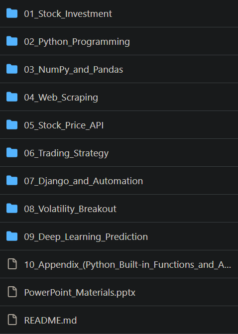

# 1. 30天掌握量化交易

- Github (5.9k stars): https://github.com/Rockyzsu/stock

**项目背景**

Rockyzsu/stock 是一款由开发者 Rockyzsu 创建的开源项目，旨在为量化交易爱好者提供一个全面的学习平台。该项目涵盖了从数据采集、分析到策略实现的各个方面，帮助用户系统地学习和实践量化交易。

**项目优势**

- 全面的功能模块：项目包含数据分析、数据采集、基金分析、K线技术形态、机器学习预测、交易部分等多个模块，满足不同层次用户的需求。
- 清晰的目录结构：项目采用清晰的目录结构，方便用户快速定位和使用各个功能模块。
- 详细的使用教程：提供了详细的使用教程，帮助用户快速上手，降低学习门槛。
- 持续更新：项目持续更新，保持与市场和技术的同步，确保用户获取最新的知识和工具。

# 2. Python入门及进阶资料

- Github (451 stars): https://github.com/tkfy920/PythonQuantitativeFinance

Python数据分析和金融量化投资方向可按照“基础知识、数据爬取、文本分析、金融量化、机器学习、深度学习”，给自己建立了学习路线图：
（1）Python基础知识
（2）金融量化常用库学习
如：Numpy、Pandas、Scipy、Matplotlib等
（3）爬虫基本知识+财经网站数据开源库
如：Scrapy、tushare、baostock等
（4）文本分析（NLP处理、词云分析、jieba分词）
（5）机器学习（sklearn）
（6）深度学习（TensorFlow）
建议安装anaconda，自带Jupyter Notebook和Spyder。
个人比较喜欢使用Jupyter Notebook来交互运行python程序，公众号上的文章和代码也都是使用它来完成的，文字使用md编译。至于Python基础，个人推荐看廖雪峰Python3入门教程（百度搜索）。

# 3. StockAnalysisInPython

- Github (479 stars): https://github.com/INVESTAR/StockAnalysisInPython

韩语的量化交易学习，从0开始