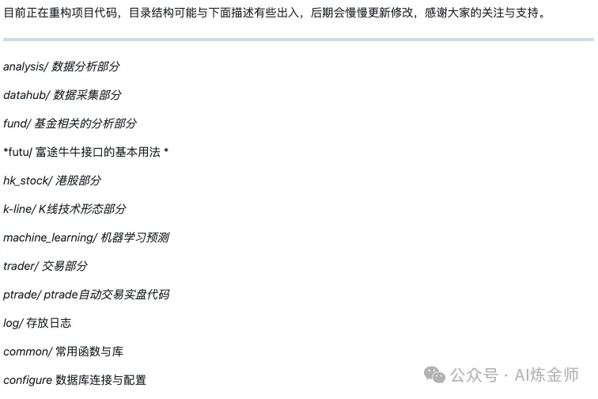

# 1. 资源

- Github (5.9k stars): https://github.com/Rockyzsu/stock

# 2. 介绍



**项目背景**
Rockyzsu/stock 是一款由开发者 Rockyzsu 创建的开源项目，旨在为量化交易爱好者提供一个全面的学习平台。该项目涵盖了从数据采集、分析到策略实现的各个方面，帮助用户系统地学习和实践量化交易。

**项目优势**

- 全面的功能模块：项目包含数据分析、数据采集、基金分析、K线技术形态、机器学习预测、交易部分等多个模块，满足不同层次用户的需求。
- 清晰的目录结构：项目采用清晰的目录结构，方便用户快速定位和使用各个功能模块。
- 详细的使用教程：提供了详细的使用教程，帮助用户快速上手，降低学习门槛。
- 持续更新：项目持续更新，保持与市场和技术的同步，确保用户获取最新的知识和工具。

**目录结构**

```text
analysis/          # 数据分析部分
datahub/           # 数据采集部分
fund/              # 基金相关的分析部分
futu/              # 富途牛牛接口的基本用法
hk_stock/          # 港股部分
k-line/            # K线技术形态部分
machine_learning/  # 机器学习预测
trader/            # 交易部分
ptrade/            # ptrade自动交易实盘代码
log/               # 存放日志
common/            # 常用函数与库
configure          # 数据库连接与配置
```
# 参考

[1] 30天掌握量化交易：Rockyzsu/stock开源项目助您快速入门（提供案例）, https://mp.weixin.qq.com/s/r5ziSA5Uu6qNOCZrD6XtnA