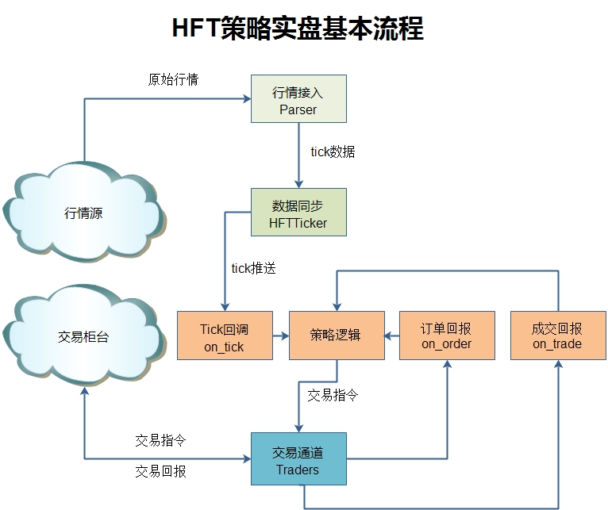
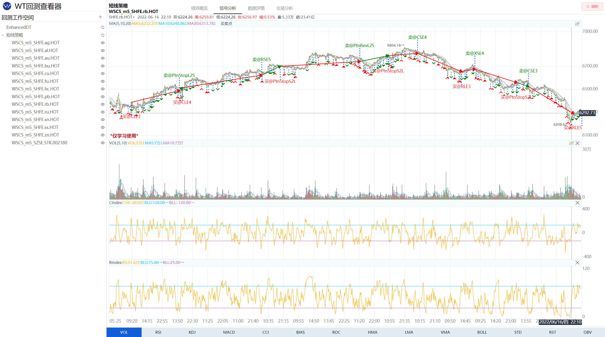

# 1. 资源

- Github (4.6k stars): https://github.com/wondertrader/wondertrader
- C++开发的量化交易框架

WonderTrader是什么
- WonderTrader是一个基于C++核心模块的，适应全市场全品种交易的，高效率、高可用的量化交易开发框架。

面向于专业机构的整体架构
- 数十亿级的实盘管理规模
- 从数据落地清洗、到回测分析、再到实盘交易、运营调度，量化交易所有环节全覆盖

WonderTrader依托于高速的C++核心框架，高效易用的应用层框架（wtpy），致力于打造一个从研发、交易、到运营、调度，全部环节全自动一站式的量化研发交易场景。

WonderTrader于0.9开启了一个新的UFT引擎，针对超低延时交易的需求进行实现，经过一系列的优化以后，系统延迟在175纳秒之内。

# 2. 核心架构与特点

WonderTrader 提供了模块化的实盘运行架构，专注于性能和稳定性：

核心优势

1. 多引擎支持
   - CTA引擎，也叫同步策略引擎，一般适用于标的较少，计算逻辑较快的策略，事件+时间驱动。典型的应用场景包括单标的择时、中频以下的套利等。Demo中提供的DualThrust策略，单次重算平均耗时，Python实现版本约70多微秒，C++实现版本约4.5微秒。
     - 
   - SEL引擎，也叫异步策略引擎，一般适用于标的较多，计算逻辑耗时较长的策略，时间驱动。典型应用场景包括多因子选股策略、截面多空策略等。
   - HFT引擎，也叫高频策略引擎，主要针对高频或者低延时策略，事件驱动，系统延迟在1-2微秒之间
     - 
   - UFT引擎，也叫极速策略引擎，主要针对超高频或者超低延时策略，事件驱动，系统延迟在200纳秒之内

2. 统一的回测支持
   - 支持多语言（C++、Python）策略的统一回测。
   - 高性能回测引擎，验证速度快，覆盖 CTA、HFT 等多类型策略。
   - 

3. 高效的数据服务
   - 本地存储引擎支持高速读写和内存切片操作，保证数据完整性和访问效率。
   - 通过 UDP 广播实时行情，支持多级分发和多账户同步。

4. 灵活的风控与管理
   - 组合盘管理，独立核算每个策略绩效。
   - 提供流量风控、账户风控、人工介入及紧急止损等多种风险控制措施。
   - 

5. Python 支持（wtpy 框架）
   - WonderTrader 提供 wtpy 框架，扩展 Python 用户的开发能力，结合 Python 的生态，提升策略设计和调试效率。

# 3. 应用场景
1. 高频交易
   HFT 引擎和 UFT 引擎为超低延时交易设计，满足极速交易需求。
2. 多账户管理 
   支持多个账户并发执行和组合管理，为机构投资者提供专业化管理能力。
3. 策略优化与回测
   提供快速的回测引擎，结合多语言支持，适合复杂策略的优化和验证。
4. 教学与研究
   wtpy 框架和 WonderTrader 的核心能力适合高校量化金融课程及科研项目。

5. 可视化与监控

WonderTrader 提供了强大的监控服务组件 WtMonSvr，支持实时查看策略运行状态和回测结果。

运行监控界面：

回测分析界面：

# 4. 支持的交易接口

期货
- CTP
- CTPMini
- 飞马Femas
- 艾克朗科（仅组播行情）
- 易达

期权
- CTPOpt
- 金证期权maOpt
- QWIN二开

股票
- 中泰XTP
- 中泰XTPXAlgo
- 华鑫奇点
- 华锐ATP
- 宽睿OES

# 5. 总结

WonderTrader 是一个功能全面且高效的开源量化交易框架，专为专业机构设计，涵盖从策略开发、回测到实盘交易的全流程需求。其高性能、高可用性和多引擎支持使其成为量化交易领域的强大工具。

# 参考

[1] WonderTrader：高性能开源量化交易框架，https://mp.weixin.qq.com/s/cf8V8pZaxt0g_IiPwrH2DQ