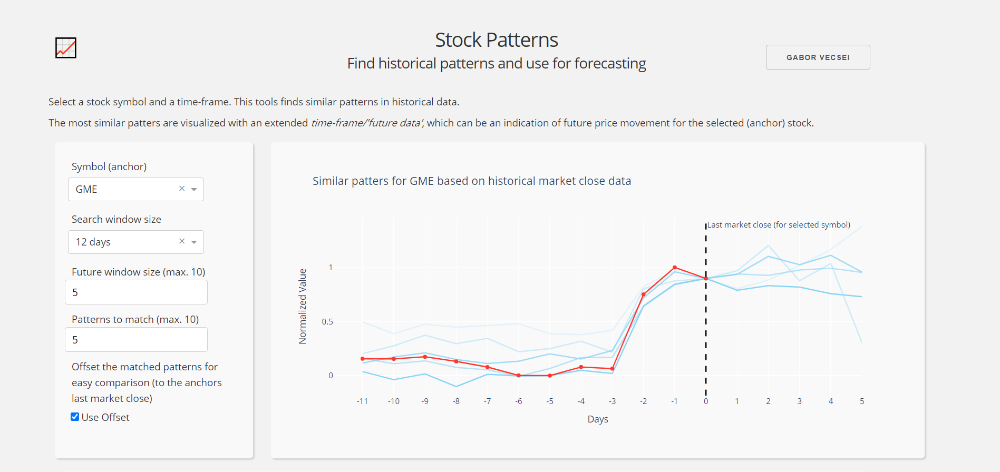
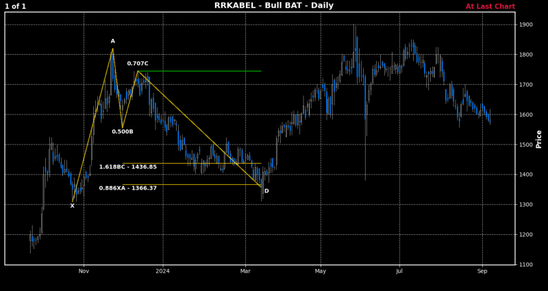
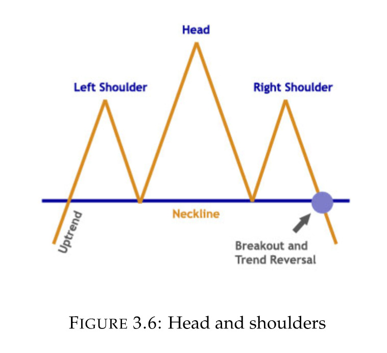
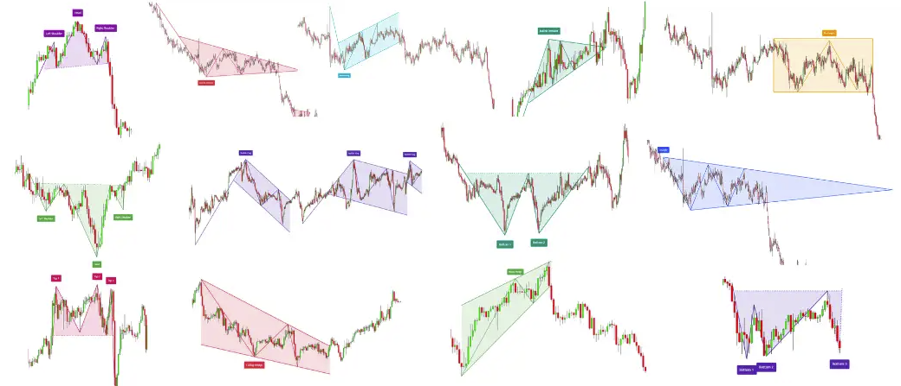

# 推荐

主推PatternPy和stock-pattern

---

# 1. Stocks-Pattern-Analyzer

- Github (240 stars): https://github.com/gaborvecsei/Stocks-Pattern-Analyzer
- 此工具应有助于根据历史（财务）数据中的相似性度量发现不同的模式

---

# 2. stock-pattern

相对比较完善。通过命令行扫描所有股票，进行常见的形态识别。

- Github (270 stars): https://github.com/BennyThadikaran/stock-pattern
- 原理：https://github.com/BennyThadikaran/stock-pattern/wiki/Pattern-Algorithms
- 作者较早的一个方案：https://medium.com/automation-generation/algorithmically-detecting-and-trading-technical-chart-patterns-with-python-c577b3a396ed
- 回测使用：https://github.com/BennyThadikaran/stock-pattern/wiki/backtest-usage

---

# 3. stock-pattern-recorginition

利用深度学习进行形态识别，用了150张图，64%准确率，CNN训练，存在过拟合，基于tensorflow，训练图片收集基于人工标注，实验分析详尽。

- Github (249 stars): https://github.com/CharlesLoo/stock-pattern-recorginition?utm_source=chatgpt.com

---

# 4. PatternPy

- Github (354 stars): https://github.com/keithorange/PatternPy?utm_source=chatgpt.com
- PatternPy：一个Python包，利用Pandas和Numpy，通过高速模式识别革新交易分析。轻松发现头部和肩部，顶部和底部，支撑和阻力。适合专家和初学者。

PatternPy 是一个功能强大的 Python 软件包，旨在改变您分析金融市场的方式。我们的使命是让所有人都能轻松高效地识别复杂的交易模式。使用 PatternPy，您可以毫不费力地从 OHLCV 数据中识别复杂的模式，例如头部和肩部、多个顶部和底部、水平支撑和阻力等等。

在 Pandas 的优雅和 Numpy 的效率的支持下，PatternPy 可在不影响准确性或用户友好性的情况下提供高速性能。无论您是经验丰富的交易者还是初学者，PatternPy 都是您的首选工具，可以提高市场分析的准确性和速度。

亮点：
- 在市场上独一无二：没有其他任何东西能比得上 PatternPy。我们为交易模式识别提供一体化解决方案，结合了功能、多功能性和简单性。
- 高速性能：PatternPy 采用矢量化概念设计，以惊人的速度处理大量数据，使您能够在需要时获取所需的信息。
- 灵活且可定制：您可以轻松调整窗口大小以适合您的偏好，从而在灵敏度和假阳性控制之间取得平衡。
- 创造财富的潜力：PatternPy 旨在帮助您更高效、更准确地识别有利可图的交易机会，从而有可能增加财富。

交易模式：Gearhead 的图表炼金术指南！🔧
- Head & Shoulders及其Mirror-Twin，反向Head & Shoulders：将此视为股票市场对中世纪战士立场的致敬。头部 - 价格实力的巅峰。肩膀 - 略低，但它们很有冲击力。当它反转时，那就是股市月球漫步！请留意，因为有什么东西即将放弃。⚔️
- 多个顶部和底部 - 水平探戈：当股票价格在图表上表现恰恰时，来回摆动而不爆发 - 这就是你的水平探戈！穿上你的舞鞋，因为阅读这个模式需要技巧和完美的时机。💃
- 水平支撑和阻力 - 价格弹跳者：这些级别就像一个专属俱乐部的精英弹跳者。价格需要 VIP 访问权限才能通过它们！他们以前曾被拒绝入场，那么他们这次会转身还是甜言蜜语呢？🕶️
- 上升和下降三角形 - 紧张感上升：这些三角形就像一根橡皮筋伸展 - 悬念令人伤脑筋。它会向上折断还是向下消失？这种模式是市场自己的惊悚片类型。🍿
- 楔形：融合命运：将楔形想象成两条趋势线，玩一场高风险的懦夫游戏——彼此加速，看看谁先偏离。当它们发生碰撞时，价格可能会向任何方向弹升。系好安全带！🚀
- 频道上下 - 股票高速公路：如果股票是汽车，那么频道就是他们的高速公路。在规定的车道内不受限制地高辛烷值运动。只是要小心那些出口 - 绕道可能会带来全新的风景！🏎️
- 双顶与底 - 市场的似曾相识：：当价格达到水平，然后 - 繁荣 - 他们又回来了，就像市场正在试图完善一个它第一次无法完成的噱头。总决赛前大胆的双重尝试！🎯
- 趋势线支撑和阻力 - 市场的长者：这些线就像股票传说中的睿智老圣人。他们见过东西，他们知道一些东西。他们的智慧？价格在哪里找到避难所或面对他们的克星的路线图。尊重长辈！🧙
- 更高-高&低-低-图表冒险家的任务：抓住你的探险家帽，因为这个图案是对未知领域的探险。新高或新低 - 它们是导致市场趋势核心的面包屑。🗺️

---

# 5. stockmarket-pattern-detection-yolov8

基于yolov8，仅给出模型和使用代码，但未给出训练数据和代码

- Github(0 star): https://github.com/chunyisong/stockmarket-pattern-detection-yolov8?utm_source=chatgpt.com
