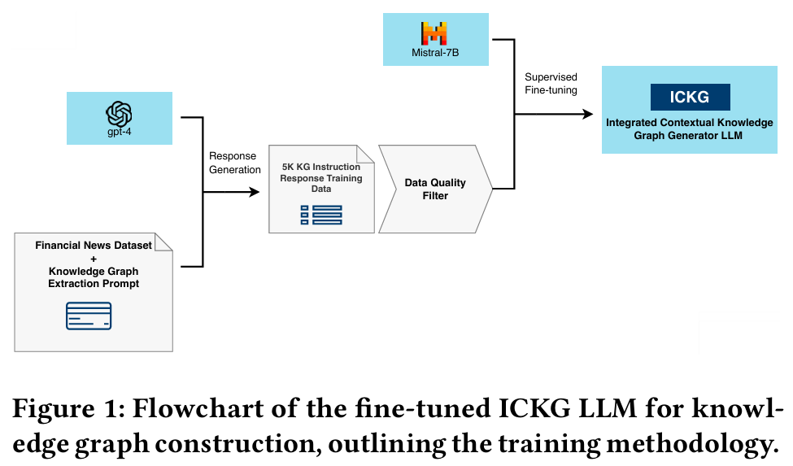
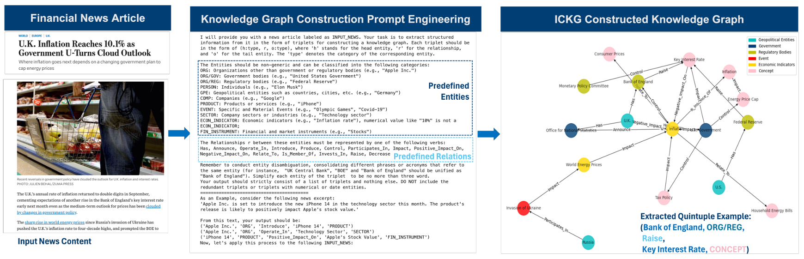
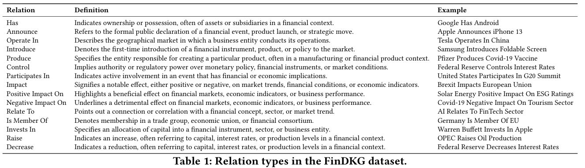
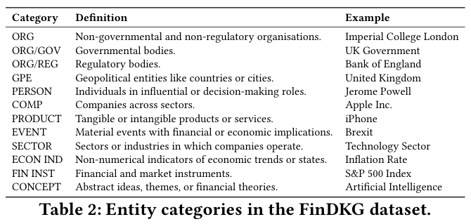
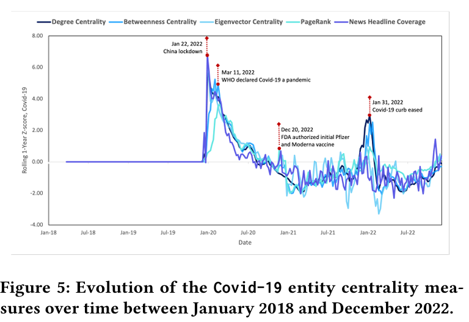
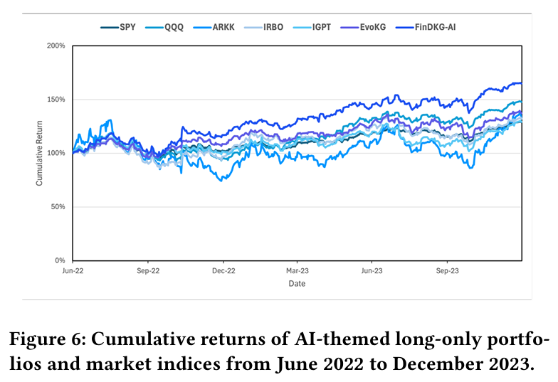

# 1. 资源

- 论文：FinDKG: Dynamic Knowledge Graphs with Large Language Models for Detecting Global Trends in Financial Markets
  - FinDKG 项目：面向全球金融的大型语言模型的动态知识图谱
  - 链接：https://arxiv.org/abs/2407.10909
  - 2024.10.15
  - 帝国理工
- 代码链接（129星）：https://github.com/xiaohui-victor-li/FinDKG/tree/main
  - GPL3.0协议
- 模型：https://huggingface.co/victorlxh/ICKG-v3.2

# 2. 太长不看核心简介

原理：
1. 利用GPT合成数据，使用mistral大模型训练可抽取知识图谱的大模型
2. 利用训练的模型，抽取知识图谱
3. 将图关系，利用图神经网络Transfomer进行训练，预测时序关系

结论：时序预测取得较好结果

# 3. 简介

“这篇来自帝国理工学院的论文探讨了如何利用动态知识图谱（DKGs）和大型语言模型（LLMs）来检测金融市场中的全球趋势。作者提出了一个名为Integrated Contextual Knowledge Graph Generator（ICKG）的开源LLM，并使用它生成了一个名为FinDKG的新型开源DKG，其中包含了金融新闻文章的信息。为了分析FinDKG，作者还设计了一种基于注意力机制的图神经网络架构，称为KGTransformer。实验结果表明，KGTransformer在链接预测任务上表现优异，并且可以超越现有的主题ETF。”

# 4. 原理

此存储库包含复制专为时间知识图谱 （TKG） 设计的 KGTransformer 模型所需的代码库和脚本。TKG 通过整合时间维度来扩展传统静态知识图谱的效用，从而捕获一段时间内实体之间的动态互连。这增加了时间复杂性，需要专门的建模技术，例如 KGTransformer，用于执行时间链接预测和异常检测等任务。

# 5. 实验

金融新闻中的趋势识别

构建一系列FinDKGs，每周日组装前一个月的滚动知识图谱，使用度中心性、中介中心性、特征向量中心性和PageRank四个中心性指标来量化实体在每个时间知识图谱中的重要性，为了使这些指标在时间上可比较，应用滚动一年的分数标准化。以全球COVID - 19大流行为案例研究，结果表明这些中心性指标能有效捕捉疫情时间线中的重要时刻。

基于FinDKG的主题投资

在在线学习设置中，每季度末在三年滚动窗口FinDKGs内拟合KGTransformer模型，用于预测哪些股票实体可能受到AI影响，构建以AI为主题的投资组合FinDKG - AI，同时使用EvoKG模型构建基于EvoKG的AI投资组合作为基准策略。样本外回测结果显示，FinDKG - AI在年化收益率和夏普比率方面在所有投资组合中表现最佳，现有AI ETF落后于市场基准，收益较低且风险较大，KGTransformer - 基于FinDKG的AI投资组合在评估期间表现优于竞争对手，在2022年11月OpenAI的ChatGPT发布时表现出明显优势，并且优于基于EvoKG的策略。
