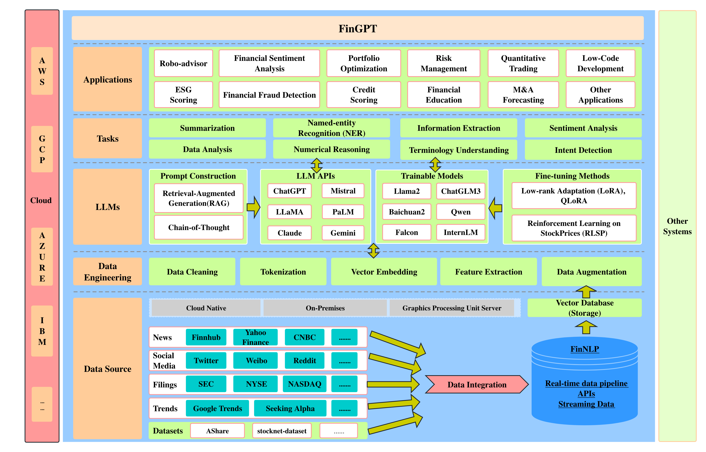
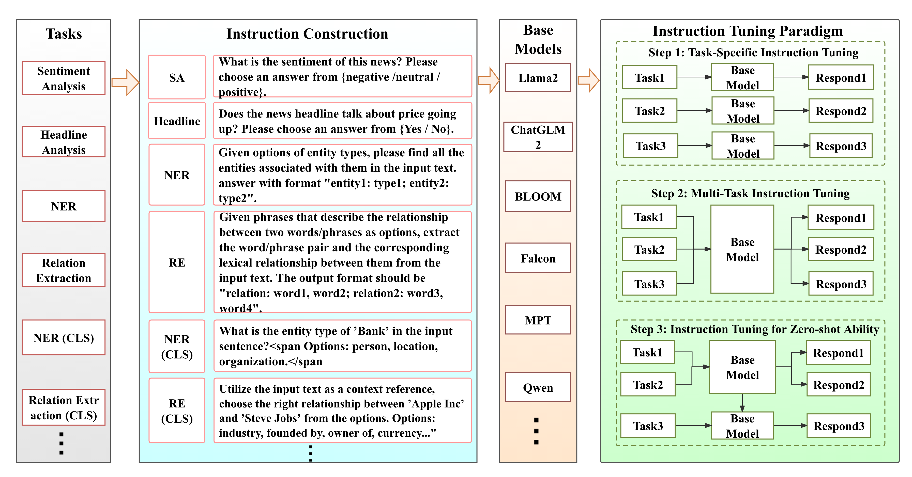

# 1. 资源

- Github (15.9k stars)：https://github.com/AI4Finance-Foundation/FinGPT
- 官网：https://ai4finance-foundation.github.io/FinNLP/zh/
- 文档：https://ai4finance-foundation.github.io/FinNLP/
- Huggingface: https://huggingface.co/FinGPT
  - 包含11个模型：对qwen/chatglm/llama/falcon/internLM均作了微调；
  - 包含14个数据集：覆盖了股价预测、分类、情感分析、实体抽取等；
- 代码已于2023年11月停止更新

# 2. 免责申明

本文仅用于教育和研究目的。

- 不用于真实交易或投资
- 不提供任何保证或担保
- 过去的表现并不代表未来的结果

使用此软件，即表示您同意仅将其用于学习目的。

# 3. 介绍

FinGPT采用数据中心的方法，为研究人员和从业者提供开发金融大语言模型（LLM）的资源。这对金融界来说无疑是令人振奋的，如果你从事金融报表的解读、数据分析、股票或者量化交易等工作，这款模型将成为你的得力助手。

FinGPT-Forecaster 应用，输入以下内容：

- 股票代码（例如 AAPL、MSFT、NVDA）
- 您希望预测发生的日期 (yyyy-mm-dd)
- 过去几周检索市场新闻的次数
- 是否添加最新的基本财务信息作为附加信息
- 点击提交！您将收到对该公司的全面分析以及对下周股价走势的预测！

FinGPT 包含 FinLLM 的全栈框架，分为五层：
- 数据源层：该层确保全面的市场覆盖，通过实时信息捕获解决金融数据的时间敏感性问题。
- 数据工程层：该层专为实时 NLP 数据处理而设计，解决了金融数据中高时间敏感度和低信噪比的固有挑战。
- LLM 层：该层专注于一系列微调方法，例如 LoRA，减轻了财务数据的高度动态性，确保了模型的相关性和准确性。
- 任务层：该层负责执行基本任务。这些任务是 FinLLM 领域性能评估和交叉比较的基准
- 应用层：展示实际应用和演示，突出了 FinGPT 在金融领域的潜在能力。

FinGPT 框架：开源金融大型语言模型

整个项目由4个部分组成：

第一部分是数据源，在这里，我们从互联网上收集历史和流媒体数据。

接下来，我们将数据推送到数据工程部分，在这里我们会对数据进行清洗，标记化处理和提示工程。

然后，数据被推送到大语言模型（LLMs）。在这里，我们可以以不同的方式使用LLMs。我们不仅可以使用收集到的数据来训练我们自己的轻量级微调模型，还可以使用这些数据和训练好的模型或LLM API来支持我们的应用程序。

最后一部分将是应用程序部分，我们可以使用数据和LLMs来制作许多有趣的应用程序。

## 3.1 数据层

FinGPT通过使用API、网络抓取工具和数据库访问，从金融新闻、社交媒体、报告文件、趋势数据和学术数据集中获取多样化数据，以确保合法和合规的实时更新和数据处理。

## 3.2 模型

FinGPT-Benchmark：我们引入了一种针对金融领域的开源大型语言模型 （LLM） 优化的新型指令调优范式，增强了它们对各种金融数据集的适应性，同时还促进了对特定任务、多任务和零样本指令调优任务的成本效益、系统化的基准测试。

- 在数据中心的自然语言处理领域，我们不需要从头开始训练模型。我们只需要调用API和进行轻量级的微调。

- 左边是一些可能会用到的LLM APIs，中间是我们可能用来进行微调的模型，右边是一些微调方法。每次微调不到 300 美元。

# 4. 应用

智能投顾：

ChatGPT可以像专业人士一样进行投资建议。

在这个例子中，苹果的股价上涨与ChatGPT分析新闻的预测相符。

量化交易：

通过结合新闻、社交媒体推文和公司公告的情感因子，尤其是Twitter推文和ChatGPT信号，我们可以显著提升交易结果，甚至单靠Twitter情感因子交易也能取得良好收益；结合价格因素将进一步优化结果。

策略开发：自动开发策略