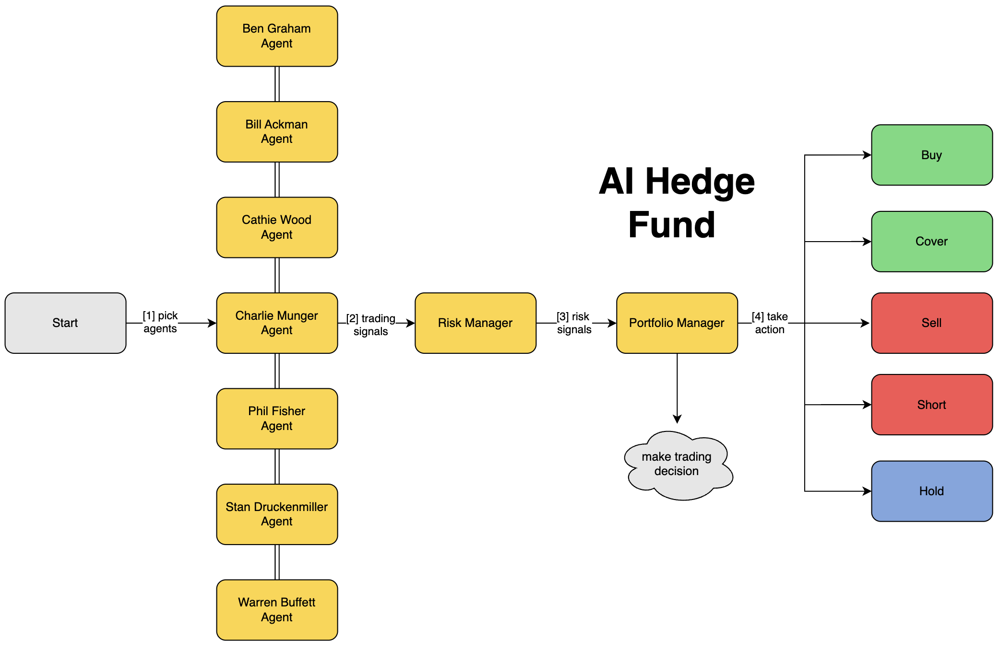

# 1. AI对冲交易
- Github (26.1k stars): https://github.com/virattt/ai-hedge-fund

该系统使用多个代理一起工作：

- Ben Graham Agent - 价值投资教父，只买有安全边际的隐藏宝石
- Bill Ackman 代理人 - 激进投资者，采取大胆的立场并推动变革
- Cathie Wood Agent - 成长型投资女王，相信创新和颠覆的力量
- 查理芒格经纪人 - 沃伦·巴菲特的合作伙伴，只以公道的价格购买精彩的企业
- Michael Burry 经纪人 - 寻找深度价值的大空头逆向者
- Peter Lynch 代理人 - 在日常业务中寻求“十倍”的实用投资者
- Phil Fisher Agent - 一丝不苟的成长型投资者，使用深入的“scuttlebutt”研究
- Stanley Druckenmiller 经纪人 - 寻找具有增长潜力的不对称机会的宏观传奇人物
- Warren Buffett 代理人 - 奥马哈的神谕，以合理的价格寻找优秀的公司0
- 估值代理 - 计算股票的内在价值并生成交易信号
- Sentiment Agent - 分析市场情绪并生成交易信号
- Fundamentals Agent - 分析基本数据并生成交易信号
- Technicals Agent - 分析技术指标并生成交易信号
- Risk Manager - 计算风险指标并设置头寸限制
- 投资组合经理 - 做出最终交易决策并生成订单



# 2. 免責聲明

本项目仅用于教育和研究目的。

- 不用于真实交易或投资
- 不提供任何保证或担保
- 过去的表现并不代表未来的结果
- Creator 对经济损失不承担任何责任
- 咨询财务顾问进行投资决策

使用此软件，即表示您同意仅将其用于学习目的。

# 3. 设置

克隆代码仓库：
```bash
git clone https://github.com/virattt/ai-hedge-fund.git
cd ai-hedge-fund
```

1. 安装 Poetry（如果尚未安装）：
    ```bash
    curl -sSL https://install.python-poetry.org | python3 -
    ```

2. 安装依赖项：
    ```bash
    poetry install
    ```

3. 配置环境变量：
    ```bash
    # 创建用于存放 API 密钥的 .env 文件
    cp .env.example .env
    ```

4. 设置 API 密钥：
    ```bash
    # 若使用 OpenAI 托管的 LLM（如 gpt - 4o、gpt - 4o - mini 等）
    # 请从 https://platform.openai.com/ 获取 OpenAI API 密钥
    OPENAI_API_KEY=你的 openai_api 密钥
    
    # 若使用 Groq 托管的 LLM（如 deepseek、llama3 等）
    # 请从 https://groq.com/ 获取 Groq API 密钥
    GROQ_API_KEY=你的 groq_api 密钥
    
    # 若要获取用于驱动对冲基金的金融数据
    # 请从 https://financialdatasets.ai/ 获取 Financial Datasets API 密钥
    FINANCIAL_DATASETS_API_KEY=你的 financial_datasets_api 密钥
    ```

重要提示：要让对冲基金正常运行，你必须设置 `OPENAI_API_KEY`、`GROQ_API_KEY`、`ANTHROPIC_API_KEY` 或者 `DEEPSEEK_API_KEY` 中的一个或多个。若你想使用所有提供商的 LLM，则需要设置全部 API 密钥。

AAPL（苹果）、GOOGL（谷歌）、MSFT（微软）、NVDA（英伟达）和 TSLA（特斯拉）的金融数据是免费的，无需 API 密钥。

对于其他股票代码，你需要在 `.env` 文件中设置 `FINANCIAL_DATASETS_API_KEY`。

# 4. 使用方法

运行对冲基金
```bash
poetry run python src/main.py --ticker AAPL,MSFT,NVDA
```

示例输出：


你还可以添加 `--ollama` 标志，使用本地 LLM 运行 AI 对冲基金。
```bash
poetry run python src/main.py --ticker AAPL,MSFT,NVDA --ollama
```

你也可以添加 `--show - reasoning` 标志，将每个代理的推理过程打印到控制台。
```bash
poetry run python src/main.py --ticker AAPL,MSFT,NVDA --show - reasoning
```
你可以选择指定开始日期和结束日期，以便针对特定时间段做出决策。
```bash
poetry run python src/main.py --ticker AAPL,MSFT,NVDA --start - date 2024-01-01 --end - date 2024-03-01 
```

运行回测工具

```bash
poetry run python src/backtester.py --ticker AAPL,MSFT,NVDA
```

示例输出：


你也可以选择指定开始日期和结束日期，对特定时间段进行回测。
```bash
poetry run python src/backtester.py --ticker AAPL,MSFT,NVDA --start - date 2024-01-01 --end - date 2024-03-01
```

你还可以添加 `--ollama` 标志，使用本地 LLM 运行回测工具。
```bash
poetry run python src/backtester.py --ticker AAPL,MSFT,NVDA --ollama
```

项目结构
```
ai - hedge - fund/
├── src/
│   ├── agents/                   # 代理定义及工作流程
│   │   ├── bill_ackman.py        # 比尔·阿克曼代理
│   │   ├── fundamentals.py       # 基本面分析代理
│   │   ├── portfolio_manager.py  # 投资组合管理代理
│   │   ├── risk_manager.py       # 风险管理代理
│   │   ├── sentiment.py          # 情绪分析代理
│   │   ├── technicals.py         # 技术分析代理
│   │   ├── valuation.py          # 估值分析代理
│   │   ├──...                   # 其他代理
│   │   ├── warren_buffett.py     # 沃伦·巴菲特代理
│   ├── tools/                    # 代理工具
│   │   ├── api.py                # API 工具
│   ├── backtester.py             # 回测工具
│   ├── main.py                   # 主入口文件
├── pyproject.toml
├──...
```