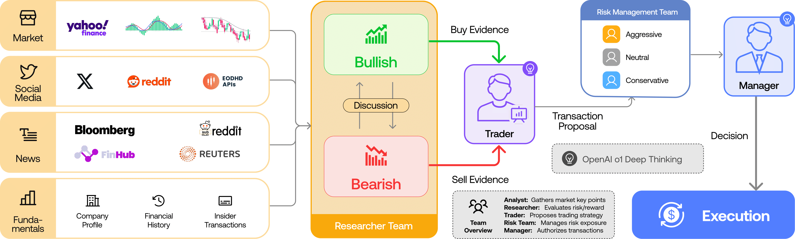

- Github (14.3k stars): https://github.com/TauricResearch/TradingAgents
- 加利福尼亚大学
- 论文：https://arxiv.org/pdf/2412.20138

TradingAgents 是一个多代理交易框架，反映了现实世界交易公司的动态。通过部署由 LLM 提供支持的专业代理：从基本面分析师、情绪专家和技术分析师，到交易员、风险管理团队，该平台协作评估市场状况并为交易决策提供信息。此外，这些代理参与动态讨论以确定最佳策略。

我们的框架将复杂的交易任务分解为专门的角色。这确保了该系统实现了一种强大、可扩展的市场分析和决策方法。
