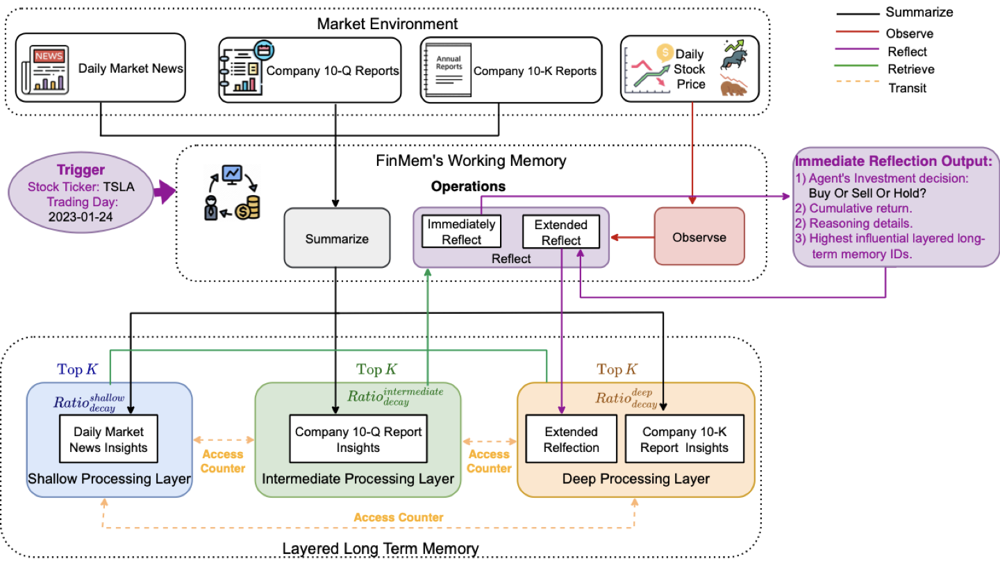
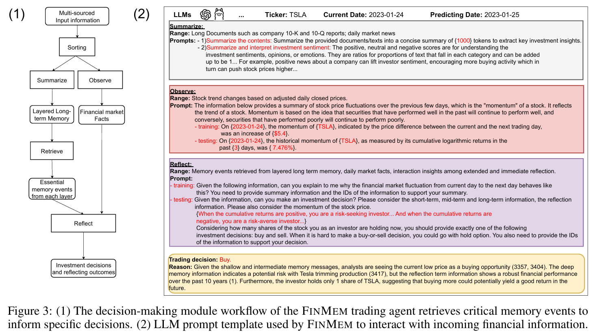
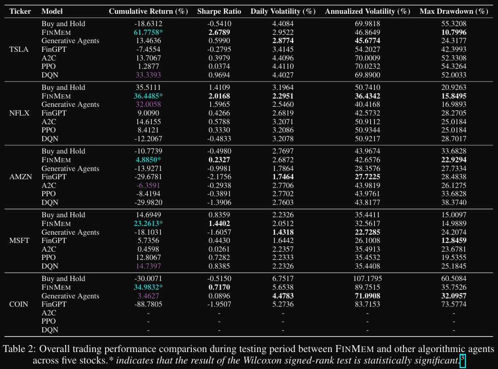
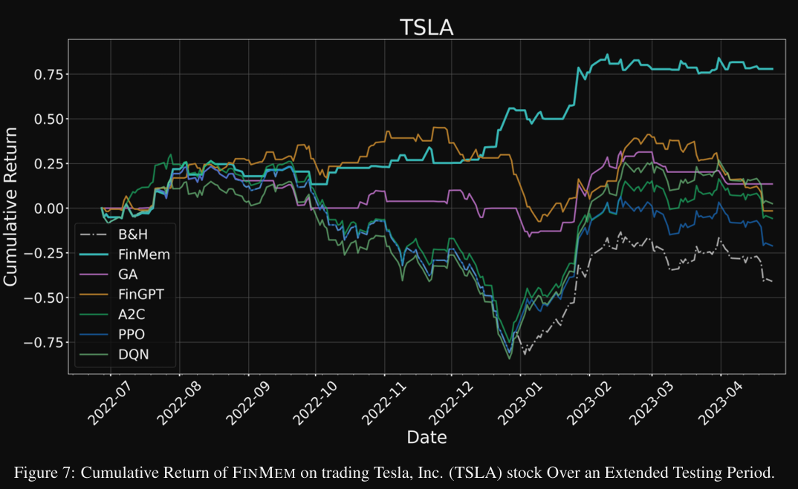
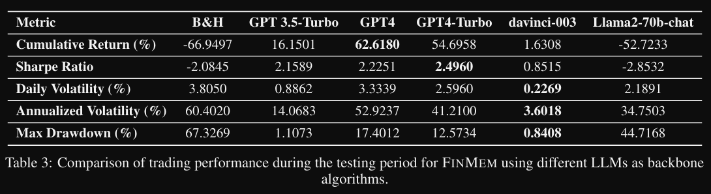
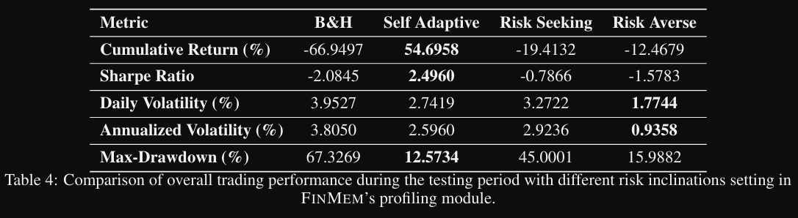
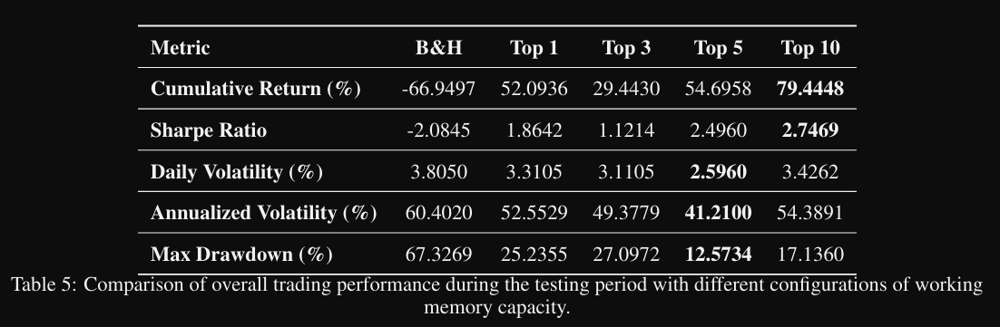

# FINMEM：具有分层内存和角色设计的性能增强型 LLM 交易代理

# 1. 资源

- Github (422 stars): https://github.com/pipiku915/FinMem-LLM-StockTrading
- MIT协议
- 目前看代码仓很可能在2024年6月之后停更
- 论文：
  - https://arxiv.org/abs/2311.13743
  - FinMem: A Performance-Enhanced LLM Trading Agent with Layered Memory and Character Design
  - 美国Stevens Institute of Technology
  - 2023年发表

# 2. 论文分析速览 （太长不看版）

**解决的问题：**
- 提出了一种基于大语言模型（LLM）的交易代理FINMEM，通过分层内存和动态角色设计处理金融数据，显著提升了交易性能，解决了现有交易代理在处理金融信息时存在的可解释性差、文本数据集成困难以及缺乏记忆组件等问题。

**核心原理：**
- 该框架主要将新闻、股票价格曲线、公司财务报表等信息输入到LLM中，通过agent多步数据加工处理，以预测股票价格，并使得预测具有可解释性
- 通过提示词和工作量构造，免训练

**实验结论**
- 相比传统方法，提示很明显，不过仅在有限的几只股票上进行了对比（可能结论有欠缺）
- 对比不同的模型，Openai模型收益很明显，但llama2-70B收益为负，回撤也很高
- 采用中平衡风险角色收益最高

# 3. 方案出发点

1. 强化学习：无法处理文本信息，文本消息对于交易决策至关重要
2. 大模型：无法对时间序列数据进行很好处理

# 4. 原理

**三个核心模块**
- Profiling模块为交易代理设定专业背景知识和风险倾向，如针对特定股票交易提供行业信息和历史财务表现，还能在风险寻求、风险规避和自适应风险等倾向间灵活切换，以此适应市场变化。
- Memory模块模拟人类认知系统，由工作记忆和分层长期记忆构成。工作记忆可进行汇总、观察和反思操作，将多源金融信息转化为交易决策；分层长期记忆依据信息的时效性和重要性，分为浅、中、深三层，通过调整衰减率来保存不同类型的金融数据。
- Decision - making模块则结合Profiling和Memory模块的结果，在训练和测试阶段分别依据不同信息做出投资决策。

Profiling模块：通过3个角色（高中低风险）进行角色，给出买、卖、持有中的一个信号

Memory模块：通过总结（新闻及财报）、观察（文本总结及股市数据）、反思操作，将多源金融信息转化为交易决策，给出买、卖、持有中的一个信号

Memor流程：

# 5. 实验结果
在实验方面，研究人员使用2021年8月15日至2023年4月25日的多源金融数据，将FINMEM与五种先进算法交易代理和一种基线交易策略进行对比。实验结果显示，FINMEM在累积回报和夏普比率等指标上优于其他模型，尤其在处理如Coinbase Global, Inc.这类历史数据有限的股票时优势明显。通过消融实验表明，GPT - 4 - Turbo是最适合FINMEM的骨干算法，自适应风险倾向能带来最佳交易表现，适当调整工作内存容量可提升交易性能。

配置：
- 使用FAISS向量库及OpenAI embedding进行搜索。
- 使用GPT4-TURBO作为LLM模型，temperature设为0.7

采用中平衡风险角色收益最高

# 6. 总结
综上所述，FINMEM凭借创新的架构设计，有效整合和理解金融数据，在股票交易中展现出卓越性能。尽管当前研究使用的是通用LLM和有限数据，但未来结合更优质的数据和金融领域微调的LLM，其交易效能有望进一步提升。此外，基于FINMEM构建多代理交易系统，在投资组合优化等领域具有广阔的应用前景。 