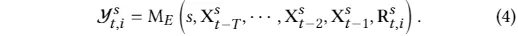
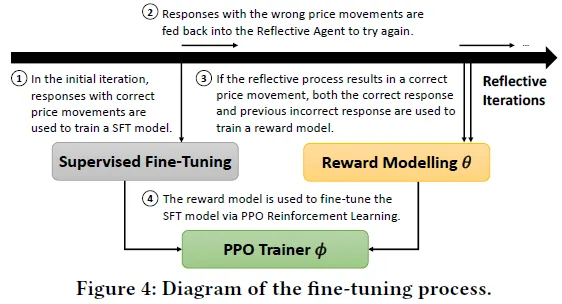
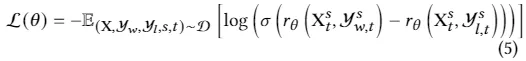
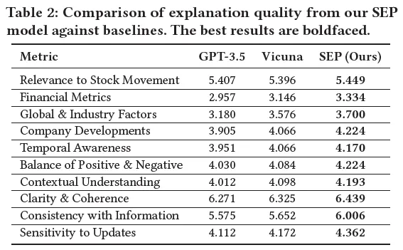
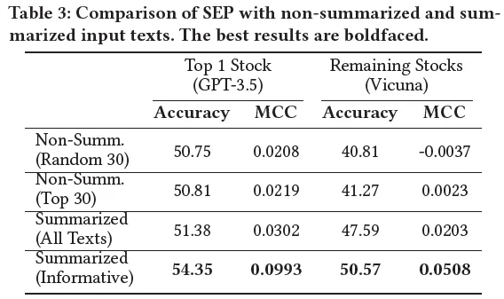
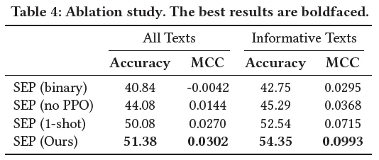
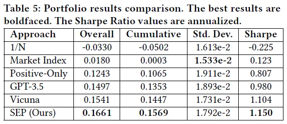

# 1. 简介

- 论文：Learning to Generate Explainable Stock Predictions using Self-Reflective Large Language Models
  - https://arxiv.org/pdf/2402.03659.pdf
- Github (18 Stars): https://github.com/koa-fin/sep

收益率达到16.6%，还能给出决策解释

# 2. 简介

WWW2024上发表了一篇使用大模型进行股票预测的论文，不仅收益率达到16.6%，还能给出决策解释。

传统的非生成式深度学习模型很难解释股票预测，而大型语言模型（LLMs）可以生成人类可读的解释，但对于股票预测这一任务仍然具有挑战性。为了解决这些问题，提出了Summarize-Explain-Predict（SEP）框架，利用自我反思的代理和Proximal Policy Optimization（PPO）来训练LLM生成可解释的股票预测。通过SEP框架，可以优化LLM在股票分类任务中的预测准确性和Matthews相关系数，并在投资组合构建任务中展示其有效性。

# 3. 原理

## 3.1 简介

金融市场中的有效市场假说（EMH），即股票价格反映所有可用信息，并且只会对新信息做出反应。为了预测未来的股票价格变动，投资者需要分析外部数据源，但是这需要处理大量信息，给金融专家带来了沉重的工作负担。因此，许多人探索使用深度学习技术进行股票预测。然而，传统的深度学习方法在股票预测中是黑盒模型，无法解释其预测结果，这降低了它们在实际应用中的可用性。

最近，大型语言模型（LLMs）为解决这个问题提出了新的思路。然而，使用LLMs进行可解释的股票预测仍然面临挑战。首先，社交文本的影响因素多样，需要模型具备权衡新信息影响的能力。其次，加入解释组件会使问题更加困难，需要大量的金融专家样本来训练RL。这需要大量的劳动力和成本，不利于扩展。

本文介绍了一个名为Summarize-Explain-Predict (SEP)的框架，用于自动化生成可解释的股票预测。该框架利用自反思代理和Proximal Policy Optimization (PPO)算法，通过自学习的方式让一个LLM模型学会如何生成股票预测和解释其推理过程。该框架通过将大量文本输入数据转化为要点形式的摘要信息，让LLM模型能够理解和权衡不同信息的影响，并生成最可能的股票预测和解释。实验证明，该框架在股票分类任务中的预测准确性和Matthews相关系数方面优于传统的深度学习和LLM方法。此外，该框架还可以应用于投资组合构建任务，生成可解释的股票权重，并通过投资组合指标验证其有效性。

文本的主要贡献包括：

- 探索了在没有专家注释样本的情况下，教授LLM模型如何以可解释的方式权衡多个文本信息的局限性；
- 提出了一种利用自反思代理和PPO技术的解决方案，使LLM模型能够自主学习如何生成可解释的股票预测；
- 通过实验证明了SEP框架的有效性，并展示了经过微调的LLM模型在预测性能和解释质量方面的改进。通过在多个股票上生成定量权重来解决投资组合任务，并通过投资组合指标验证了该方法的有效性。

## 3.2 相关工作

文本分析在股票预测中的应用历程：早期研究使用不同的文本表示方法，如词袋、名词短语和命名实体，后来被结构化信息所取代。最近的研究则更注重增加其他形式的信息，如音频数据和公司关系图。

大型语言模型在金融领域的应用：BloombergGPT是最著名的金融领域的大型语言模型之一，其他研究也尝试使用自己的金融领域语言模型。最近的研究则探索使用大型语言模型通过指导调整或预训练模型来进行股票预测。本文则通过增加自我反思代理和PPO训练器来优化股票预测的语言模型。

## 3.3 方法

本文介绍了可解释的股票预测任务和数据，并提出了SEP框架，包括Summarize模块、Explain模块和Predict模块。Summarize模块从非结构化文本输入中生成事实信息摘要，Explain模块通过自我反思迭代生成股票预测的解释，Predict模块使用自动生成的注释样本微调LLM并生成置信度预测。

预备工作

本文旨在通过给定股票的文本语料库，预测下一个交易日的股票价格变动，并提供人类可读的解释。文本语料库包含过去T天的文本，我们需要生成一个二进制价格变动预测和相应的解释。每个语料库包含一个变量数量的未结构化文本，我们需要提取其中的要点。

通过采用ACL18 StockNet数据集的数据收集方法构建了一个新的数据集。原始数据集的时间范围为2014年至2016年，我们收集了2020年至2022年的更新版本。由于之前的工作，行业数量扩大了，推文数量也呈指数增长。我们收集了11个行业中排名前5的股票的数据，总共有55只股票。股价数据来自Yahoo Finance，推文数据使用Twitter API收集。此外，考虑到每天的推文数量很大，我们使用BERTopic进行聚类，以识别每天的代表性推文。这些推文将作为所有模型的文本输入。

摘要生成

本模块旨在从非结构化的输入文本中生成摘要信息。当前的LLM已经具备了超越人类的摘要能力。为了避免超出字符限制，我们首先使用LLM生成每天的事实信息的点形式摘要。在提示中，我们还提供了两个示例。

解释生成

Explain模块的目标有两个方面：虽然模块的关键目标是为股票预测生成清晰的解释，但生成的解释也可以作为推理步骤，让LLM进行自我反思，以改进自己的预测。

解释提示

Explain模块的提示包含两个变量输入：指定的股票以及从上一个模块生成的提取的信息序列。给定这些输入，LLM生成响应第二天的价格预测，以及解释。我们将其形式化为：

与之前的摘要提示类似，我们从数据集中选择两个案例，并手动合成响应轨迹以用作少样本样本。此外，选择的两个示例案例具有一个积极和一个消极的运动标签，以避免任何多数标签偏差。

自我反思的过程

目前的LLM没有经过生成股票预测的训练，这可能会导致在上一步中错误地生成注释示例。为了解决这个问题，我们将LLM部署为一个自主代理，通过一个自我反思循环，可以迭代地改进其过去的响应。

对于不正确的样本，然后我们给定其之前的输入和输出提示LLM为每次迭代生成反馈，我们将其称为短期记忆。反馈应该清楚地解释它在之前的推理中哪里出了问题，并提出一个高级计划来减轻下一次迭代的失败。总体的形式如下：

对于每次迭代，LLM从其失败中吸取的教训，添加到其长期记忆。

通过这个过程，我们能够得到正确和错误的回答对。

预测生成

预测模块的目标是对LLM进行微调，以生成对未见过的测试期间的良好股票预测和解释。

模型微调

本文利用类似RLHF的三步过程来微调LLM。在训练过程中，我们使用反射的二进制评估来选择“更好”的响应，而不是人工反馈。

在第一步中，我们收集演示数据，这些数据来自初始迭代中的正确预测。这些样本没有对应的“错误”回答，因为它们是从最初的提示中提取的。这些样本被用来进行有监督微调。

在第二步中，我们收集包含成对正确和不正确的响应数据。这些用于训练奖励模型，该模型学习对正确的回答给予更高的奖励分数。

第三步，使用PPO对训练好的策略进行优化。我们首先使用监督策略初始化模型，并使用它为从整个数据集随机选择的样本生成预测。接下来，奖励模型用于为每个响应生成奖励。然后，我们尝试通过最大化整体回报来优化PPO模型。

我们注意到，目标包括一个附加项，惩罚训练策略和监督策略之间的KL分歧，这用于阻止策略坍缩成单一模式，并防止其生成与原始参考模型太不同的响应。

基于置信度抽样

在推理过程中，首先使用预训练的LLM对非结构化输入文本进行总结。然后，我们使用经过训练的策略从总结的事实生成第二天的预测。为了生成预测，我们使用best-of-𝑛采样器，在该采样器中，我们生成𝑛响应，并使用奖励模型的分数来选择最佳响应。

# 4. 实验

本文评估了SEP模型在股票预测任务中的表现，并回答了三个研究问题：

Q1：SEP模型在分类准确性和解释质量方面如何与传统深度学习和其他LLM方法相比？

Q2：每个提出的组件如何帮助提高SEP模型的性能？

Q3：SEP框架是否足够通用，可用于其他金融相关任务，如可解释的投资组合构建？

## 4.1 实验设置

基线

作者将该模型与传统深度学习模型和经过微调的大型语言模型进行比较，并使用预测准确率和Matthews相关系数作为评估指标。基准模型包括：VAE+Attention、GRU+Attention、Transformer、GPT-3.5-turbo、Vicuna-7b-v1.5、FinGPT-Forecaster。

此外，SEP框架的一个关键特征是Summarize模块，它从非结构化推文中提取关键信息，供LLM基于其预测。对于LLM实验，我们报告了删除这些案例之前和之后的结果。在实践中，这可以被视为LLMs的一个好处，因为它能够主动判断它没有足够的信息来进行预测，投资者可以选择寻找更多的信息来进行分析，或者不进行当天的投资。

实现细节

我们将OpenAI GPT-3.5-turbo-16k用于每个行业的前1名股票，将Vicuna-13b-v1.5-16k用于其余股票。使用Vicuna-7b-v1.5-16k进行预测模型训练，LLM使用trl进行训练。使用4位量化的LoRA进行所有组件的训练。在推理时，使用n=4进行n-shot采样。最佳响应将作为选择的输出进行最终比较。。

效果对比（Q1）

在预测准确性方面，SEP模型在使用GPT生成的解释上表现最佳，MCC指标也优于其他模型。在解释生成方面，SEP模型通过自我反思和强化学习，能够生成更好的解释，提高了模型的可解释性。

我们可以得出以下结论:

通用性指标（如信息一致性）得分最高，可比较不同语言模型的相对得分。

预测准确率仍是首要指标，即使预测错误，所有语言模型都能提供高质量的解释。

SEP模型在所有指标上得分最高，其通过自我反思和强化学习，内在地教导模型更好地比较因素以提高预测准确性。

消融分析（Q2）

本文评估了三个组件的效率：Summarize、Explain和Predict模块。Summarize模块通过提取重要的事实信息来减少输入文本的噪音和长度。Explain模块通过自我反思生成注释样本，提高了模型的预测准确性。Predict模块的消融研究表明，去除非信息性文本可以提供最佳结果。同时，使用最多共享的文本比随机抽样更好。最后，Explain模块的自我反思可以生成更多的决定性和正确的注释样本，用于Fine-tuning。

在指导调整过程中，加入解释组件（从SEP（二进制）到SEP（无PPO））平均提高了6.9%的准确性，可能是因为调整LLM以生成解释，从而引发LLM的推理过程，提高了预测准确性。

指导调整变体（SEP（无PPO））与基础模型（Vicuna模型）的结果非常相似，可能是因为样本在反射迭代之前（即图4中的步骤1）被采集，这些样本是基础模型已经能够处理的“简单”样本。

PPO强化学习（从SEP（无PPO）到SEP（1-shot））的改进最大，平均提高了14.8%，强调了PPO训练器在教授LLM更有效地生成股票预测方面的能力。此外，n-shot采样使用学习的奖励模型加权选择最佳输出，平均改进3.0%（从SEP（1-shot）到SEP（Ours）），进一步证明了PPO过程中训练的奖励模型的有用性。

投资组合优化

SEP框架能够教会LLM以二进制方式权衡输入文本中的信息。通过使用SEP框架对LLM进行微调，我们进一步探索了其泛化能力，使其能够在定量上权衡其自动生成的解释中的信息，以生成股票投资组合权重。我们使用与上述相同的方法对LLM进行微调，但这次输入信息是每天篮子中所有生成的解释。为了减少LLM需要权衡的股票数量并防止负权重（从而设置无卖空约束[37]），我们只筛选出预测为正的股票。然后，我们提示LLM根据每只股票的前景生成投资组合权重。我们将两组生成的权重输入到PPO训练器中，选择利润更高的一组作为“更好”的响应。我们比较了由三种不同LLM生成的投资组合的表现：GPT-3.5-turbo、Vicuna和我们微调的SEP模型。我们还包括了三个基准：1/N投资组合（篮子中的11只股票以相等权重购买）[14]、标准普尔500指数和仅买入预测为正的股票（Positive-Only）。我们使用四个指标评估投资组合的表现：总收益（简单地将每天的收益相加）、累计收益（评估期间重新投资任何额外的利润或损失后的最终收益）、利润的标准差和年化夏普比率[45]。从表5中可以看出，仅买入预测为正的股票的投资组合已经展现出良好的表现。

我们可以观察到：

标准差结果显示，1/N和市场指数的投资组合方法包含更多的股票，能够更均匀地分散股价波动，但它们的夏普比率仍然低于其他模型，表明风险回报比较低。

预训练的LLM模型（如GPT-3.5和Vicuna）在大多数指标上表现优于仅考虑正面因素的投资组合，显示了使用LLM在信息之间进行权衡以产生投资组合权重的能力。

我们的SEP模型在大多数投资组合指标上表现优于其他方法，并在标准差方面达到可比较的性能，展示了我们SEP框架的有效性。此外，LLM模型能够解释生成的投资组合权重，增加了结果的可解释性和可信度。

# 5. 总结和未来工作

本文探索了可解释的股票预测任务，并提出了SEP框架来解决当前LLMs在权衡市场因素和生成股票预测方面的限制。通过实验证实，SEP模型在预测准确性和生成解释质量方面优于传统深度学习和LLM方法。未来的研究可以探索解决SEP框架中累积错误的可能性，利用其他数据源提高预测质量，并改进评估生成的股票解释的指标。

# 参考

[1] 使用大模型进行股票预测，收益率16.6%，还会自我反思和给出合理解释，https://mp.weixin.qq.com/s/GRagqhsyeXT15W2_4V4XqA