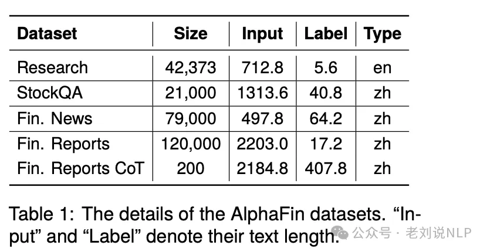
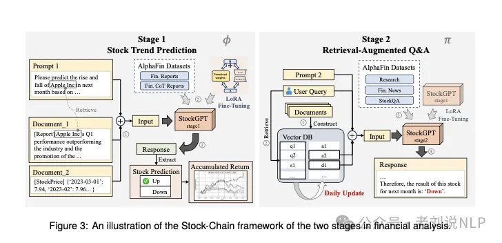
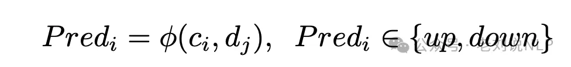
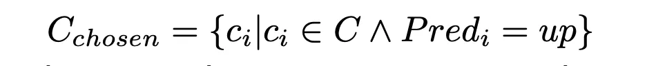
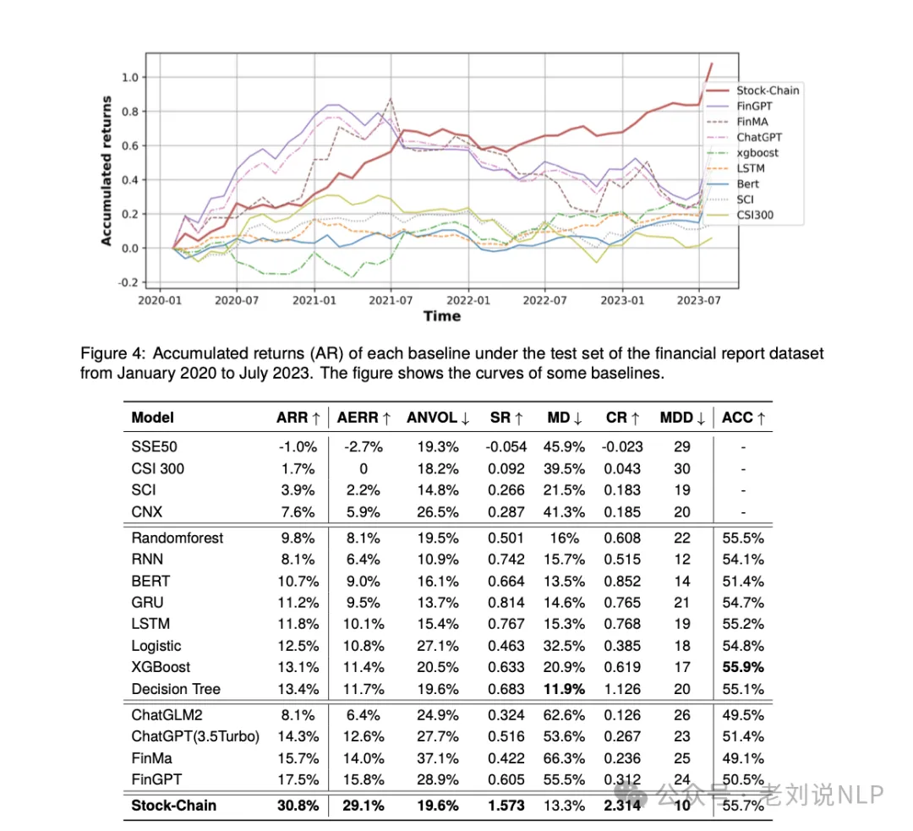

# 1. 资源

- 论文：
  - AlphaFin: Benchmarking Financial Analysis with RetrievalAugmented Stock-Chain Framework
  - https://arxiv.org/pdf/2403.12582.pdf,https://github.com/AlphaFin-proj/AlphaFin
- Github (18 Stars): https://github.com/AlphaFin-proj/AlphaFin

# 2. 问题起因

金融分析任务主要包括两个关键领域，股票走势预测和相应的金融问题解答。目前，机器学习和深度学习算法（ML&DL）已被广泛应用于股票走势预测，并取得了显著进展，但这些方法无法提供预测理由，缺乏可解释性和推理过程，也无法整合金融新闻或报告等文本信息。

而当下大型模型（LLM）具有出色的文本理解和生成能力受到广泛关注，但由于金融训练数据集的稀缺以及与实时知识的整合有限，仍然存在幻觉，无法跟上最新的信息。


# 3. 简介

一个是发布了用于微调 FinLLM的AlphaFin，其中包含传统研究数据集、实时财务数据和手写CoT数据。

另一个是提出了与RAG集成的Stock-Chain框架，该框架可以为投资者提供股票走势预测，并通过RAG整合实时市场数据和宏观经济新闻，从而完成股票分析，在具体实现上，其基于AlphaFin数据集对StockGPT进行微调，并将其集成到Stock-Chain框架中，并通过RAG进一步与实时金融数据库集成，以解决LLM输出的幻觉以及LLM无法生成实时内容的问题。

# 4. 原理

## 4.1 数据

如下图所示，数据集包括Research研究数据集、StockQA数据集、金融新闻数据集以及财务报告数据集四个部分：



其中：

Research研究数据集：这部分包括来自学术界的传统金融数据集，包括FPB、FinQA、convFinQA以及Headline，以增强大模型的信息提取和总结能力。在这部分数据上，传统的研究数据集主要是英文的，而且数量很大。为了提升LLM们的中文能力，保证质量进行微调，只从源头抽取了一部分。

StockQA数据集：这部分包含来自Tushare和AKshare的股价和其他财务数据，使用顺序数据格式，例如股票价格趋势（例如{...,170,173,171,175,173,170,...}）。但鉴于源数据以顺序格式呈现，使用ChatGPT并按以下提示生成财务问题，以增强多样性，随后，我们使用ChatGPT生成回复并获取用于训练LLM的问答对，对应的prompt如下：

```text
Based on the ..., give me a good financial question. Input: <sequential data>, Output: <Question>.
```

金融新闻数据集：为了向大模型提供真实世界的金融知识，整合了在线新闻来源，例如中央电视台和华尔街CN的金融版块，在数据处理上，使用Chat-GPT提取每条新闻的摘要，并构建财经新闻数据集，从而提升摘要能力。

财务报告数据集：通过DataYes构建财务报告数据集（DataYes，2021），包括机构对公司进行的专业分析和知识。在数据处理上，手动对齐公司的财务报告及其报告发布当天的股价，并使用以下模板生成最终数据，并还手动创建200份具有专业财务知识和较长标签的财务报告CoT数据，对应的prompt如下：

```text
According to ...  conclusions can be drawn: 
 1.  Fundamentals:  ...
2.  Technical aspects:  ...
   Therefore, we predict the ...  is
   <up/down>, probability:  <Prob>
```

## 4.2 架构

Stock-Chain Framework

财务分析任务可以被视为两个对应部分，即股票趋势预测和相应的财务问答，因此Stock-Chain框架分为两个阶段，一个Stock Trend Prediction，另一个是Retrieval-Augmented Q&A，如下图所示：



第一阶段是股票走势预测，给定一家公司ci和相应的文档dj，该阶段通过结合LLM和AlphaFin数据集维护一个股票预测系统φ，给出股票趋势预测Predi。

其中：


对于第一阶段Stock Trend Prediction，任务很有趣，其给定一组公司C和相应的知识文档D，以预测涨跌：



其目标是从中找出一组能涨的公司子集C chosen:



这一步涉及到知识文档D的处理，在实现上，其给定一个公司ci，首先检索它的相关文档dj。然后，设计一个提示模板Prompt进行组装，例如：

```text
Please predict the rise and fall of the stock next month based on the research reports and data pro-vided below. Please provide a clear answer, either “up" or “down". <re-port><market data>
```

然后，利用AlphaFin的所有财务报告数据集进行训练，并利用手动创建的报告CoT数据集来进一步微调，微调过程均采用LoRA，通过这两个步骤的微调，得到StockGPTstage1，能够预测基于dj的ci的趋势，并提供详细的分析和解释。

第二个阶段Retrieval-Augmented Q&A，将多轮对话会话视为两个对话者之间的几个查询-回复对的序列。 具体的，将Qt和Rt表示为当前时间步t处的用户查询和代理回复，并将Ht=[Q0, R0, ..., Qt−1, Rt−1] 表示为对话历史记录，然后我财务问答任务形式化为根据当前查询、对话历史记录和相应文档获取回复，因此，该部分的任务可以形式化为：给定对话历史Ht、用户查询Qt以及检索到的与Qt相关的文档dj，对话系统π给出回复Rt。


在具体实现上：

在向量数据库构建侧，使用ChatGPT进行粗粒度文档级摘要，以及通过RefGPT 进行细粒度实体级对话生成，如下：sk表示dk的摘要，(qk_, ak_) 表示生成对话的查询-答案对，qk_是一个问题。


在向量化embedding侧，采用BGE进行嵌入表示；

在数据更新侧，报告可以不断实时加入。

接着，继承StockGPTstage1作为基础LLM，然后继续在AlphaFin的研究数据集、财经新闻和StockQA数据集上训练StockGP Tstage1以获得StockGPTstage2，对应的prompt为：

```text
You are an intelligent assistant, please answer my question. To help you ... local knowledge base is pro- vided as follows: <knowledge> Now, answer the question...: <his-tory><query>
```

然后，将prompt、检索到的知识、对话历史记录和用户查询进行连接，以获得大模型的输入 It，并将其输入StockGPT，得到回复Rt。


# 5. 果

通过计算年华回报率以及涨跌预测准确率的评估，可以看到一些有趣的现象，例如xgboost依然很抗打。



也可以看看其最终效果：


# 参考

[1] 大模型+RAG用于金融股票预测分析框架：兼看图表理解领域大模型的工作，https://mp.weixin.qq.com/s/Fmt4G7RPYqGkKdt1_c2RKA