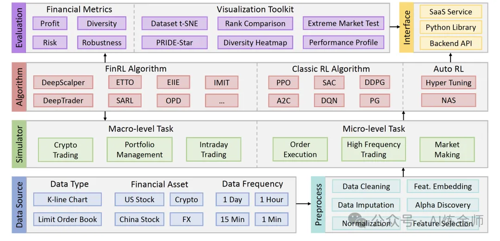

# 1. 资源

- Github (1.7k stars): https://github.com/TradeMaster-NTU/TradeMaster
- 论文：
  - PRUDEX-Compass: Towards Systematic Evaluation of Reinforcement Learning in Financial Markets (Transactions on Machine learning Research 2023)
  - Reinforcement Learning for Quantitative Trading (Survey) (ACM Transactions on Intelligent Systems and Technology 2023)
  - Deep Reinforcement Learning for Quantitative Trading: Challenges and Opportunities (IEEE Intelligent Systems 2022)
  - DeepScalper: A Risk-Aware Reinforcement Learning Framework to Capture Fleeting Intraday Trading Opportunities (CIKM 2022)
  - Commission Fee is not Enough: A Hierarchical Reinforced Framework for Portfolio Management (AAAI 21)
- 平台功能整体较为完整，包含大模型agent策略，大部分内容都更新于2年前，目前更新缓慢

# 2. 简介

每个人都能看懂的大模型知识分享，LLMs春/秋招大模型面试前必看，让你和面试官侃侃而谈

# 3. 项目背景
TradeMaster 由南洋理工大学 (NTU) 开发，是首个全面覆盖量化交易流程的开源平台，目标是通过强化学习技术解决交易策略的开发难题。它不仅支持多种金融数据和市场环境，还预置了多种强化学习算法，结合全面的评估工具，为用户提供从策略开发到部署的全方位支持。

TradeMaster 的设计理念聚焦以下几点：

1. 全面性  
    - 涵盖数据加载、策略训练、评估、可视化等完整工具链。
2. 灵活性
   - 适配多种任务场景，如组合管理、高频交易和订单执行。
3. 开放性
   - 支持用户自定义算法和市场环境，扩展潜力巨大。

# 4. 核心优势

## 4.1 强化学习驱动的策略开发

TradeMaster 内置了包括 DDPG、PPO、A2C、SARL 等在内的 13 种强化学习算法，用户可以快速应用这些算法进行交易策略的训练和优化。

## 4.2 多样化的任务支持
平台支持三大核心任务：

- Portfolio Management
   - （组合管理）：资产的最优分配与动态调整。
- High-Frequency Trading
   - （高频交易）：低延时高效率的交易策略。
- Order Execution
   - （订单执行）：降低交易成本，优化订单执行路径。
 
## 4.3 数据与市场环境丰富
TradeMaster 提供了覆盖股票、加密货币等多个市场的数据支持，同时内置数据驱动的高保真模拟器，为策略的开发和测试提供真实可靠的环境。

## 4.4 全面的评估体系
TradeMaster 提供了 6 大维度和 17 项指标（如收益、风险、稳定性等）的系统评估工具，帮助用户全面了解策略的优劣势。

# 5. 总结

TradeMaster 是一个功能强大且专业化的开源平台，为量化交易和强化学习领域的研究和实践提供了全方位的支持。通过其丰富的数据、多样的任务场景和系统化的评估工具，用户能够快速开发、测试并优化交易策略。如果您对强化学习与量化交易的结合感兴趣，TradeMaster 无疑是一个值得深入探索的平台。

# 参考

[1] TradeMaster："全流程"强化学习驱动，加密货币量化交易工具, https://mp.weixin.qq.com/s/Pam3fgXcJE6FinrXrJwTRg
