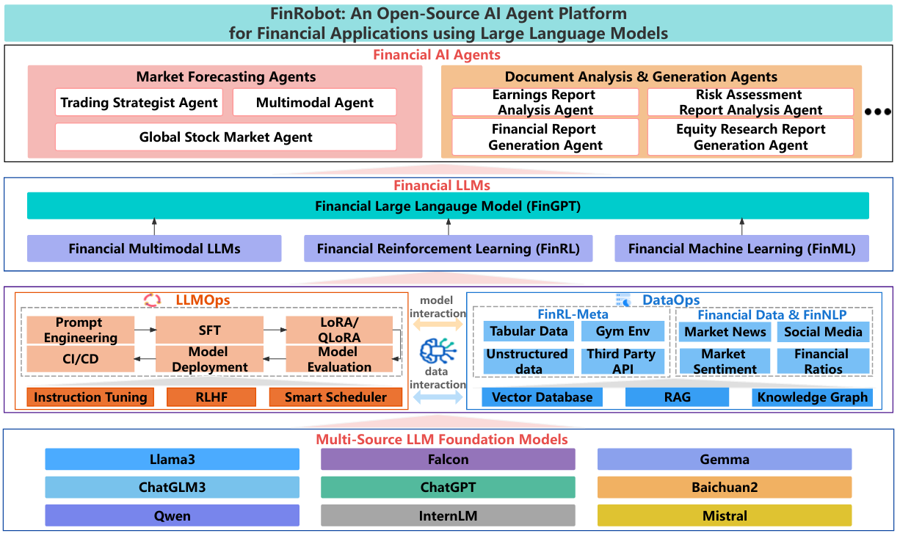
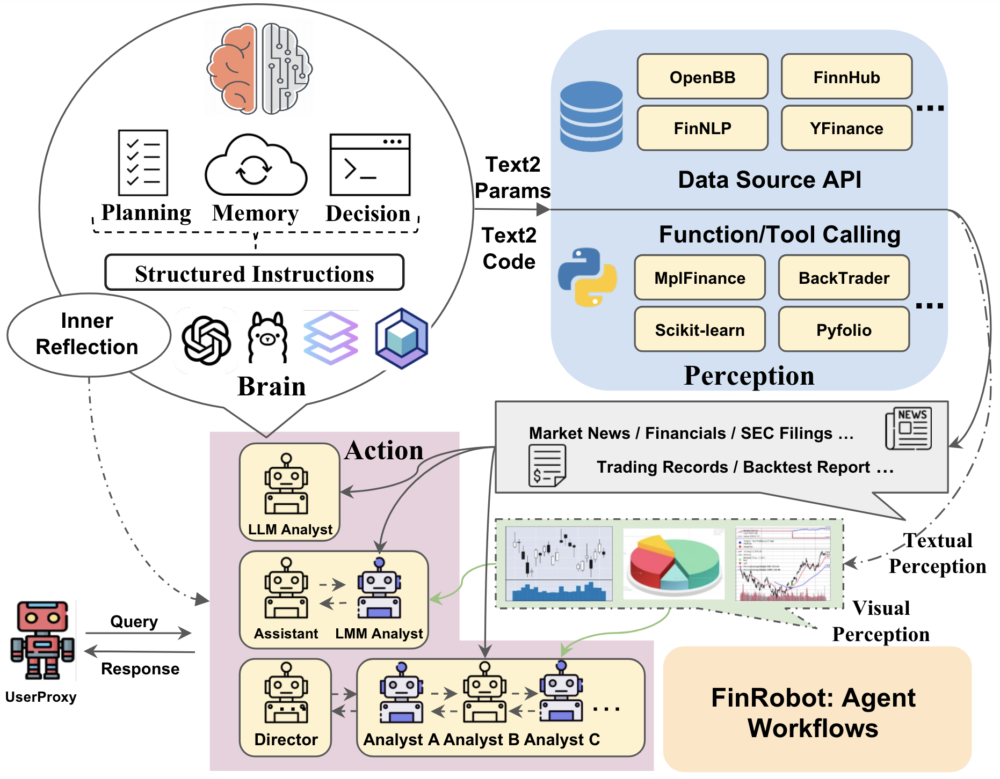
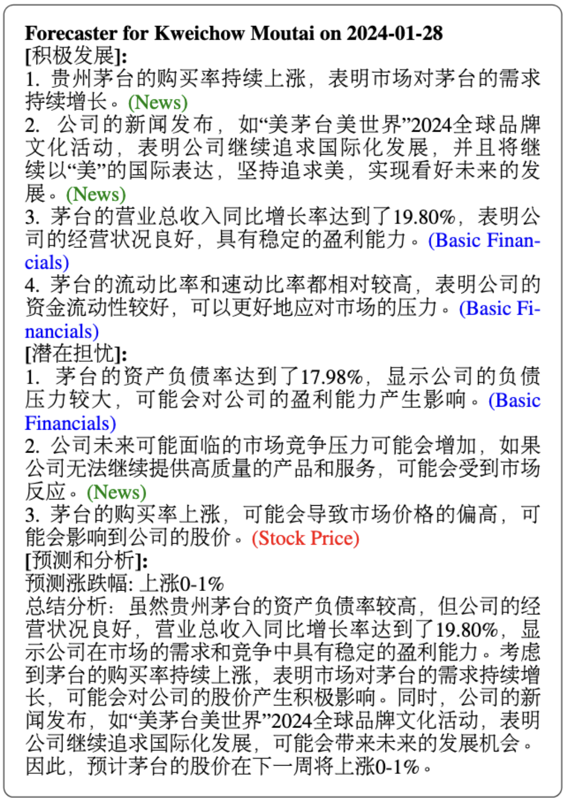

# FinRobot：基于大语言模型的金融应用开源AI智能体平台
# 1. 资源

- Github (2.3k stars): https://github.com/AI4Finance-Foundation/FinRobot
- FinRobot: An Open-Source AI Agent Platform for Financial Applications using Large Language Models
  - arXiv 技术论文：https://arxiv.org/pdf/2405.14767
  - 2024.5
  - AI4Finance Foundation及国内外大学合作开发的金融专业 AI 代理平台
- 官网：https://ai4finance.org/

# 2. 快速阅读
- 功能：FinRobot 提供市场预测、文档分析和交易策略等多种金融专业 AI 代理。
- 技术：基于大型语言模型（LLMs）和金融思维链（CoT）提示技术，增强复杂分析和决策能力。
- 应用：广泛应用于金融领域的市场预测、年度报告分析和交易策略优化。

# 3. 原理

FinRobot 是一个开源的 AI Agent 平台，专注于金融领域的应用。它基于大型语言模型（LLMs）构建，能够进行复杂的金融分析和决策。通过金融思维链（CoT）提示功能，FinRobot 将复杂的金融问题分解为逻辑步骤，增强其分析能力。

FinRobot 的架构包括金融 AI 代理层、金融 LLM 算法层、LLMOps 和 DataOps 层以及多源 LLM 基础模型层，支持市场预测、文档分析和交易策略等多种金融专业 AI 代理。

**FinRobot 的主要功能**
- 金融机器学习（FinML）：基于多种机器学习技术提高金融预测分析的能力。
- 金融多模态 LLM：处理并综合来自多种模态（如文本、图表和表格）的信息，提供全面深入的金融文档理解。
- LLMOps 层：实现高模块化和可插拔性，优化任务分配，包括任务管理、代理注册、代理适配器和主管代理等组件。
- 数据操作层（DataOps Layer）：管理金融分析所需的广泛和多样化的数据集，确保输入 AI 处理管道的所有数据都是高质量和代表当前市场状况的。
- 金融思维链（Financial Chain-of-Thought）提示技术：业务特定分析、市场分析、估值分析，提供对记录和派生值的来源和推导的详细解释，适应性和发展性。
- 市场模拟：通过结合类似人类的推理过程来超越纯粹的数值分析，模拟市场参与者的决策过程。
- 市场预测代理：分析公司的股票代码、最新财务数据和市场新闻，预测其股票走势。
- 年度报告分析代理：专门用于分析公司的年度报告，提取关键信息并生成摘要。
- 交易策略代理：根据市场数据和预定的规则制定交易策略，结合技术分析和基本面分析，为不同风险偏好的投资者提供定制化的交易建议。
- 金融图表代理：专门用于生成和解释金融图表，将复杂的数据可视化，帮助用户更直观地理解市场趋势和模式。
- 优化交易代理：通过机器学习算法优化现有的交易策略，回测历史数据，调整参数，以提高策略的性能和稳定性。

**FinRobot 的技术原理**
- 金融 AI 代理层（Financial AI Agents Layer）：通过金融思维链（CoT）技术将复杂的金融问题分解为逻辑序列，增强复杂分析和决策能力。
- 金融 LLM 算法层（Financial LLM Algorithms Layer）：配置和使用针对特定领域和全球市场分析而定制的经过特殊调整的模型。
- LLMOps 和 DataOps 层：应用训练和微调技术以及使用与任务相关的数据来生成准确的模型。
- 多源 LLM 基础模型层（Multi-source LLM Foundation Models Layer）：集成各种 LLM，使上述各层能直接访问它们。

**FinRobot 工作流程**

- 感知：该模块从市场信息、新闻和经济指标中捕获和解释多模式金融数据，使用复杂的技术来构建数据以进行全面分析。
- 大脑：作为核心处理单元，该模块使用 LLM 感知来自感知模块的数据，并利用金融思维链 （CoT） 流程生成结构化指令。
- 动作：此模块执行 Brain 模块中的指令，应用工具将分析见解转化为可作的结果。行动包括交易、投资组合调整、生成报告或发送警报，从而积极影响金融环境。

**FinRobot：智能调度器**

Smart Scheduler 是确保模型多样性以及优化集成和为每个任务选择最合适的 LLM 的核心。

- Director Agent：此组件编排任务分配过程，确保根据代理的性能指标和对特定任务的适用性将任务分配给代理。
- 代理注册：管理注册并跟踪系统内代理的可用性，从而促进高效的任务分配过程。
- 代理适配器：根据特定任务定制代理功能，增强其性能和在整个系统中的集成。
- 任务管理器：管理和存储为各种财务任务量身定制的不同通用和基于 LLM 的微调代理，并定期更新以确保相关性和有效性。

# 4. 效果

**市场预测**

**辅助撰写报告**

金融 CoT：

- 收集初步数据：10-K 报告、市场数据、财务比率
- 分析财务报表：资产负债表、损益表、现金流
- 公司概况和业绩：公司简介、业务亮点、细分市场分析
- 风险评估：评估风险
- 财务绩效可视化：绘制市盈率和每股收益
- 将调查结果综合成段落：将所有部分合并成一个连贯的摘要
- 生成 PDF 报告：使用工具自动生成 PDF
- 质量保证：检查字数

**具有多式联运功能的 Trade Strategist Agent**

# 参考

[1] FinRobot：开源的金融专业 AI Agent，提供市场预测、报告分析和交易策略等金融解决方案,https://mp.weixin.qq.com/s/TX2K4jmhlodioTEBY5kn3A
