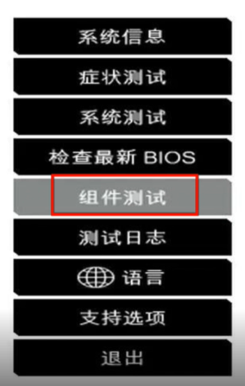
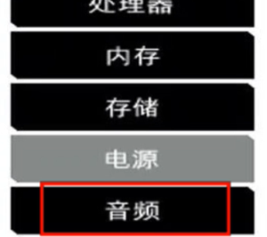
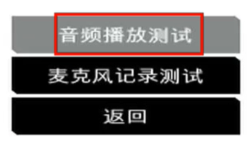
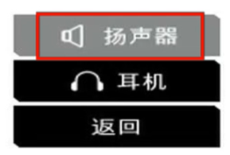
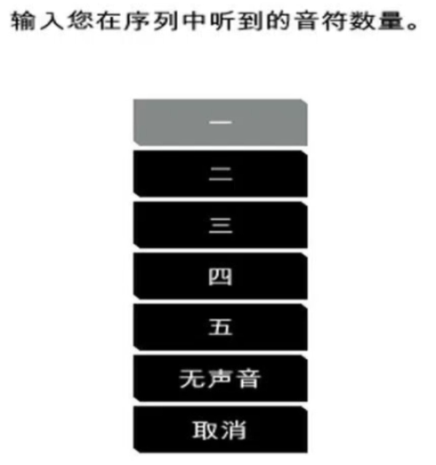
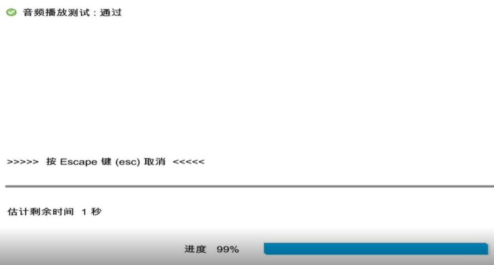
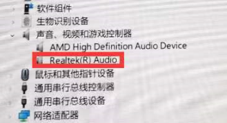

1. 问题
   Windows更新后，系统没有声音。
   
2. 解决方法   
    (1) 硬件检测        
        - 以惠普战系列为例，操作视频：https://cs-china.ext.hp.com/css-wechat-service/doc.html?DOMAIN=CN&docId=20010156&categoryCode=03&r=FQtyuzyZ    
        - 重启电脑，不停的按F2键，进入界面后，按如下步骤进行操作
                  
    
    
    
    
    
    
    
    
    
    
    
    
    
    
    （2） 卸载驱动   
          
          (a) 用鼠标右键点击开始--设备管理器--声音、视频和游戏控制器
          
      
          
          (b) 鼠标右键 点击它 选择卸载设备 卸载时不需要勾选删除驱动程序
          
          (c) 卸载完成后 重启电脑 注意 重启 不可以关机后开机就是重启