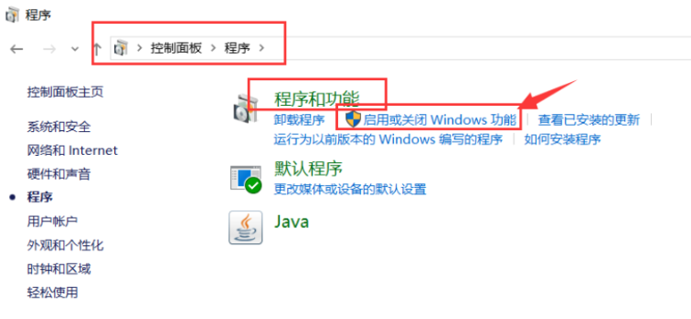
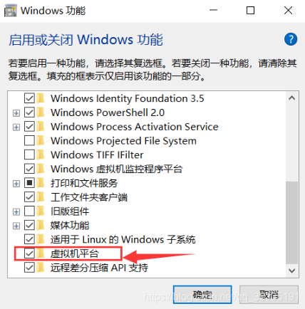
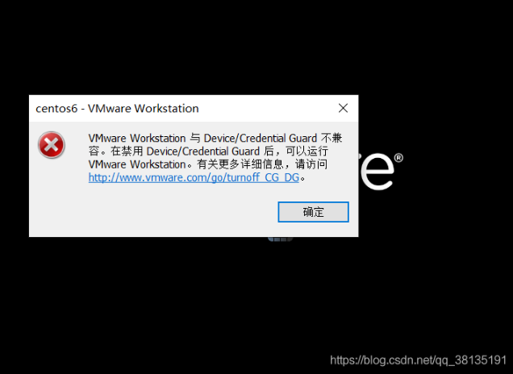
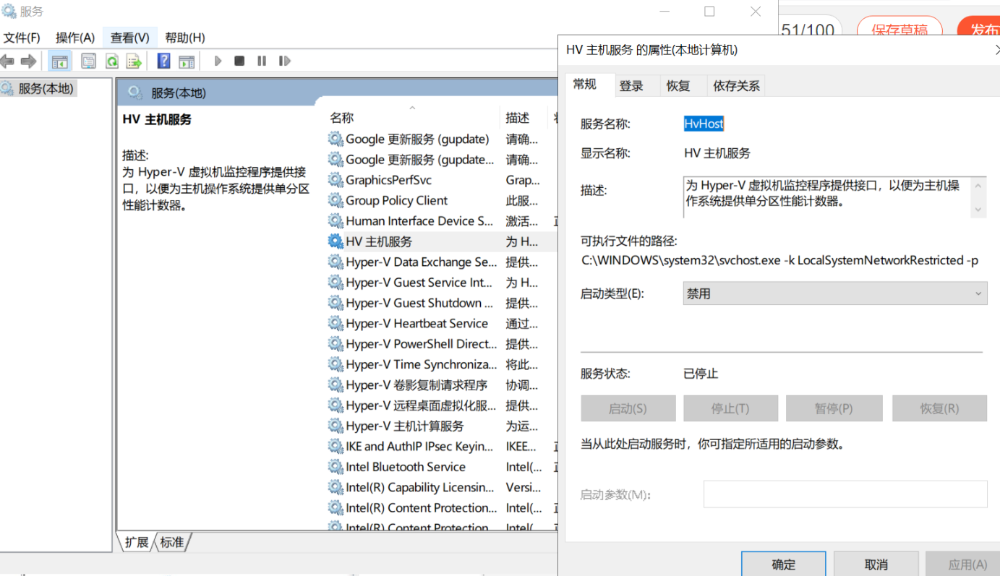

1. 检查是否开启虚拟化

    可以在BIOS或UEFI设置里面启动虚拟化功能，有些主板并没有自动开这个功能，
    这时候就会出现“未能启动虚拟机”的问题。只要在BIOS或UEFI设置开启这个功能就可以了，
    BIOS或UEFI设置不同主板所在的位置不一样。Ⅰ
    ：进入BIOS或UEFI。开机时按【F2】或【F12】或【DEL】或【ESC】等键。
    (一般台式机统是DEL，笔记本根据品牌各有不同)

2. 控制面板设置
    
    
    
    
    重启电脑

3. 不兼容
   
   通过上述配置后，报不兼容错误
   
   
   
   - 方法一：
   
    背景：如果使用的是win10专业版，那么直接：   
    （1）控制面板——程序——打开或关闭windows功能，选择勾选Hyper-V，确定禁用该服务即可；   
    （2）重启电脑，再启动VM虚拟机。

    但是找了半天没找到Hyper-V这个选项，查了VMware Workstation 与 Device/Credential Guard 不兼容。
    在禁用 Device/Credential Guard 后，可以运行 VMware
    这篇博客，里面第二步需要用到的禁用Device Guard：[win+R] 打开输入 gpedit.msc ，
    依次 本地计算机策略 --> 计算机配置 --> 管理模板>系统 --> Device Guard，将 基于虚拟化的安全设置 设置为 “已禁用”。

    但是我gpedit.msc又啥都没出现。里面提到的“策略编辑器”我也没找到，所以继续查，
    发现这篇博客提到如果是win家庭版，没有上面提到那坨是正常的，按照法二就好。

    方法二：  
    1、按下WIN+R打开运行，然后输入services.msc回车；  
    2、在服务中找到 HV主机服务，双击打开设置为禁用
    
    

    3、win+x，然后打开powershell（管理员）运行命令bcdedit /set hypervisorlaunchtype off。
    4、重启电脑，大功告成。

参考
[1] 解决：VMware Workstation 与 Device/Credential Guard 不兼容, 
    原文链接：https://blog.csdn.net/qq_35812205/article/details/121050789
