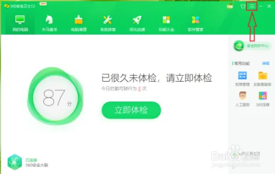
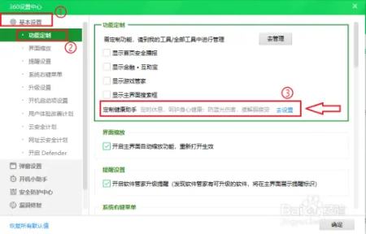
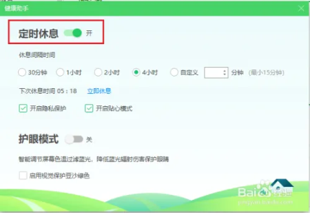

安装了360安全卫士后，360安全卫士会定时启动屏保，有时候视频看得好好的，突然就进入屏保了，而且屏保的壁纸大多是游戏广告，非常的烦人，那么应该怎么关闭呢？

下面小编将介绍如何关闭360安全卫士的屏保。

1. 打开360安全卫士。
2. 点击右上角的【≡ 】按钮。

3. 点击【设置】
4. 依次点击【基本设置】>>【功能定制】；
在右侧的窗口中找到“定制健康助手”，点击右侧的【去设置】。

5. 点击“定时休息”右边的开关。

注意：开关显示“开”，表示定时开启屏保；开关显示“关”，表示关闭屏保。

“定时休息”关闭；取消勾选【开启隐私保护】。

注意：如果不取消勾选，360安全卫士的屏保一样会启动。