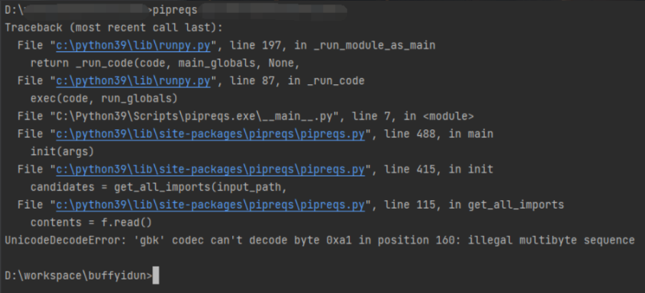

# 安装 requirements.txt
## 1. 全量导出
1. 列出已安装的包
    pip freeze or pip list

2. 导出requirements.txt
    pip freeze > <目录>/requirements.txt

3. 安装包  
    pip install <包名> 或 pip install -r requirements.txt
    
    通过使用== >= <= > <来指定版本，不写则安装最新版
    
    requirements.txt内容格式为：
    ```
    APScheduler==2.1.2
    Django==1.5.4
    MySQL-Connector-Python==2.0.1
    MySQL-python==1.2.3
    PIL==1.1.7
    South==1.0.2
    django-grappelli==2.6.3
    django-pagination==1.0.7

    ```

## 2. 只导出项目相关的包
使用 pipreqs 第三方库生成 requirements.txt 文件
1. 安装pipreqs第三方库
    ```
       pip install pipreqs  
    ```
    pipreqs 第三方库只生成我们当前Python项目中所用到的依赖包及其版本号，
    而pip freeze 方式会把所有包全部列出并生成。

2. 查看pipreqs版本
    ```
        pip show pipreqs
    ```
    
3. 使用pipreqs生成 requirements.txt 文件
    ```
    pipreqs D:\xxx\xxx 
    ```
   
   
   - pipreqs 命令使用方式为：pipreqs 当前Python项目的根目录
   - 上面执行时提示编码方式不对，按照提示，在执行命令中指定编码方式为 utf-8

4. 在执行命令中指定编码方式为 utf-8
    ```
    pipreqs D:\xxx\xxx --encoding=utf8
    ```
   
5. 可以使用参数 --force 来覆盖重新生成 requirements.txt 
    ```
    pipreqs D:\xxx\xxx --encoding=utf8 --force
    ```

# 参考
[1] pip 安装依赖 requirements.txt， https://blog.csdn.net/deflypig/article/details/94425433
[2] Python项目生成requirements.txt文件及pip升级问题解决及流程, https://www.cnblogs.com/wangchengxu/p/15766344.html#:~:text=pip%20install%20-r%20requirements.txt%20%3E%20%E8%AF%A5%E5%91%BD%E4%BB%A4%E4%BC%9A%E6%8A%8A,requirements.txt%20%E6%96%87%E4%BB%B6%E4%B8%AD%E5%88%97%E5%87%BA%E7%9A%84%E5%BA%93%E4%BE%9D%E6%AC%A1%E8%BF%9B%E8%A1%8C%E5%AE%89%E8%A3%85%EF%BC%8C%E6%9C%80%E5%90%8E%E7%AD%89%E5%BE%85%E5%AE%89%E8%A3%85%E5%AE%8C%E6%88%90%E5%8D%B3%E5%8F%AF%E3%80%82%20%E5%9B%9B%E3%80%81%E5%AE%89%E8%A3%85%20pipreqs%20%E7%AC%AC%E4%B8%89%E6%96%B9%E5%BA%93%E6%97%B6%EF%BC%8C%E5%BD%93pip%E7%89%88%E6%9C%AC%E8%BF%87%E4%BD%8E%E6%97%B6%E4%BC%9A%E6%8F%90%E7%A4%BAwarn%EF%BC%9Apip%E7%89%88%E6%9C%AC%E4%BD%8E%2C%20%E9%9C%80%E8%A6%81%E6%9B%B4%E6%96%B0pip%E7%89%88%E6%9C%AC%201.