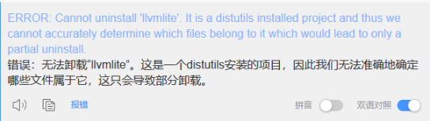
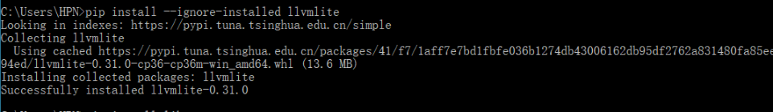

1. 问题：  
    ERROR: Cannot uninstall 'llvmlite'. It is a distutils installed project and 
    thus we cannot accurately determine which files belong to it which would lead to only 
    a partial uninstall.）
    
    

2. 解决：
    在软件“everything”中搜索"llvmlite"，找到所有的“llvmlite”并删除。
    
    
    之后就可以安装了。如果仍无法安装，使用忽略参数安装python包，执行如下命令：
    
    ```
    pip install --ignore-installed llvmlite
    ```
   
    
    
    之后再安装tsfresh即可