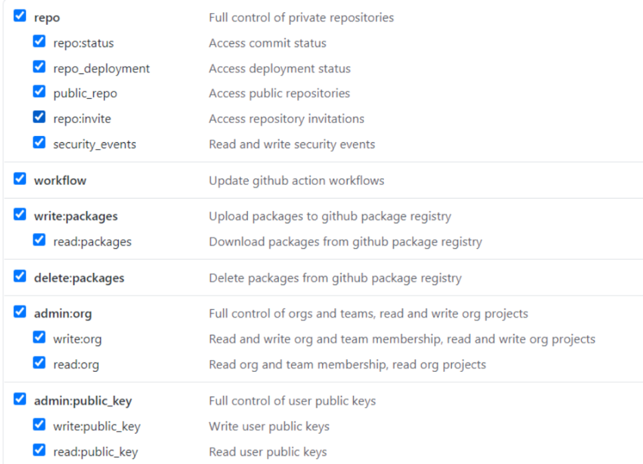

显示如图错误。
在github中：右上角头像-> settings --> Developer settings -->Personal access tokens --> Generate new token，创建新的token

Token创建权限选择，选择有效期，一般全选就行

复制这个token，使用token登录

打开PyCharm,进入 File -> Settings-> Version Control -> GitHub，点击右上角 + 号

选择 Log In via Token

我们可以看到我们GitHub账号已经成功添加到PyCharm

