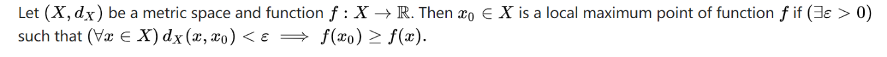
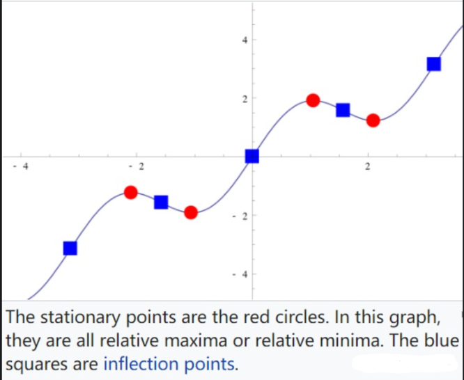
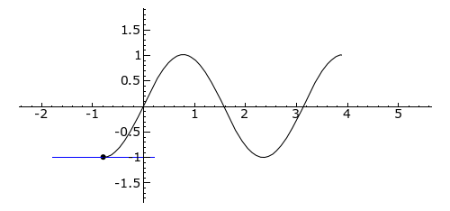
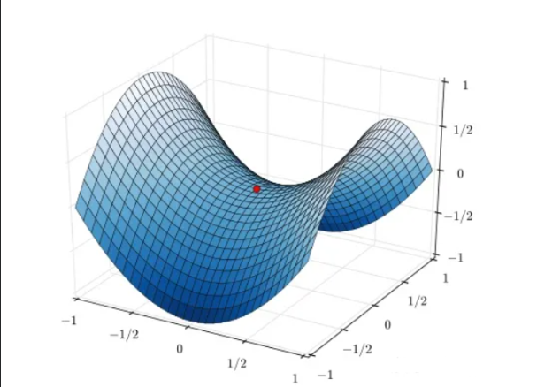
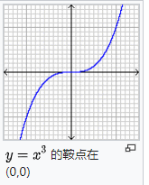
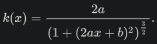

# 临界点、驻点、拐点、鞍点、顶点（曲线）

## 1. 临界点 critial point

 - f: R -> R：不可微或者导数为0的点
 - f: C -> C: 不是全纯（？）或者导数等于0
 - f: R^n -> R: 梯度没有定义或者等于0
 - f: R^m -> R^n: Jacobian的秩不是最大的
 
临界点是我们用来求极值可能出现的点

## 2. 极值点（Extrema）

最大值和最小值，统称为极值点，按范围分局部和全局极值点；

## 3. 驻点（Stationary Point）

驻点又称为稳定点，函数一阶导数为0的点，（局部领域内，倒数很小，函数几乎“停止”增长或者下降，所以叫做稳定点）

## 4. 拐点

拐点（Inflection point）或称反曲点，是一条连续曲线改变凹凸性的点，或者等价地说，是使切线穿越曲线的点。

## 5. 鞍点 saddle point
一个不是局部极值点的驻点称为鞍点。鞍点的英文是 saddle point 或者 minmax point.

鞍点来自于双曲面，比如下图f(x,y)=x^2 - y^2, 在(0, 0) 是一个临界点，但它并不是极值点，
长得像马鞍的形状，所以叫鞍点。

在一维空间里，鞍点是驻点·也是拐点。因为函数图形在鞍点由凸转凹，或由凹转凸。

## 6. 顶点（曲线）vertex (curve)

在平面曲线中， 顶点是曲率的一阶导数为零的点。 这通常是曲率的局部最大值或最小值，
并且一些人将顶点定义为更具体地是曲率的局部极限点。

考虑抛物线 y = ax^2+bx+c

它的有符号的曲率是：

它的曲率极值点在x = -b/2a处取到，这个点是它的驻点（导数也为0），同时这个点也是它的顶点。

# 参考

[1] 临界点、驻点、拐点、鞍点、顶点（曲线）, https://zhuanlan.zhihu.com/p/117224925
[2] 极值点、驻点、拐点、鞍点区别, https://zhuanlan.zhihu.com/p/392995220