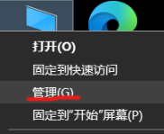
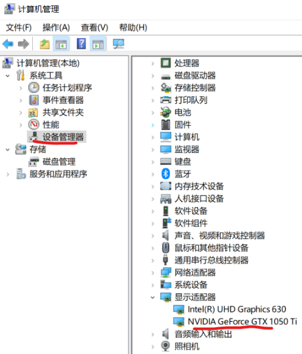
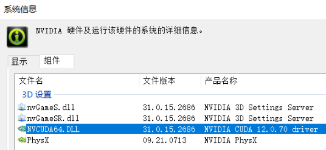
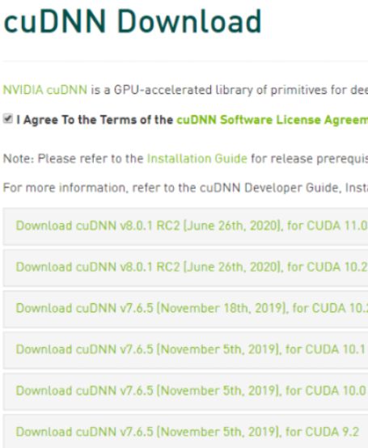
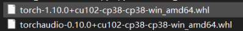

# Win10 + GTX 1050 Ti + CUDA10.2 + cudnn8.6
&emsp;&emsp;带有英伟达显卡的个人游戏本PC，完全可以作为一个小型的深度学习训练机器。使用GPU训练速度比CPU要快出几十倍。
本章主要介绍在Windows环境下，个人PC，配置GPU，构建深度学习环境。

&emsp;&emsp;GPU配置常用网址汇总：英伟达的网址在国内访问不稳定，可以把com改为cn后，较为稳定：
* CUDA和驱动版本有对应关系：https://docs.nvidia.com/cuda/cuda-toolkit-release-notes/index.html
* 驱动下载地址：https://www.nvidia.cn/geforce/drivers/
* CUDA下载网站：https://developer.nvidia.cn/cuda-toolkit-archive
* CUDA 10.2文档：https://docs.nvidia.com/cuda/archive/10.2/
* CUDNN下载网页：https://developer.nvidia.cn/zh-cn/cudnn 
* CUDNN 各文档：https://docs.nvidia.com/cuda/archive/10.2/ 

&emsp;&emsp;深度学习库地址：
* 官网：https://pytorch.org/get-started/previous-versions/
* 历史版本：https://pytorch.org/get-started/previous-versions/


# 1. 显卡状态查看
## 1.1 方法1：从设备管理器查看   
&emsp;&emsp;桌面“我的电脑”右键菜单-->管理(G)  



&emsp;&emsp;可见本机有一个集成显卡和一个独立显卡 1050ti。(初步测试，可能由于设备有一个集成显卡，所以利用GPU训练时，
不会导致电脑无法显示)  

&emsp;&emsp;右键"NVIDIA GeForce GTX 1050 Ti"，选择属性，查看显卡驱动信息。   

*** 注意：  
1. 此处无法更新到最新的驱动，需要从英伟达官网下载最新的驱动程序自行安装。
2. 另外，即便驱动安装到了最新的版本，此处的版本号和安装的号仍然不一致，
   怀疑指代不同的驱动，或者说没有跟随外部的信息。

## 1.2 方法2：从英伟达控制面板查看
&emsp;&emsp;在桌面单击鼠标右键，选择NVIDIA 控制面板，并打开  
   

&emsp;&emsp;在NVIDIA控制面板界面顶栏选择帮助->系统信息打开
   
&emsp;&emsp;NVIDIA驱动版本信息
   
&emsp;&emsp;设置一项内可见名为NVCUDA64.DLL文件，在文件对应产品名称一栏可见当前硬件支持的CUDA版本（对答主本机来说为CUDA11.1）


# 2. 显卡驱动更新
## 2.1 驱动和CUDA对应版本
&emsp;&emsp;CUDA和驱动版本有对应关系（参考https://docs.nvidia.com/cuda/cuda-toolkit-release-notes/index.html），
具体如下：


## 2.2 方法1：从官网下载更新
&emsp;&emsp;在英伟达驱动下载官网：https://www.nvidia.cn/geforce/drivers/，选择手动搜索驱动
   
&emsp;&emsp;下载最新的驱动即可，之后打开软件，按照安装步骤安装即可


# 2.3 方法2：从本地显卡控制软件升级
&emsp;&emsp;如果之前装过英伟达驱动，会有一个“GeForce Experience”应用在windows下，可以进行在线升级。


# 3. CUDA安装
## 3.1 安装
* CUDA下载网站：https://developer.nvidia.cn/cuda-toolkit-archive
* CUDA 10.2文档：https://docs.nvidia.com/cuda/archive/10.2/

&emsp;&emsp;选择需要下载的版本，这里我使用CUDA10.2版本，并选择对应的配置，
可以根据自己的需要选择installer type（推荐exe[local]），这样就下载了离线包，
避免安装中途网络中断等问题。
   
&emsp;&emsp;注意CUDA10.2有一个主包，和2个补丁包，都需要下载

&emsp;&emsp;下载好.exe文件后，直接双击打开，显示临时解压文件位置

&emsp;&emsp;可更改为你想解压到的位置，点击OK，等待系统检查，授权许可，
接下来在安装选项中选择自定义安装，并将VS勾选去掉（否者安装过程容易退出）。

下一步，到达指定安装位置，可以更改为自己想要安装到的位置，然后便静静等待安装完成即可

## 3.2 验证是否安装成功
### 3.2.1 验证方法
&emsp;&emsp;在windows开始菜单，输入cmd，之后打开命令行窗口，输入
```bash
nvcc -V
```

如果现实出CUDA的版本信息，说明安装成功。

### 3.2.2 查看显卡状态
&emsp;&emsp;在windows开始菜单，输入cmd，之后打开命令行窗口，输入
```bash
nvidia-smi
```

如上图，可以看到显卡的驱动程序版本和CUDA的支持版本(这个版本比我安装的版本要高，
不确定这个高版本是否随着驱动也被安装了，估计只是显示这个驱动支持的最高CUDA版本)

## 3.3 配置环境变量
&emsp;&emsp;桌面--》右键单击"我的电脑"图标--》选择属性--》在搜索框搜索“环境变量”--》选择“编辑系统环境变量”  
  
&emsp;&emsp;点击“环境变量”  


&emsp;&emsp;选择上图中“Path”,点击“编辑...”

&emsp;&emsp;新建环境变量，加入如下内容。
```bash
C:\Program Files\NVIDIA GPU Computing Toolkit\CUDA\v10.2
C:\Program Files\NVIDIA GPU Computing Toolkit\CUDA\v10.2\lib\x64
C:\Program Files\NVIDIA GPU Computing Toolkit\CUDA\v10.2\bin
C:\Program Files\NVIDIA GPU Computing Toolkit\CUDA\v10.2\libnvvp
```

# 4. CUDNN安装
&emsp;&emsp;CUDNN需要在英伟达官网注册后，才能下载（注意版本需要和CUDA配套）。
* CUDNN下载网页：https://developer.nvidia.cn/zh-cn/cudnn (注：用cn访问速度更快，".com"可能访问不了)
* CUDNN 各文档：https://docs.nvidia.com/cuda/archive/10.2/
   
&emsp;&emsp;之后会需要你注册一个账号，按照程序引导，注册就好了，注册完后再点击下载cuDNN便会进入下一界面
选择对应的cuDNN下载
  
&emsp;&emsp;将下载下来的cudnn文件解压，并用将解压出的文件，每个目录下的文件拷贝至cuda安装目录下同名的文件夹
（注意不是覆盖拷贝那3个文件夹，是对应拷贝文件夹下的内容）


# 5. 安装Pytorch-GPU版本
## 5.1 安装步骤
* 官网：https://pytorch.org/get-started/previous-versions/
* 历史版本：https://pytorch.org/get-started/previous-versions/
&emsp;&emsp;根据系统环境选择，会得到安装命令：

&emsp;&emsp;在windows开始菜单，输入cmd，之后打开命令行窗口，输入（选择GPU或者CPU版，此处用第一个，
第二个保留使用）:
```bash
# CUDA 10.2
conda install pytorch==1.10.0 torchvision==0.11.0 torchaudio==0.10.0 cudatoolkit=10.2 -c pytorch

# CPU Only
conda install pytorch==1.10.0 torchvision==0.11.0 torchaudio==0.10.0 cpuonly -c pytorch
```
&emsp;&emsp;如果conda命令安装出现联网问题，可在网站下载离线安装包：https://download.pytorch.org/whl/torch_stable.html


&emsp;&emsp;下载完成后，打开下载目录，从菜单选择“打开 Windows PowerShell(R)”

&emsp;&emsp;输入如下命令：
```bash
pip install .\torch-1.10.0+cu102-cp38-cp38-win_amd64.whl
```

## 5.2 验证安装是否成功
&emsp;&emsp;在windows开始菜单，输入cmd，之后打开命令行窗口，输入python进入python环境
```python
import torch
print(torch.cuda.is_available())
print(torch.cuda.device_count())
```


验证成功

# 参考：
1. https://blog.csdn.net/weixin_44739865/article/details/121460260