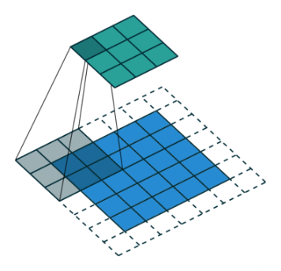
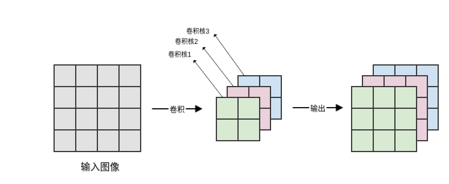
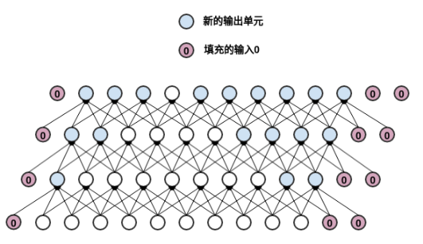
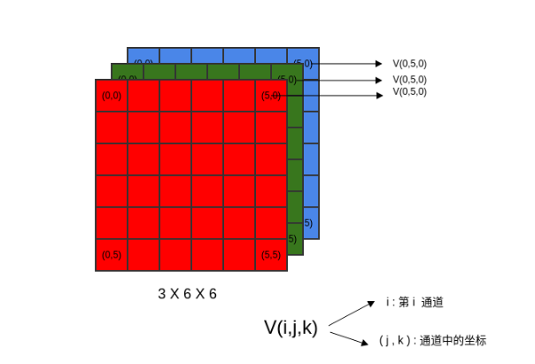
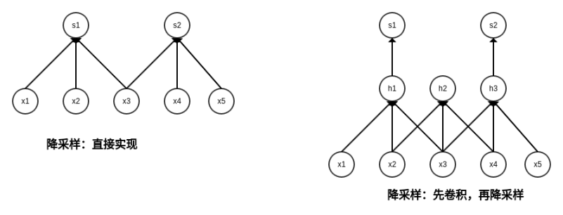
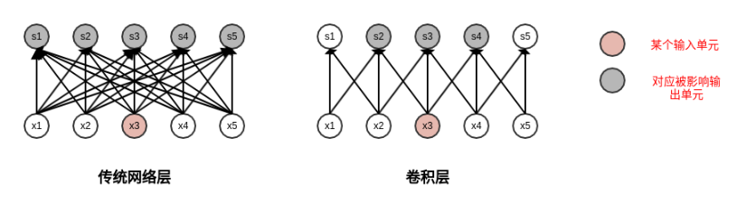
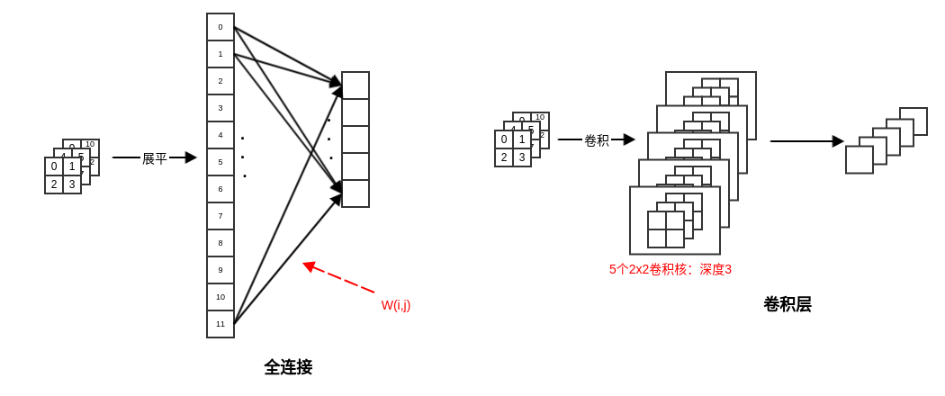

# 1. CNN基础
## 1.1 概念和计算方式
&emsp;&emsp;离散卷积可以视作输入矩阵与一个特殊的核矩阵的乘法
  
&emsp;&emsp;具体计算方式

&emsp;&emsp;如果希望卷积层能够提取多个特征，则可以并行使用多个卷积核，每个卷积核提取一种特征。我们称输出的feature map 具有多个通道channel 

## 1.2 输入填充
1. 在卷积神经网络中，可以隐式地对输入填充零，使其得到加宽。  
    如果未填充零，则网络每一层的宽度会逐层递减。根据卷积的性质，网络每一层宽度减少的数量等于卷积核的宽度减1。

    * 如果卷积核尺寸较大，则网络的宽度迅速缩减，这限制了卷积神经网络的网络深度。
    * 如果卷积核尺寸较小，则可用的卷积核的数量大幅度降低，这限制了卷积神经网络的表达能力。

2. 对输入V有三种填充零的方式：valid 填充、same 填充、full 填充。
3. valid 填充：不使用零来填充输入，卷积核只允许访问那些图像中能完全包含整个核的位置。
    * 在valid 填充模式中，输出的大小在每一层都缩减。假设核的宽度是k，则每经过一层，输出的宽度减少了k-1。
    * 如果输入图像的宽度是m，则网络经过了d层之后，输出的宽度变成m-(k-1)*d。如果核的宽度k非常大时，缩减非常明显。最终网络会缩减到1。
4. same 填充：使用足够的零来填充，使得输出和输入保持相同的大小。这是最常见的填充方式。
    * 在same填充模式中，网络可以包含任意多的卷积层，因为它不存在网络输出宽度缩减的问题。
    * same 填充模式的一个问题是：输入的边缘单元可能存在一定程度上的欠表达。
    因为输入的中间区域的单元的影响域为全部的输出单元，这意味着这些输入单元的信息会被很多输出单元所编码。
    而输入的边缘区域的单元的影响域只是输出单元的一部分，这意味着这些输入单元的信息仅仅被少量输出单元所编码。

5. full 填充：在输入的两端各填充k-1个零，使得每个输入单元都恰好被卷积核访问k次。其中k为卷积核的宽度。
    * 它将从卷积核和输入开始相交的时候开始做卷积。
    * 假设核的宽度是k，则每经过一层，输出的宽度增加了k-1。
        如果输入图像的宽度是m，则网络经过了d层之后，输出的宽度变成m+(k-1)*d。
    * 它使得输入的边缘单元也能够得到充分表达。
    * full 填充的一个问题是：输出的边界单元依赖于更少的输入单元。  
    这使得学习到的结果在输出的中间部分表现较好，边缘部分的表现较差。
    

## 1.3 3D卷积

## 1.4 降采样

&emsp;&emsp;如果对卷积层的输出进行降采样，则表示跳过图片中的一些位置，可以通过设定stride步幅决定。
* 优点：可以降低计算开销。因为它降低了卷积层的输出单元数量，也就降低了高层网络的输入单元数量。
* 缺点：提取的特征可能没有那么好，因为跳过的位置可能包含一些关键信息

## 1.5 反向传播

## 1.6 网络组合形式
* 执行卷积运算：这个阶段是线性变换，其作用是从输入中提取特征。
* 执行非线性的激活函数（如reLU单元）。这个阶段是非线性变换，其作用是引入非线性。
    实际应用中，这一阶段可以被丢弃，因为第三阶段也可以引入非线性。
* 通过池化函数来调整输出：这个阶段也是非线性变换，其作用是降低输出的维度，但保留了大部分重要的信息

# 2. CNN特性
&emsp;&emsp;稀疏交互sparse interactions、参数共享parameter sharing 、等变表示equivariant representation。

## 2.1 稀疏交互
&emsp;&emsp;每个输出单元仅仅与少量的输入单元产生关联。这降低了网络的参数和计算量，不仅减少了模型的存储需求，也降低了计算复杂度.

## 2.2 参数共享
* 在模型的多个位置使用相同的参数。
* 卷积运算在存储需求和计算效率方面要大大优于传统网络层的稠密矩阵的乘法运算

## 2.3 等变表示
&emsp;&emsp;如果一个函数满足：输入发生改变，输出也以同样的方式改变，则称它是等变的equivariant 

# 3. 计算复杂度
假设输入的feature map 为：宽度Wi、高度Hi、输入通道数Ci。假设一共Co个卷积核，每个卷积核的宽度为Wk、
高度为Hk。假设沿着宽度方向卷积的步幅为Sw，沿着高度方向卷积的步幅为Sh。  
* 卷积后的维度: floor((原始尺寸-核尺寸) / 步幅) + 1  (floor向下取整)，通道数为Co
* 参数量：Ci*Wk*Hk*Co
* 计算量(以一次乘-加计算为单位): Ci*Wk*Hk*Co*W0*H0
    * feature map中每个值都通过一次卷积操作，每个卷积的乘加运算量为Ci*Wk*Hk. 一共有Co*W0*H0这样的值

# 4. 全连接 V.S. 卷积层
## 4.1 参数和计算量对比
对于普通的全连接层。
* 参数量：Ci*Wi*Hi*Co*Wo*Ho. 
    * 全连接层是卷积层计算量的(Wi*Hi*Wo*Ho)/(Wk*Hk), 当feature_map高为32*32，卷积核高度2*2，步长1，
      全连接层的计算量是卷积层的256倍。

## 4.2 互相转换
对于一个feature_map
* 若用全连接层，需要展平为Ci*Wi*Hi的一维向量，权重W=W(i,j), i=1,2,...Ci*W*H; j=1,2,...Co, 一共Ci*Wi*Hi*Co个参数。
* 若用卷积层，则需Co个卷积核，每个卷积核尺寸都是Wi*Hi,一共Ci*Wi*Hi*Co个参数。
* 如果W:j重新reshape成Wi*Hi*Ci，则正好与第j个卷积核相同。因二者都是输入的线性组合，因此二者可以互相转换。

# 参考
[1] AI算法工程师手册  https://www.huaxiaozhuan.com/%E6%B7%B1%E5%BA%A6%E5%AD%A6%E4%B9%A0/chapters/5_CNN.html