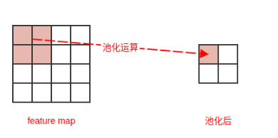

# 1. 定义
池化运算用一个矩阵区域内部的某个总体统计量来作为神经网络在该矩阵区域的输出，它综合了该矩阵区域的信息。
* 最大池化：定义一个窗口，并从窗口内取出最大值作为总体统计量。
* 均值池化：定义一个窗口，并从窗口内取出平均值作为总体统计量

池化层输出的数量由池化的宽度W和步幅S决定。设输入单元的数量为N
单元的数量为floor((N-W)/S) + 1 (向下取整)

如下所示，池化层的输入单元数量为 6 ，池的宽度为3、步幅为 2，池化层的输出单元数量为 2

# 2. 计算复杂度
假设输入的feature map 为：宽度Wi、高度Hi、输入通道数Ci。假设一共Co个卷积核，每个卷积核的宽度为Wk、
高度为Hk。假设沿着宽度方向卷积的步幅为Sw，沿着高度方向卷积的步幅为Sh。  
* 卷积后的维度: floor((原始尺寸-核尺寸) / 步幅) + 1  (floor向下取整)，通道数为Co
* 参数量：0
* 计算量：Ci*Wo*Ho