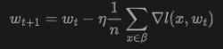
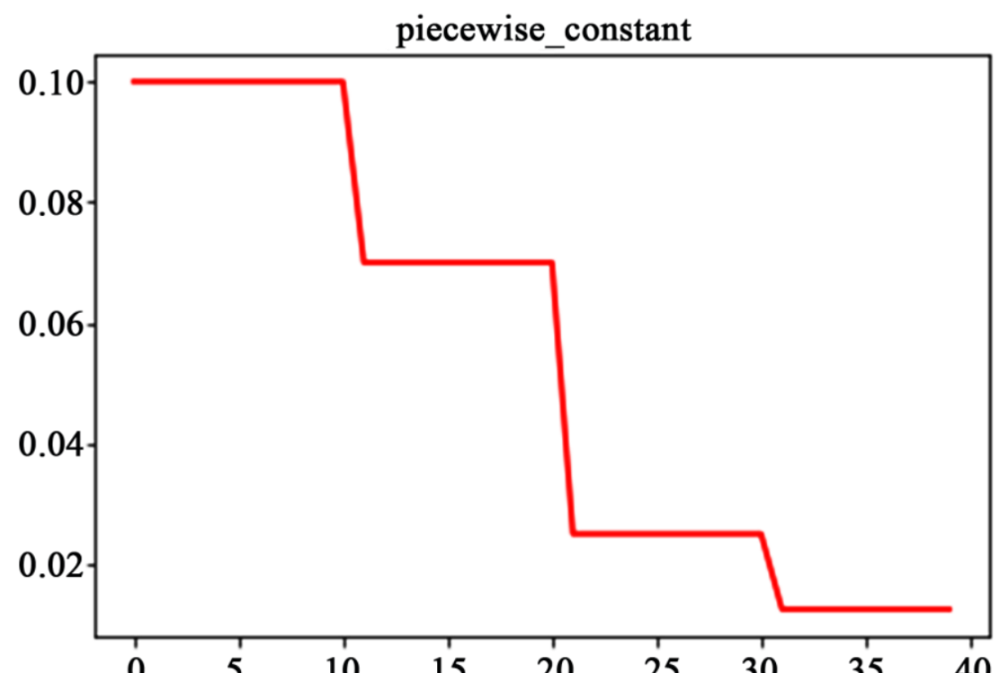
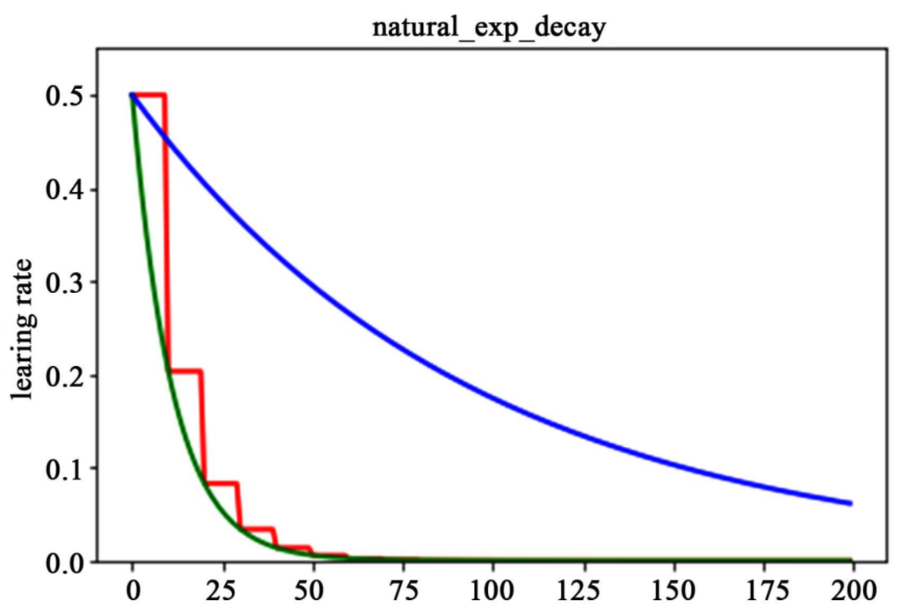
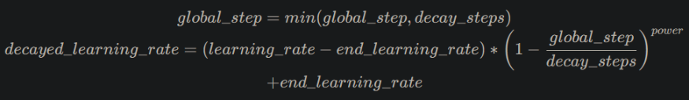
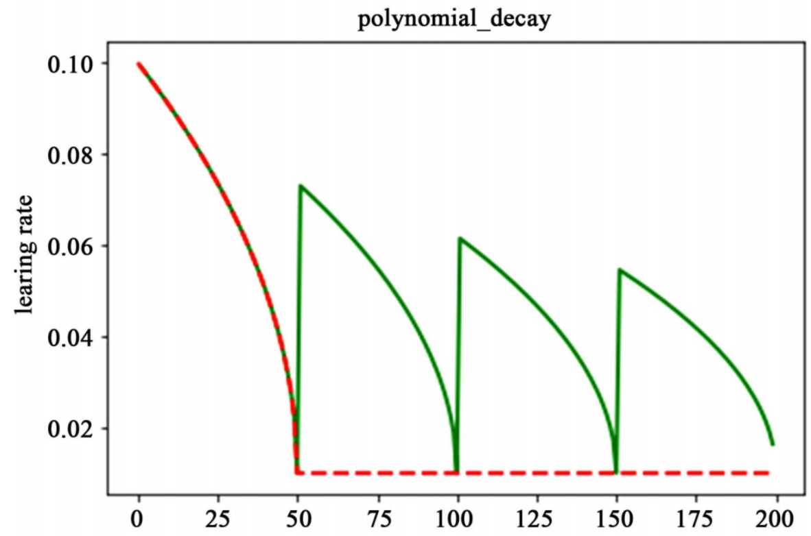
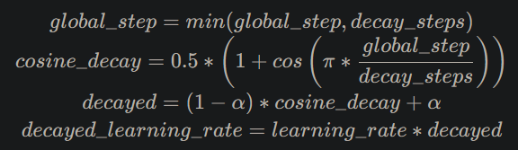
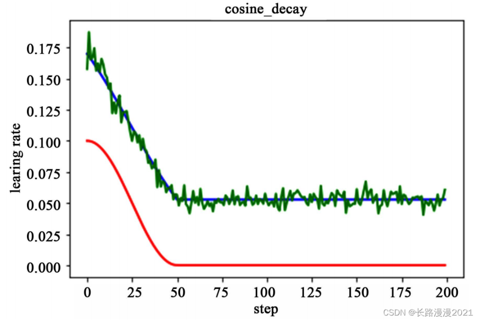
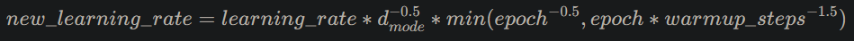
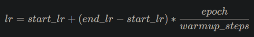
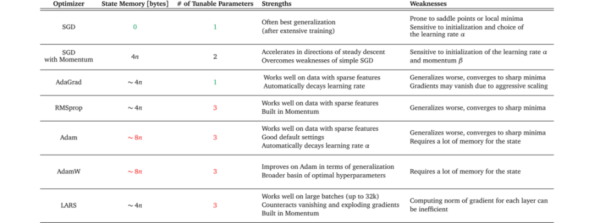

写作日期： 2023-02-09

# 1. 前言

所谓超参数，即不是通过学习算法本身学习出来的，需要作者手动调整（可优化参数）的参数(理论上我们也可以设计一个嵌套的学习过程，
一个学习算法为另一个学习算法学出最优超参数)。

# 2. 模型网络优化

## 2.1 网络设计和选取

网络架构，尽量使用时下最新的模型，并参考论文对应的配置参数。

使用经典网络搭配

- CNN + BatchNorm + Relu
- RNN/Transformer + LayerNorm

其它技巧：

- norm层可以加快收敛，保证模型收敛
- 注意激活层的选取，如sigmoid容易梯度消息
- 可视化查看每层的梯度，是否消失

## 2.2 网络参数选取

在设计网络架构的时候，我们通常需要事先指定一些网络架构参数，比如:

- 卷积层(convlution)参数: 卷积层通道数、卷积核大小、卷积步长。
- 池化层(pooling)参数: 池化核大小、步长等。
- 网络深度（这里特指卷积神经网络 cnn），即 layer 的层数；网络的深度一般决定了网络的表达（抽象）能力，网络越深学习能力越强。
- 网络宽度，即卷积层通道(channel)的数量，也是滤波器（3 维）的数量；网络宽度越宽，代表这一层网络能学习到更加丰富的特征。

这些参数一般在设计网络架构时就已经确定下来了，参数的取值一般可以参考经典 paper 和一些模型训练的经验总结，
或者进行参数搜索

## 2.3 权重参数初始化

常用的初始化方法:

- Xavier，kaiming 系列
- 使用预训练模型参数，往往收敛的更快更好

尝试不同的权重初始化方法

尝试不同的卷积核权重初始化方式。目前常用的权重初始化方法有 Xavier 和 kaiming 系列，
pytorch 在 torch.nn.init 中提供了常用的初始化方法函数，
默认是使用 kaiming 均匀分布函数: nn.init.kaiming_uniform_()。


pytorch框架默认是使用 kaiming 均匀分布函数

下面是一个使用 kaiming_normal_（kaiming 正态分布）设置卷积层权重初始化的示例代码。

```python
import torch
import torch.nn as nn

# 定义一个卷积层
conv = nn.Conv2d(in_channels=3, out_channels=16, kernel_size=3, stride=1, padding=1)

# 使用He初始化方式设置卷积层的权重
nn.init.kaiming_normal_(conv.weight, mode="fan_out", nonlinearity="relu")
```

使用不同的卷积层权重初始化方式，会有不同的输出效果。分别使用 xavier_normal_ 和 xavier_normal_ 初始化权重，
并使一个输入图片经过一层卷积层，其输出效果是不同的，对比图如下所示:


# 3. batch size设定

## 3.1.1 背景知识

深度学习中经常看到 epoch、 iteration 和 batchsize，这三个名字的区别如下：

- batch size：批大小。在深度学习中，一般采用 SGD 训练，即每次训练在训练集中取 batch_size 个样本训练；
- iteration：1 个 iteration 等于使用 batch_size 个样本训练一次；
- epoch：1 个 epoch 等于使用训练集中的全部样本训练一次；

batch size 的大小会影响模型的收敛速度和优化程度。同时其也直接影响到 GPU 内存的使用情况，
如果你的 GPU 内存（显存）不大，该数值最好设置小一点，否则会出现显存溢出的错误。

## 3.1.2 batch size选择

batch size 是所有超参数中最好调的一个，也是应该最早确定下来的超参数，其设置的原则就是，batch size 别太小，
也别太大，取中间合适值为宜，通常最好是 2 的 n 次方，如 16, 32, 64, 128。
在常见的 setting（～100 epochs），batch size 一般不会低于 16。

```
设置为  2 的 n 次方的原因：计算机的 gpu 和 cpu 的 memory 
都是 2 进制方式存储的，设置 2 的 n 次方可以加快计算速度。
```

batch size 太小和太大的问题:

batch size 太小：每次计算的梯度不稳定，引起训练的震荡比较大，很难收敛。
batch size 太大: 虽然大的 batch size 可以减少训练时间，即收敛得快，但深度学习的优化（training loss 降不下去）
和泛化（generalization gap 很大）都会出问题。
（结论来源论文-Accurate, Large Minibatch SGD: Training ImageNet in 1 Hour）

有论文指出 LB（Large batch size）之所以出现 Generalization Gap 问题，
是因为 LB 训练的时候更容易收敛到 sharp minima，而 SB （Small batch size）则更容易收敛到 flat minima，
并且 LB 还不容易从这些 sharp minima 中出来，另外，作者认为关于 batch size 的选择是有一个阈值的，
一旦超过这个阈值，模型的质量会退化，网络的准确度大幅下降。


Flat_and_Sharp_Minima

```
参考论文来源 On Large-Batch Training for Deep Learning: Generalization Gap and Sharp Minima[1]，
该论文主要探究了深度学习中一个普遍存在的问题——使用大的 batchsize 
训练网络会导致网络的泛化性能下降（文中称之为Generalization Gap）。
```

另外:

合适的 batch size 范围和训练数据规模、神经网络层数、单元数都没有显著的关系。
合适的 batch size 范围主要和收敛速度、随机梯度噪音有关。

### 3.1.3 Batch size和学习率的关系

batch size 和学习率有紧密联系，随机梯度下降算法的原理如下:



n是批量大小(batchsize)， η是学习率(learning rate)。从随机梯度下降算法（SGD），
可知道除了梯度本身，这两个因子直接决定了模型的权重更新，从优化本身来看它们是影响模型性能收敛最重要的参数。

学习率（learning rate）直接影响模型的收敛状态，batch size 则影响模型的泛化性能，
两者又是分子分母的直接关系，相互也可影响。

参考来源-【AI不惑境】学习率和batchsize如何影响模型的性能？[3]

```
Krizhevsky提出，如果BatchSize加大，可以加大学习率，当BatchSize加大k倍，
则学习也加大k的开根号位数，后来发现使用线性变换调节二者关系效果更好。
用这种方法将AlexNet的BatchSize从128加大到1024精度只损失1%。
但是太大的学习率又会在一开始使模型训练不稳定，解决该问题的方法是学习率warm-up
```

由于目前大都采用自适应学习率调整策略，往往只有初始化的时候需要考虑batch size和学习率的关系，
之后，策略会自动调整学习率。

# 4. 学习率设定

## 4.1 背景知识

反向传播指的是计算神经⽹络参数梯度的⽅法。总的来说，反向传播依据微积分中的链式法则，
沿着从输出层到输⼊层的顺序，依次计算并存储⽬标函数有关神经⽹络各层的中间变量以及参数的梯度。

前向传播：输入层-->输出层；反向传播：输出层-->输入层。

现阶段的所有深度神经网络的参数都是由 BP（反向传播）算法训练得到的，
而 BP 算法是基于梯度下降（gradient desent）策略，以目标的负梯度方向对参数进行调整的，
以下公式描述了这种关系。


即：new_weight= existing_weight — learning_rate * gradient

n是批量大小(batchsize)， η是学习率(learning rate)。w是待更新的权重参数。学习率范围为(0, 1)
控制着算法每一轮迭代中更新的步长，很明显可得，若学习率太大则容易振荡导致不收敛，
太小则收敛速度又会过慢（即损失函数的变化速度过慢）。虽然使用低学习率可以确保我们不会错过任何局部极小值，
但也意味着我们将花费更长的时间来进行收敛，特别是在被困在高原区域的情况下。


采用小学习速率（顶部）和大学习速率（底部）的梯度下降。图来源：Coursera 上吴恩达（Andrew Ng）的机器学习课程。

## 4.2 如何设置学习率

训练CNN模型，如何设置学习率有两个原则可以遵守:

- 模型训练开始时的初始学习率不宜过大，cv 类模型以 0.01 和 0.001 为宜；
- 模型训练过程中，学习率应随轮数（epochs）增加而衰减。
- 学习率的范围通常为[10e-6, 1] 

除以上固定规则的方式之外，还有些经验可以参考:

- 对于图像分类任务，使用 finetune 方式训练模型，训练过程中，冻结层的不需要过多改变参数，
  因此需要设置较小的学习率，更改过的分类层则需要以较大的步子去收敛，学习率往往要设置大一点。
  （来源-pytorch 动态调整学习率[4]）

- 寻找理想学习率或诊断模型训练学习率是否合适时也可借助模型训练曲线(learning curve)的帮助。
  下图展示了不同大小的学习率下损失函数的变化情况，图来自于 cs231n。
  
    
    不同学习率下训练损失值随训练轮数增加呈现的状态

为了使训练数据集中的所有数据对模型训练有相等的作用，通常是以epoch为单位衰减学习率。

学习率调整方法基本上有两种：

1. 基于经验的手动调整。
   
    通过尝试不同的固定学习率，如3、1、0.5、0.1、0.05、0.01、0.005，0.005、0.0001、0.00001等，观察迭代次数和loss的变化关系，找到loss下降最快关系对应的学习率。关于学习率的大小所带来的loss变化：
   
   ```
   1. 太大: 如果训练初期loss出现梯度爆炸或NaN这样的情况（暂时排除其他原因引起的loss异常），
       说明初始学习率偏大，可以将初始学习率降低10倍再次尝试；
   2. 太小: 如果训练初期loss下降缓慢，说明初始学习率偏小，可以将初始学习率增加5倍或10倍再次尝试；
   3. 需要进一步降低了: 如果训练一段时间后loss下降缓慢或者出现震荡现象，
       可能训练进入到一个局部最小值或者鞍点附近。如果在局部最小值附近，
       需要降低学习率使训练朝更精细的位置移动；如果处于鞍点附件，需要适当增加学习率使步长更大跳出鞍点
   4. 如果网络权重采用随机初始化方式从头学习，有时会因为任务复杂，初始学习率需要设置的比较小，否则很容易梯度飞掉带来模型的不稳定(振荡)。这种思想也叫做Warmup，在预热的小学习率下，模型可以慢慢趋于稳定,等模型相对稳定后再选择预先设置的学习率进行训练,使得模型收敛速度变得更快，模型效果更佳。
   5. 如果网络基于预训练权重做的微调(finetune)，由于模型在原数据集上以及收敛，有一个较好的起点，可以将初始学习率设置的小一些进行微调，比如0.0001。
   ```

2. 基于策略的调整。
   
       2.1 fixed 、exponential、polynomial
       2.2. 自适应动态调整。adadelta、adagrad、ftrl、momentum、rmsprop、sgd

## 4.5 常见学习率策略

### 4.5.1 概述

以上是理论分析，但在实际应用中，以 pytorch 框架为例，pyTorch 提供了六种学习率调整方法，
可分为三大类，分别是:

- 有序调整：按照一定规律有序进行调整，这一类是最常用的，分别是等间隔下降(Step)， 
  按需设定下降间隔(MultiStep)，指数下降(Exponential)和 CosineAnnealing。
  这四种方法的调整时机都是人为可控的，也是训练时常用到的。
- 自适应调整: 如依据训练状况伺机调整 ReduceLROnPlateau 方法。
  该法通过监测某一指标的变化情况，当该指标不再怎么变化的时候，就是调整学习率的时机，因而属于自适应的调整。
- 自定义调整: 自定义调整 Lambda。Lambda 方法提供的调整策略十分灵活，
  我们可以为不同的层设定不同的学习率调整方法，这在 fine-tune 中十分有用，
  我们不仅可为不同的层设定不同的学习率，还可以为其设定不同的学习率调整策略，简直不能更棒了!

常见的学习率调整方法有:

- lr_scheduler.StepLR: 等间隔调整学习率。调整倍数为 gamma 倍，调整间隔为 step_size。
- lr_scheduler.MultiStepLR: 按设定的间隔调整学习率。适合后期使用，通过观察 loss 曲线，手动定制学习率调整时机。
- lr_scheduler.ExponentialLR: 按指数衰减调整学习率，调整公式:
- lr_scheduler.CosineAnnealingLR: 以余弦函数为周期，并在每个周期最大值时重新设置学习率。
- lr_scheduler.ReduceLROnPlateau: 当某指标不再变化(下降或升高)，调整学习率（非常实用的策略）。
- lr_scheduler.LambdaLR: 为不同参数组设定不同学习率调整策略。

学习率调整方法类的详细参数及类方法定义，请参考 pytorch 官方库文档-torch.optim[5]。

学习率衰减常用参数有哪些

| 参数名称              | 参数说明                      |
| ----------------- | ------------------------- |
| learning_rate     | 初始学习率                     |
| global_step       | 用于衰减计算的全局步数，非负，用于逐步计算衰减指数 |
| decay_steps       | 衰减步数，必须是正值，决定衰减周期         |
| decay_rate        | 衰减率                       |
| end_learning_rate | 最低的最终学习率                  |
| cycle             | 学习率下降后是否重新上升              |
| alpha             | 最小学习率                     |
| num_periods       | 衰减余弦部分的周期数                |
| initial_variance  | 噪声的初始方差                   |
| variance_decay    | 衰减噪声的方差                   |

### 4.5.2 详细介绍

1. 分段常数衰减（Piecewise Decay）  
   
    分段常数衰减需要事先定义好的训练次数区间，在对应区间置不同的学习率的常数值，
    一般情况刚开始的学习率要大一些，之后要越来越小，要根据样本量的大小设置区间的间隔大小，
    样本量越大，区间间隔要小一点。下图即为分段常数衰减的学习率变化图，横坐标代表训练次数，纵坐标代表学习率。
   
    

2. 指数衰减（Exponential Decay）
   以指数衰减方式进行学习率的更新，学习率的大小和训练次数指数相关，其更新规则为：
   
   ```
       decayed_learning_rate = learning_rate ∗ decay_rate^(global_step / decay_steps)
   ```
   
   这种衰减方式简单直接，收敛速度快，是最常用的学习率衰减方式，如下图所示，
   绿色的为学习率随训练次数的指数衰减方式，红色的即为分段常数衰减，
   它在一定的训练区间内保持学习率不变。
   
    

3. 自然指数衰减（Natural Exponential Decay）
   它与指数衰减方式相似，不同的在于它的衰减底数是e，故而其收敛的速度更快，
   一般用于相对比较容易训练的网络，便于较快的收敛，其更新规则如下
   
   ```
       decayed_learning_rate = learning_rate ∗ e^(-decay_steps / global_step)
   ```
   
    下图为为分段常数衰减、指数衰减、自然指数衰减三种方式的对比图，红色的即为分段常数衰减图，
    阶梯型曲线。蓝色线为指数衰减图，绿色即为自然指数衰减图，很明可以看到自然指数衰减方式下
    的学习率衰减程度要大于一般指数衰减方式，有助于更快的收敛。
   
    

4. 多项式衰减（Polynomial Decay）
   
   应用多项式衰减的方式进行更新学习率，这里会给定初始学习率和最低学习率取值，然后将会按照给定的衰减方式
   将学习率从初始值衰减到最低值,其更新规则如下式所示。
   
    
   
    需要注意的是，有两个机制，降到最低学习率后，到训练结束可以一直使用最低学习率进行更新，
    另一个是再次将学习率调高，使用 decay_steps 的倍数，取第一个大于 global_steps 的结果，
    如下式所示.它是用来防止神经网络在训练的后期由于学习率过小而导致的网络一直在
    某个局部最小值附近震荡，这样可以通过在后期增大学习率跳出局部极小值。
   
   ```
       decay_steps = decay_steps ∗ ceil(global_step / decay_steps)
   ```
   
    如下图所示，红色线代表学习率降低至最低后，一直保持学习率不变进行更新，
    绿色线代表学习率衰减到最低后，又会再次循环往复的升高降低。
   
    

5. 余弦衰减（Cosine Annealing Decay）
   
   余弦衰减就是采用余弦的相关方式进行学习率的衰减，衰减图和余弦函数相似。
   该方法为论文SGDR：Stochastic Gradient Descent with Warm Restarts中
   cosine annealing动态学习率。其更新机制如下式所示：
   
   
   
   如下图所示，红色即为标准的余弦衰减曲线，学习率从初始值下降到最低学习率后保持不变。
   蓝色的线是线性余弦衰减方式曲线，它是学习率从初始学习率以线性的方式下降到最低学习率值。
   绿色噪声线性余弦衰减方式。
   
   

6.  多间隔衰减（Multi Step Decay）
    间隔衰减 （Step Decay）是指学习率按照指定的轮数间隔进行衰减，该过程可举例说明为：
    
    ```
    learning_rate = 0.5 # 学习率初始值
    step_size = 30      # 每训练30个epoch进行一次衰减
    gamma = 0.1         # 衰减率
    
    learning_rate = 0.5    if epoch < 30 
    learning_rate = 0.05   if 30 <= epoch < 60
    learning_rate = 0.005  if 60 <= epoch < 90
    ```
  
    多间隔衰减（Multi Step Decay）是指学习率按特定间隔进行衰减，与间隔衰减的区别在于：
    间隔衰减的epoch间隔是单一且固定的，而多间隔衰减中的epoch间隔是预先指定的多间隔。该过程可举例说明为：

    ```
    learning_rate = 0.5    # 学习率初始值
    milestones = [30, 50]  # 指定轮数间隔
    gamma = 0.1            # 衰减率
    
    learning_rate = 0.5    if epoch < 30
    learning_rate = 0.05   if 30 <= epoch < 50
    learning_rate = 0.005  if 50 <= epoch
    ```
    
7. 逆时间衰减（Inverse Time Decay）  
   学习率大小与当前衰减次数成反比。其计算公式如下：
   
   ```
      new_learning_rate = learning_rate / (1 + gamma ∗ epoch) 
   ```
   
   其中，learning_rate为初始学习率，gamma为衰减率，epoch为训练轮数。 

8. Lambda衰减（Lambda Decay）   

   使用lambda函数来设置学习率，其中lambda函数通过epoch计算出一个因子，
   使用该因子乘以初始学习率。该衰减过程可参考如下例子： 
   
   ```
    learning_rate = 0.5                      # 学习率初始值
    lr_lambda = lambda epoch: 0.95 ** epoch  # 定义lambda函数
    
    learning_rate = 0.5                      # 当epoch = 0时，0.5 * 0.95 ** 0 = 0.5
    learning_rate = 0.475                    # 当epoch = 1时，0.5 * 0.95 ** 1 = 0.475
    learning_rate = 0.45125                  # 当epoch = 2时，0.5 * 0.95 ** 2 = 0.45125
   ```
   
9. 诺姆衰减（Noam Decay）

    诺姆衰减的计算方式如下：
    
       
    
     其中，dmodel 代表模型的输入、输出向量特征维度，warmup_steps 为预热步数，learning_rate 为初始学习率。
     更多细节请参考论文: [attention is all you need](https://arxiv.org/pdf/1706.03762.pdf)。

10. loss自适应衰减（Reduce On Plateau）

    当loss停止下降时，降低学习率。其思想是：一旦模型表现不再提升，
    将学习率降低 2-10 倍对模型的训练往往有益。此外，每降低一次学习率后，将会进入一个冷静期。
    在冷静期内不会监控loss变化也不会进行衰减。当冷静期结束后，会继续监控loss的上升或下降。
    
11. 线性学习率热启动（Linear Warm Up）

    线性学习率热启动是一种学习率优化策略，在正常调整学习率前，先逐步增大学习率。
    可借鉴论文[《Cyclical Learning Rates for Training Neural Networks》](https://arxiv.org/abs/1506.01186)文中
    介绍了估计最小学习率和最大学习率的方法，比如在首次训练时（第1个epoch），
    先设置一个非常小的初始学习率，在每个batch之后都更新网络，同时增加学习率，
    统计每个batch计算出的loss，看增加到多大时，loss开始变差（很容易看到，
    调大到一定程度，loss变大，甚至变成nan），从而得到初始学习率。其核心在于将学习率由小变大。

    当训练步数小于热启动步数（warmup_steps）时，学习率 lr 按如下方式更新：
    
    
    
    当训练步数大于等于热身步数（warmup_steps）时，学习率 lr 为：
    
        lr = learning rate
    
    其中，lr 为热身之后的学习率，start_lr 为学习率初始值，end_lr 为最终学习率，epoch 为训练轮数

### 4.5.3 torch中绘制学习率曲线
```python
model = torch.nn.Linear(2, 1)
optimizer = torch.optim.SGD(model.parameters(), lr=1.0)
lambda1 = lambda epoch: 0.65 ** epoch
scheduler = torch.optim.lr_scheduler.LambdaLR(optimizer, lr_lambda=lambda1)     # 后面的代码主要在这里更改，所以不再赘述

lrs = []

for _ in range(10):
    optimizer.step()
    lrs.append(optimizer.param_groups[0]["lr"])
    # lrs.append(scheduler.get_lr())  # 与上一句功能相同
    # print("Factor = ", round(0.65 ** i,3)," , Learning Rate = ",round(optimizer.param_groups[0]["lr"],3))
    scheduler.step()
plt.plot(range(10),lrs)
```

# 5. 优化器
## 5.1 优化器定义

优化器（优化算法）优化的是神经元参数的取值(w, b)。优化过程如下：假设θ表示神经网络中的参数，J(θ)表示
在给定的参数取值下，训练数据集上损失函数的大小（包括正则化项），则优化过程即为寻找某一参数θ，
使得损失函数J(θ)最小。

在完成数据预处理、数据增强，模型构建和损失函数确定之后，深度学习任务的数学模型也就确定下来了，
接下来自然就是选择一个合适的优化器(Optimizer)对该深度学习模型进行优化（优化器选择好后，
选择合适的学习率调整策略也很重要）。

## 5.2 优化器选择

最为常用且经典的优化器算法是 （基于动量的）随机梯度下降法 SGD（stochastic gradient descent） 
和 Adam 法，其他常见的优化器算法有 Nesterov 型动量随机下降法、Adagrad 法、Adadelta 法、RMSProp 法。

优化器的选择虽然没有通用的准则，但是也还是有些经验可以总结的:

- SGD 是最常见的神经网络优化方法，收敛效果较稳定，但是收敛速度过慢。
- Adam 等自适应学习率算法对于稀疏数据具有优势，且且收敛速度很快，但是收敛效果不稳定（容易跳过全局最优解）。

下表 1 概述了几种优化器的优缺点，通过下表可以尝试找到与数据集特征、训练设置和项目目标相匹配的优化器。

某些优化器在具有稀疏特征的数据上表现出色，而其他优化器在将模型应用于以前未见过的数据时可能表现更好。
一些优化器在大批量（batch_size 设置较大）下工作得很好，
而另一些优化器会在泛化不佳的情况下收敛到极小的最小值。



网络上有种 tricks 是将 SGD 和 Adam 组合使用，先用 Adam 快速下降，再用 SGD 调优。
但是这种策略也面临两个问题: 什么时候切换优化器和切换后的 SGD 优化器使用什么样的学习率？
论文 SWATS Improving Generalization Performance by Switching from Adam to SGD
给出了答案，感兴趣的读者可以深入阅读下 paper。

优化器的算法原理可以参考花书第八章内容，Pytorch 框架优化器类的详细参数及类方法定义，
请参考 pytorch 官方库文档-torch.optim[8]。

# 6. 模型finetune

由于初始化的权重可能会导致模型收敛不佳，且为了加快训练速度，可以预训练模型的权值参数作为
我们自定义模型的初始化参数。在基础模型基础上，针对特定任务在进行调优，这个过程称为 finetune，
更广泛的称之为迁移学习。fintune 的本质其实就是，让我们有一个较好的权重初始化值。

finetune的好处：
- 加快模型收敛
- 往往比重头训能得到一个更好的模型

模型 finetune 一般步骤如下:

- 获取预训练模型的权重（如  imagenet ）；
- 使用预训练模型权重初始化我们的模型，即加载预训练模型权重参数。

模型 finetune 一般有两种情况:
- 数据量少的情况：直接使用预训练模型权重当作特征提取器，只改变模型最后的全连接层。
- 有一定数据量：全网调优比固定层效果好，可以可虑浅层用较低的学习略（底层作为特征提取器），高层用高些的学习率。
- 网络有部分相同：使用自定义网络结构，只有部分网络和预训练模型相同，加载相同的权重，加快训练时间

# 参考

[1] 深度学习炼丹-超参数设定和模型训练, https://mp.weixin.qq.com/s/upps5iZYHzRCZbEZ0wyvBg
[2] batchsize和数据量设置比例_设置BatchSize, https://blog.csdn.net/weixin_39695306/article/details/111716140
[3] 深度学习实战（八）——如何设置学习率，https://blog.csdn.net/qq_37764129/article/details/94032900
[4] 学习率设置，https://blog.csdn.net/xq151750111/article/details/125789981 
