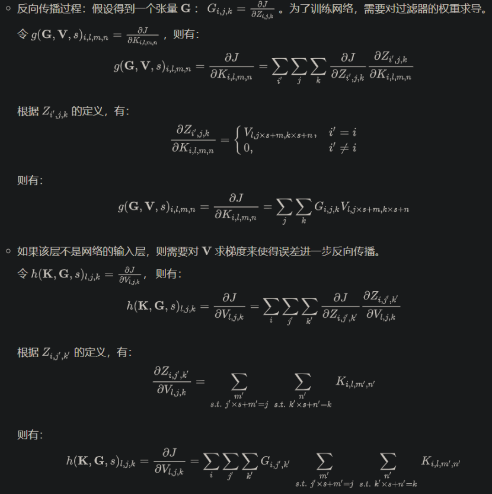
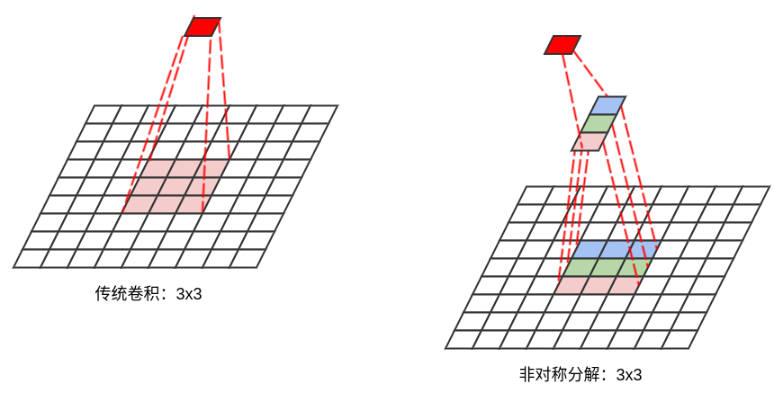
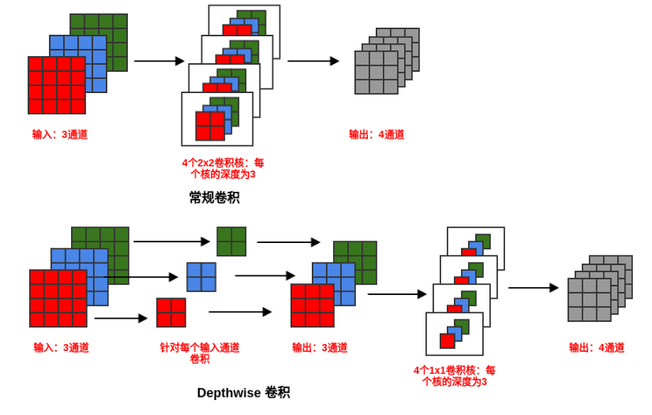

# 1. CNN基础
## 1.1 概念和计算方式
&emsp;&emsp;离散卷积可以视作输入矩阵与一个特殊的核矩阵的乘法
  
&emsp;&emsp;具体计算方式


&emsp;&emsp;如果希望卷积层能够提取多个特征，则可以并行使用多个卷积核，每个卷积核提取一种特征。我们称输出的feature map 具有多个通道channel 


## 1.2 输入填充
1. 在卷积神经网络中，可以隐式地对输入填充零，使其得到加宽。  
    如果未填充零，则网络每一层的宽度会逐层递减。根据卷积的性质，网络每一层宽度减少的数量等于卷积核的宽度减1。

    * 如果卷积核尺寸较大，则网络的宽度迅速缩减，这限制了卷积神经网络的网络深度。
    * 如果卷积核尺寸较小，则可用的卷积核的数量大幅度降低，这限制了卷积神经网络的表达能力。

2. 对输入V有三种填充零的方式：valid 填充、same 填充、full 填充。
3. valid 填充：不使用零来填充输入，卷积核只允许访问那些图像中能完全包含整个核的位置。
    * 在valid 填充模式中，输出的大小在每一层都缩减。假设核的宽度是k，则每经过一层，输出的宽度减少了k-1。
    * 如果输入图像的宽度是m，则网络经过了d层之后，输出的宽度变成m-(k-1)*d。如果核的宽度k非常大时，缩减非常明显。最终网络会缩减到1。
4. same 填充：使用足够的零来填充，使得输出和输入保持相同的大小。这是最常见的填充方式。
    * 在same填充模式中，网络可以包含任意多的卷积层，因为它不存在网络输出宽度缩减的问题。
    * same 填充模式的一个问题是：输入的边缘单元可能存在一定程度上的欠表达。
    因为输入的中间区域的单元的影响域为全部的输出单元，这意味着这些输入单元的信息会被很多输出单元所编码。
    而输入的边缘区域的单元的影响域只是输出单元的一部分，这意味着这些输入单元的信息仅仅被少量输出单元所编码。


5. full 填充：在输入的两端各填充k-1个零，使得每个输入单元都恰好被卷积核访问k次。其中k为卷积核的宽度。
    * 它将从卷积核和输入开始相交的时候开始做卷积。
    * 假设核的宽度是k，则每经过一层，输出的宽度增加了k-1。
        如果输入图像的宽度是m，则网络经过了d层之后，输出的宽度变成m+(k-1)*d。
    * 它使得输入的边缘单元也能够得到充分表达。
    * full 填充的一个问题是：输出的边界单元依赖于更少的输入单元。  
    这使得学习到的结果在输出的中间部分表现较好，边缘部分的表现较差。
    

## 1.3 3D卷积


## 1.4 降采样

&emsp;&emsp;如果对卷积层的输出进行降采样，则表示跳过图片中的一些位置，可以通过设定stride步幅决定。
* 优点：可以降低计算开销。因为它降低了卷积层的输出单元数量，也就降低了高层网络的输入单元数量。
* 缺点：提取的特征可能没有那么好，因为跳过的位置可能包含一些关键信息


## 1.5 反向传播


## 1.6 网络组合形式
* 执行卷积运算：这个阶段是线性变换，其作用是从输入中提取特征。
* 执行非线性的激活函数（如reLU单元）。这个阶段是非线性变换，其作用是引入非线性。
    实际应用中，这一阶段可以被丢弃，因为第三阶段也可以引入非线性。
* 通过池化函数来调整输出：这个阶段也是非线性变换，其作用是降低输出的维度，但保留了大部分重要的信息

# 2. CNN特性
&emsp;&emsp;稀疏交互sparse interactions、参数共享parameter sharing 、等变表示equivariant representation。

## 2.1 稀疏交互
&emsp;&emsp;每个输出单元仅仅与少量的输入单元产生关联。这降低了网络的参数和计算量，不仅减少了模型的存储需求，也降低了计算复杂度.


## 2.2 参数共享
* 在模型的多个位置使用相同的参数。
* 卷积运算在存储需求和计算效率方面要大大优于传统网络层的稠密矩阵的乘法运算

## 2.3 等变表示
&emsp;&emsp;如果一个函数满足：输入发生改变，输出也以同样的方式改变，则称它是等变的equivariant 

# 3. 计算复杂度
假设输入的feature map 为：宽度Wi、高度Hi、输入通道数Ci。假设一共Co个卷积核，每个卷积核的宽度为Wk、
高度为Hk。假设沿着宽度方向卷积的步幅为Sw，沿着高度方向卷积的步幅为Sh。  
* 卷积后的维度: floor((原始尺寸-核尺寸) / 步幅) + 1  (floor向下取整)，通道数为Co
* 参数量：Ci*Wk*Hk*Co
* 计算量(以一次乘-加计算为单位): Ci*Wk*Hk*Co*W0*H0
    * feature map中每个值都通过一次卷积操作，每个卷积的乘加运算量为Ci*Wk*Hk. 一共有Co*W0*H0这样的值

# 4. 全连接 V.S. 卷积层
## 4.1 参数和计算量对比
对于普通的全连接层。
* 参数量：Ci*Wi*Hi*Co*Wo*Ho. 
    * 全连接层是卷积层计算量的(Wi*Hi*Wo*Ho)/(Wk*Hk), 当feature_map高为32*32，卷积核高度2*2，步长1，
      全连接层的计算量是卷积层的256倍。

## 4.2 互相转换
对于一个feature_map
* 若用全连接层，需要展平为Ci*Wi*Hi的一维向量，权重W=W(i,j), i=1,2,...Ci*W*H; j=1,2,...Co, 一共Ci*Wi*Hi*Co个参数。
* 若用卷积层，则需Co个卷积核，每个卷积核尺寸都是Wi*Hi,一共Ci*Wi*Hi*Co个参数。
* 如果W:j重新reshape成Wi*Hi*Ci，则正好与第j个卷积核相同。因二者都是输入的线性组合，因此二者可以互相转换。

* 卷积层可以适配变长大小

# 5. 卷积变体
## 5.1 局部连接
局部连接与卷积很类似：局部连接也是连接受限的，但是每个连接都有自己的权重。
即：局部连接实现了稀疏交互，但是没有实现参数共享。


* 与全连接相比，局部连接实现了稀疏交互

* 如果知道特征是一小部分区域的函数，而不是整个区域的函数时，局部连接层很有用。
  此时只需要处理部分输入即可。如：如果需要辨别一张图片是否人脸图像，
  则只需要在图像的下部中央部分寻找即可。卷积也可以处理局部特征，
  但是对于不满足平移不变性的特征，卷积层无能为力。此时需要使用局部连接层。
    ```
    在图片中识别是否存在人脸，这满足平移不变性，因此也可以使用卷积来处理。
    ```

* 有时候，可以进一步限制卷积层或者局部连接层。如：限制输出的通道  仅仅利用了一部分输入通道（而不是全部输入通道） 的数据。
  这种方案减少了通道之间的连接，使得模型的参数更少，降低了存储消耗，减少了计算量

## 5.2 拼接卷积
1. 拼接卷积tiled convolution对卷积和局部连接进行了折中：学习一组核，使得当核在空间移动时，它们可以循环利用。

* 拼接卷积在相邻的位置上拥有不同的过滤器，就像局部连接层一样。
* 拼接卷积每隔一定的位置，使用相同的过滤器，就像卷积层一样。
* 拼接卷积的参数仅仅会增长常数倍，常数就是过滤器集合的大小

2. 通常在卷积层会引入非线性运算，而在非线性运算中，需要加入偏置项。
* 对于局部连接，每个输入单元都有各自的偏置。
* 对于拼接卷积，偏置项通过与核一样的拼接模式来共享。
* 对于常规卷积，通常在输入通道级别上共享偏置。即：同一个通道使用一个偏置项。

如果输入是固定大小的，也可以在每个输入位置上学习一个单独的偏置。其好处是：允许模型校正输入图像中不同位置的差异

## 5.3 分组卷积
1. 分组卷积 Group convolution ：将多个卷积核拆分为分组，每个分组单独执行一系列运算之后，最终在全连接层再拼接在一起。
    * 通常每个分组会在单独的GPU 中训练，从而利用多GPU 来训练。
    * 分组卷积的重点不在于卷积，而在于分组：在执行卷积之后，将输出的feature map 执行分组。
      然后在每个组的数据会在各个GPU 上单独训练。
    ```
    对卷积的输出feature map 分组，等价于在卷积过程中对卷积核进行分组。
    ```
    

2. 分组卷积在网络的全连接层才进行融合，这使得每个GPU 中只能看到部分通道的数据，这降低了模型的泛化能力。

   如果每次分组卷积之后，立即融合卷积的结果则可以解决这个问题。

3. 分组卷积降低了模型的参数数量以及计算量
    假设输入feature map具有Ci的输入通道、宽/高分别为Wi和Hi，假设卷积核的宽/高分别为Wk,Hk，有Co个卷积核。则：
    * 参数数量：Wk * Hk * Ci * Co
    * 计算量（以一次乘-加计算为单位）：Wk*Hk*Ci*Wo*Ho*Co。 其中Wo, Ho分别为输出feature map的宽/高
    假设采用分组卷积，将输入通道分成了G组，则分组之后：
    * 参数数量：G*Wk*Hk*(Ci/G)*(Co/G)
    * 计算量（以一次乘-加计算为单位）：G*Wk*Hk*(Ci/G)*Wo*Ho*(Co/G)
    因此分组卷积的参数数量、计算量均为标准卷积计算的1/G 。
    
    ```
    考虑到全连接层的参数数量在网络中占据主导地位，因此即使采取分组卷积，网络最终的参数数量的减小幅度不会很大。
    ```

    因此分组卷积主要降低的是计算量。
    
4. 分组卷积最早在AlexNet 中出现。由于当时的硬件资源的限制，训练AlexNet 时卷积操作无法全部放在同一个GPU 中处理。因此，通过分组来在多个GPU 上分别处理，然后将多个GPU 的处理结果融合。

## 5.4 小卷积核替代
1. 在AlexNet 中用到了一些非常大的卷积核，如11x11、5x5 等尺寸的卷积核。
    * 卷积核的尺寸越大，则看到的图片信息越多，因此获得的特征会越好。
    
      但是卷积核的尺寸越大，模型的参数数量会爆涨，不利于模型的深度的增加，计算量和存储量也大幅上升。

    * 卷积核的尺寸越小，模型的参数数量越少，模型可以越深。
    
      但是卷积核的尺寸太小，则只能看到图片的一个非常小的局部区域，获得的特征越差。

2. 一种解决方案是：用多个小卷积层的堆叠来代替较大的卷积核。
   
    假设大卷积核的宽度是k，则每经过一层，输出的宽度减少了k-1。假设希望通过n个宽度为k'的小卷积核来代替，
    则为了保持输出的大小一致，需要满足：
        
        k - 1 = n(k' - 1)
        
    * 当k'=3时，即用尺寸为3的卷积核代替尺寸为k的卷积核时，有： n = (k-1)/2 
    * 如：用 2 个 3x3 的卷积核来代替1个 5x5 的卷积核。
    
       假设输入通道数为Ci，输出通道数为Co，则5x5卷积核的参数数量为Co*Ci*5*5；
    
       而2个3x3 卷积核的参数数量为2*Co*Ci*3*3，是前者的 72% 。
    
    * 如果用5个3x3的卷积核来代替1个11x11的卷积核，则替代后的卷积核的参数数量是替代前的37%
    
    

3. 用多个小卷积层的堆叠代替一个大卷积层的优点：
    * 可以实现与大卷积层相同的感受野。
    * 具有更大的非线性，网络表达能力更强。
    
       虽然卷积是线性的，但是卷积层之后往往跟随一个ReLU 激活函数。这使得多个小卷积层的堆叠注入了
       更大的非线性。
    
    * 具有更少的参数数量。

4. 小卷积层堆叠的缺点是：加深了网络的深度，容易引发梯度消失等问题，从而使得网络的训练难度加大。

5。 用多个小卷积层的堆叠代替一个大卷积层可以看作是一种正则化：要求大卷积核通过多个小卷积核进行分解
    （同时在小卷积层之间注入非线性）。

6. 感受野：一个特定的CNN输出单元在输入空间所受影响的区域。上图中，染色的区域为某个输出单元的感受野。
    * 一个感受野可以用中心位置和大小来表示。
    * 用多个小卷积核来代替大卷积核时，输出单元的感受野不会受到影响。

7. 通常选择使用3x3 卷积核的堆叠：
    * 1x1 的卷积核：它无法提升感受野，因此多个1x1 卷基层的堆叠无法实现大卷积层的感受野。
    * 2x2 的卷积核：如果希望输入的feature map 尺寸和输出的feature map 尺寸不变，则需要对输入执行非对称的padding。
      此时有四种padding 方式，填充方式的选择又成了一个问题。
    * 3x3 的卷积核：可以提升感受野，对称性填充（不需要考虑填充方式），且尺寸足够小

## 5.5 非对称卷积核
1. 在卷积核分解过程中，还有一种分解方式：非对称卷积核分解，将nxn卷积替换为1xn卷积和nx1卷积。
    

2. 非对称卷积核的分解有以下优点：
    * 感受野保持不变。
    * 节省计算成本，尤其是当n 较大时。
    
        假设输入通道数和输出通道数都为C，原始卷积nxn的参数数量为：n*n*C*C=n^2C^2 。
    
        假设非对称卷积的1xn 的输出通道数也是C，则非对称分解时参数数量为：1*n*C*C+n*1*C*C = 2nC^2。
        它是原始卷积的参数数量的2/n。

3. 在Inception v2 论文中作者指出：对于较大的特征图 ，这种分解不能很好的工作；
   但是对于中等大小的特征图（尺寸在12～20 之间），这种分解效果非常好。

    因此非对称卷积分解通常用在较高的网络层

## 5.6 多尺寸卷积核
1. 图像中目标对象的大小可能差别很大。如下图所示，每张图像中狗占据区域都是不同的。
    
    由于信息区域的巨大差异，为卷积操作选择合适的卷积核尺寸就非常困难。
    * 信息分布更具有全局性的图像中，更倾向于使用较大的卷积核。如最左侧的图片所示。
    * 信息分布更具有局部性的图像中，更倾向于使用较小的卷积核。如最右侧的图片所示。
    

2. 一个解决方案是：分别使用多个不同尺寸的卷积核从而获得不同尺度的特征。然后将这些特征拼接起来。
    * 在Inception 系列的网络中，大量使用这种思想。
    
        在最初版本的Inception 结构中，一个输入图片会分别同时经过1x1,3x3,5x5 的卷积核的处理；
        得到的特征再组合起来。
    
    * 通过多种尺度的卷积核，无论感兴趣的信息区域尺寸多大，总有一种尺度的卷积核与之匹配。
      这样总可以提取到合适的特征。
      
      
      
3. 多尺寸卷积核存在一个严重的问题：参数数量比单尺寸卷积核要多很多，这就使得计算量和存储量都大幅增长。

## 5.7 1*1卷积
1. 1x1 卷积并不是复制输入，它会进行跨通道的卷积。它有三个作用：
    * 实现跨通道的信息整合。
    * 进行通道数的升维和降维。
    * 在不损失分辨率的前提下（即：feature map 尺寸不变），大幅增加非线性。
      事实上1x1卷积本身是通道的线性组合，但是通常会在1x1卷积之后跟随一个ReLU激活函数。
    

2. 1x1 卷积层通常会形成瓶颈层bottleneck layer。瓶颈层指的是网络中信息被压缩的层。
    在前文提到的例子（示意图如下所示）中，输入feature map 先经过1x1 卷积的压缩，
    这会导致该段信息容量的下降；然后经过常规卷积，此段信息容量不变；最后经过1x1 卷积的膨胀，
    恢复了信息容量。整体而言模型的信息容量很像一个bottleneck，因此1x1 卷积层也被称作瓶颈层。
    

## 5.8 DepthWise 卷积
1. 标准的卷积会考虑所有的输入通道，而DepthWise 卷积会针对每一个输入通道进行卷积操作，
   然后接一个1x1 的跨通道卷积操作。
   

2. DepthWise 卷积与分组卷积的区别在于：
    * 分组卷积是一种通道分组的方式，它改变的是对输入的feature map 处理的方式。
     Depthwise 卷积是一种卷积的方式，它改变的是卷积的形式。
    * Depthwise 分组卷积结合了两者：首先沿着通道进行分组，然后每个分组执行DepthWise 卷积。

3. 假设输入张量为Ci个通道、宽度为Wi、高度为Hi。
    * 假设使用标准卷积，输入通道的数量为Ci，输出通道的数量为Co，卷积核的尺寸为Wk*Hk。则需要的参数数量为
     Ci*Wk*Hk*Co。
    * 使用Depthwise卷积时，图像的每个通道先通过一个Wk*Hk的deptpwise卷积层，再经过一个1x1、输出通道为Co
     的卷积层。
     
     参数数量为：
        Ci*Wk*Hk + Ci*1*1*Co=WkHkCi + CiCo
        
    其参数数量是标准卷积的1/Co + 1/WkHk。因此depthwise卷积的参数数量远远小于标准卷积。

4. DepthWise 卷积有几种变形的形式：
    * 只有对每个输入通道执行单通道卷积，没有后续的1x1 的跨通道卷积。
    * 对输入通道执行单通道卷积的结果执行BN 和 ReLU，再后接1x1 的跨通道卷积。这会引入更多的非线性。

## 5.9 通道混洗分组卷积
1. 在分组卷积中，特征的通道被平均分配到不同的分组中。如果融合的时刻非常靠后，则对模型的泛化性相当不利，
   因为如果能在早期知道其它通道的一些信息，则很可能得到更有效的特征。
2. 通道混洗分组卷积在每一次分组卷积之后执行一次通道混洗，被混洗过的通道被分配到不同的分组中。
    经过通道混洗之后，每个分组输出的特征能够考虑到更多的通道，因此输出特征的表达能力更强。
    在ShuffleNet 中，大量运用了这种通道混洗分组卷积。
    
    
3. 在AlexNet 的分组卷积中，执行的是标准卷积操作。
    在ShuffleNet 中，分组卷积执行的是deptiwise 卷积，从而使得参数更少。

## 5.10 通道加权卷积
1. 在常规卷积中，各通道产生的特征都是不分权重直接结合的。通道加权卷积中，不同的通道具有不同的权重，
   各通道产生的特征经过加权之后再结合。

    所用到的权重是输入的函数。

    注意：因为卷积是线性过程，因此卷积计算的通道加权等价于对输入的feature map 的通道加权。

2. SEnet（Squeeze-and-Excitation Networks）网络大量使用通道加权卷积。在SEnet 中存在三个关键的操作：

    * Squeeze 操作：沿着空间维度压缩特征，将每个二维的feature map 通道压缩成一个实数。
        该实数具有全局的感受野，表征了在该feature map 通道上响应的全局分布。

    * Excitation 操作：通过一个类似循环神经网络中的门机制，用一个sigmoid 激活函数的全连接层获取
      每个feature map 通道的权重。

      实际上，Excitation 操作使用了两个全连接层来获取通道权重。

    * Reweight 操作：将特征通道的权重通过乘法逐通道的加权到先前的feature map 上。
    
    
## 5.11 空洞卷积
1. 在图像分割任务，图像输入到传统卷积层，然后再输入到池化层。由于图像分割是逐像素的输出，
   因此需要将池化层的输出（一个较小的尺寸）升采样（一般使用反卷积操作）到原始的图像尺寸来进行预测。

    但是这里有几个问题：
    * 升采样（如：线性插值） 是确定性的映射，无法学习（也没有参数要学习）。
    * 在这个图像的先减少尺寸、再增大尺寸过程中，有一些信息损失。
    * 小物体信息无法重建。假设有4个池化层，每个池化层的尺寸为2、步长为2，理论上任何小于2^4=16
      个像素的物体信息将无法被重建。

    解决方案是空洞卷积。

2. 空洞卷积：对于空洞数为d的空洞卷积：
    它实际上等价于一个卷积核为(d+1)K + 1的新的卷积核，其中K为当前卷积核的大小。新的卷积核的特点是：
    每隔d个位置，权重非零；否则权重为零。另外首行、首列、尾行、尾列权重均为零。
    d+1称作膨胀比dilation rate。
    
    
    
3. 空洞卷积的优点：在不做池化损失信息的情况下，加大感受野，让每个卷积的输出都包含较大范围的信息。
   在图像需要全局信息，或者语音、文本需要较长序列信息的问题中，空洞卷积都能很好的应用。
   
4. 空洞卷积的缺点：
    * 网格效应(Gridding Effect)。如果仅仅多次叠加多个dilation rate=2 的3x3的卷积核时，会发现：
    并不是所有的输入像素都得到计算，也就是卷积核不连续。这对于逐像素的预测任务来说，是致命的问题。
    
    
    * 长距离信息可能与任务无关。采用空洞卷积可能对大物体的分割有效果，但是对于小物体的分割可能没有好处。
       如何同时处理不同大小的物体，则是设计好空洞卷积网络的关键。

5. 为了解决空洞卷积的缺点，人们提出了一种混合空洞卷积的结构（Hybrid Dilated Convolution:HDC)。
    
    该结构有三个特性：
    * 叠加的空洞卷积的dilation rate不能有大于1的公约数。这是为了对抗网格效应。
      如：[2,4,6] 不是一个好的三层空洞卷积，因为会出现网格效应。
    * 将dilation rate 设计成锯齿状结构。这是为了同时满足小物体、大物体的分割要求。
      如[1,2,5,1,2,5] 的循环结构。
    * 最后一层的空洞卷积的dilation rate 最大，且dilation rate 小于等于卷积核的大小。
      这也是为了对抗网格效应。

    下面是一组dilation rate 分别为[1,2,5] 的卷积核，卷积核的尺寸为3x3
    

## 5.12 反卷积
上采样有3种常见的方法：双线性插值(bilinear)，反卷积(Transposed Convolution)，反池化(Unpooling)，
我们这里只讨论反卷积。这里指的反卷积，也叫转置卷积，它并不是正向卷积的完全逆过程，用一句话来解释：
    
    反卷积是一种特殊的正向卷积，先按照一定的比例通过补  来扩大输入图像的尺寸，接着旋转卷积核，再进行正向卷积。


## 5.13 因果卷积

因果卷积如上图所示。对于上一层t时刻的值，只依赖于下一层t时刻及其之前的值。
与传统的卷积神经网络的不同之处在于，因果卷积不能看到未来的数据，它是单向的结构，不是双向的。
也就是说，先有前因，才能有后果，它是一种严格的时间约束模型，因此被称为因果卷积。

优点：  
* 并行性。当给定一个句子，TCN可以将并行处理句子，而不需要像RNN那样顺序的处理。  
* 灵活的感受野。TCN的感受野的大小由层数、卷积核大小、扩张系数确定。可以根据不同的任务不同的特点点进行灵活定制。 
* 梯度稳定。RNN经常存在梯度消失和梯度爆炸的问题，这主要是由于在不同时间段共享参数导致的。
   像传统的卷积神经网络一样，TCN也不存在梯度消失和梯度爆炸的问题。 
* 内存更低。RNN在使用时需要保存每一步的信息，这会占用大量的内存，TCN的卷积内核在一个层中共享，内存使用更低。

缺点 
* TCN 在迁移学习方面可能没有那么强的适应性。这是因为在不同的领域，模型预测所需的历史信息量可能会有所不同。
  因此，在将一个模型从一个需要较少内存信息的问题迁移到一个需要较长内存的问题上时，TCN 的性能可能会很差，因为其感受野不够大。 
* 论文中描述的TCN仍然是单向结构。在诸如语音识别和语音合成等任务上，纯单向结构仍然非常有用。然而，大多数文本使用双向结构。
  TCN可以很容易扩展为双向结构，只需使用传统的卷积结构代替因果卷积即可。 
* TCN毕竟是卷积神经网络的一种变体。虽然使用扩展卷积可以扩大感受野，但仍然受到限制。
  与Transformer相比，任意长度的相关信息都可以获取的特性仍然很差。TCN在文本中的应用还有待检验。


# 6. 高效的卷积算法
## 6.1 傅里叶变换
卷积等效于：使用傅里叶变换将输入和核都转换到频域，然后在频域将输入和核进行逐点相乘，
最后把相乘的结果使用傅里叶逆变换转换回时域。对于某些规模的问题，这种算法可能比直接计算离散卷
积效率更高。

## 6.2 可分离卷积
1. 对于一个d维的核矩阵，如果可以表示成d个一维向量的外积时，称该核是可分离的。
   这里的外积不同于代数意义上的叉乘

2. 当核K是可分离时。
    * 直接使用K进行卷积运算是非常低效的。它等价于连续的对d个一维向量ki执行卷积。
      因此直接计算卷积需要O(Wd)个参数，需要O(Wd)的运行时间和存储空间。
    * 如果使用可分离卷积，则只需要连续的对d个一维向量Ki执行卷积。
      此时需要O(w*d)个参数，只需要O(w*d)的运行时间和存储空间。
    * 但遗憾的是：并不是每个核都是可分离的。

# 7. CNN常见搭配设计
## 7.1 使用 cbr 组合
在 cnn 模型中，卷积层（conv）一般后接 bn、relu 层，组成 cbr 套件。BN 层（batch normalization，
简称 BN，批规范化层）很重要，是卷积层、激活函数层一样都是 cnn 模型的标配组件，
其不仅加快了模型收敛速度，而且更重要的是在一定程度缓解了深层网络的一个难题“梯度弥散”，
从而使得训练深层网络模型更加容易和稳定。

另外，模型训练好后，模型推理时的卷积层和其后的 BN 层可以等价转换为一个带 bias 的卷积层
（也就是通常所谓的“吸BN”），其原理参考深度学习推理时融合BN，轻松获得约5%的提速。

对于 cv 领域的任务，建议无脑用 ReLU 激活函数。

```python
# cbr 组件示例代码
def convbn_relu(in_planes, out_planes, kernel_size, stride, pad, dilation):
    return nn.Sequential(
        nn.Conv2d(in_planes, out_planes, 
                  kernel_size=kernel_size, stride=stride, 
                  padding=dilation if dilation > 1 else pad, 
                  dilation=dilation, bias=False),
        nn.BatchNorm2d(out_planes),
        nn.ReLU(inplace=True)
        )
```

# 参考
[1] AI算法工程师手册  https://www.huaxiaozhuan.com/%E6%B7%B1%E5%BA%A6%E5%AD%A6%E4%B9%A0/chapters/5_CNN.html  
[2] 时域卷积网络（Temporal Convolutional Network，TCN）https://www.cnblogs.com/ZTianming/p/14654307.html
[3] 深度学习炼丹-超参数设定和模型训练, https://mp.weixin.qq.com/s/upps5iZYHzRCZbEZ0wyvBg