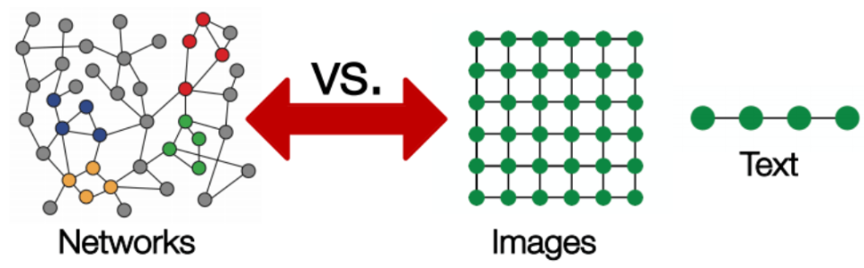
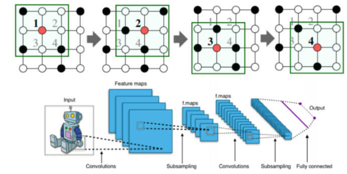
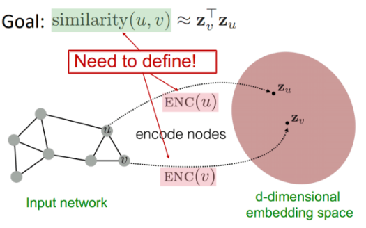
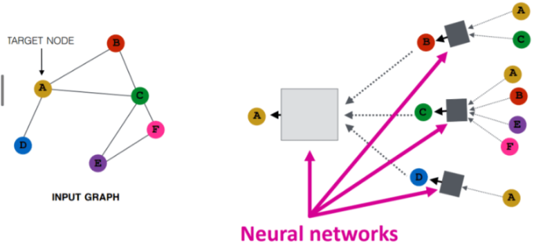
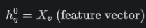
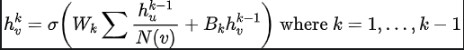
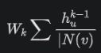
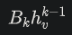
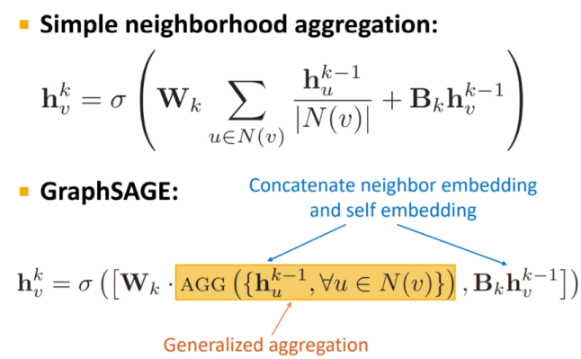

# 前言

本文摘自： https://mp.weixin.qq.com/s/YY_0OUwd4rFThqLK0br6yQ

神经网络最近的成功促进了模式识别和数据挖掘的研究。CNN、RNN和Transformer网络结构在计算机视觉和自然语言处理中有众多应用。

深度学习非常擅长用于矩阵输入的数据，但是那些从非欧几里得域生成数据的应用程序又如何呢？比如对象之间具有复杂关系和相互依赖关系？

我们将介绍图神经网络 (GNN)，将从图论和基本定义开始，然后介绍GNN的形式和原理，最后介绍GNN的一些应用。

# 什么是图？
GNN 最基本的部分是图。在计算机科学中，图是由两个部分组成的数据结构：节点（顶点）和边。

图可以定义为，其中  是节点集， 是它们之间的边。如果节点之间存在方向依赖性，则边是有向的。如果不是，则边是无向的。


图表可以表示社交媒体网络或分子之类的东西。将节点视为用户，将边视为连接。社交媒体图可能如下所示：


图通常由邻接矩阵A表示。如果图有n个节点，则A的维度为(n*n)。有时节点具有一组特征（例如，用户配置文件）。
如果节点有f个特征，则节点特征矩阵X的维度为n*f。

# 图为什么难分析？

图数据非常复杂，给现有的机器学习算法带来了很多挑战。原因是传统的机器学习和深度学习工具专门处理简单的数据类型，
像具有相同结构和大小的图像，我们可以认为是固定大小的网格图。文本和语音是序列，因此我们可以将它们视为折线图。



**但是有更复杂的图，没有固定的形式，具有可变大小的无序节点，其中节点可以有不同数量的邻居。**

现有的机器学习算法有一个核心假设，即样本彼此独立。这对于图形数据是错误的，因为每个节点都通过各种类型的链接与其他节点相关。

# Graph Neural Network

图神经网络 (GNN) 是一类深度学习方法，旨在对图描述的数据进行推理。GNN 是可以直接应用于图的神经网络，
并提供一种简单的方法来执行节点级、边级和图级预测任务。GNN 可以完成卷积神经网络 (CNN) 无法做到的事情。

## 为什么CNN不行？

CNN 可用于处理视觉输入，并执行图像分类、图像识别或对象检测等任务。这是 CNN 最受欢迎的地方。

CNN 背后的核心概念引入了隐藏的卷积层和池化层，以通过一组内核形式的感受野来识别空间局部特征。



卷积如何对规则网格的图像进行操作？我们在二维图像上滑动卷积运算符窗口，然后在该滑动窗口上计算一些函数。然后，我们将它传递给许多层。

我们的目标是将卷积的概念推广到这些简单的二维格之外。使我们能够达到目标的洞察力是卷积采用图像的一个小子块（图像的一个小矩形部分），
对其应用一个函数，并产生一个新部分（一个新像素）。

由于图的任意大小和复杂的拓扑结构，这意味着没有空间局部性，因此很难在图上执行 CNN。还有不固定的节点顺序。
如果我们第一次将节点标记为A、B、C、D、E，第二次标记为B、D、A、E、C，那么网络中矩阵的输入就会发生变化。
图对于节点排序是不变的，因此无论我们如何对节点进行排序，我们都希望获得相同的结果。

# 图深度学习基础

在图论中，我们实现了节点嵌入的概念。意思是将节点映射到一个d维的嵌入空间（低维空间而不是图的实际维度），
使得图中相似的节点相互靠近嵌入。

我们的目标是映射节点，使嵌入空间中的相似性近似于网络中的相似性。

假设和定义为图中的两个节点，Xu和Xv是两个特征向量。现在我们将定义编码器函数Enc(u)和Enc(v) ，它们将特征向量转换为Zu和Zv。



相似度函数可以是欧氏距离。现在的挑战是如何想出encoder函数呢？

位置信息可以通过使用计算图来实现。如下图所示，i是红色节点，我们可以看到该节点如何连接到它的邻居以及那些邻居的邻居。
我们将看到所有可能的连接，并形成一个计算图。


一旦位置信息保存了计算图，我们就开始聚合。这基本上是使用神经网络完成的。神经网络以灰色方框呈现。
它们要求聚合是顺序不变的，例如求和、平均值、最大值，因为它们是置换不变函数。此属性允许执行聚合。



让我们继续讨论 GNN 中的前向传播规则。它决定了输入的信息如何进入神经网络的输出端。

因此，为了在这个计算图中执行前向传播，我们需要 3 个步骤：

步骤1：初始化网络结构



步骤2：完成逐层计算



1. 第一部分是平均节点v的所有邻居。



2. 第二部分是节点v的前一层嵌入乘以偏差Bk，这是一个可训练的权重矩阵，它基本上是节点v的自循环计算



3. 计算得到输出，是K层邻域聚合后的embedding。


现在，为了训练模型，我们需要在嵌入上定义损失函数。我们可以将嵌入输入任何损失函数并运行随机梯度下降来训练权重参数。

训练过程可以是无人监督的或有监督的：

无监督训练：仅使用图形结构：相似的节点具有相似的嵌入。
有监督训练：为节点分类、正常或异常节点等监督任务训练模型。

# GCN原理

GCN 首次在“Spectral Networks and Deep Locally Connected Networks on Graphs”（Bruna 等人，2014 年）中引入，
作为将神经网络应用于图结构数据的方法。

最简单的 GCN 只有三个不同的算子：

- 图卷积
- 线性层
- 非线性激活

这些操作通常按此顺序完成。它们一起构成一个网络层。我们可以组合一个或多个层来形成一个完整的 GCN。

在 Python 中，我们可以使用 PyTorch 轻松构建 GCN：

```python
import torch
from torch import nn

class GCN(nn.Module):
    def __init__(self, *sizes):
        super().__init__()
        self.layers = nn.ModuleList([
            nn.Linear(x, y) for x, y in zip(sizes[:-1], sizes[1:])
        ])
    def forward(self, vertices, edges):
        # ----- Build the adjacency matrix -----
        # Start with self-connections
        adj = torch.eye(len(vertices))
        # edges contain connected vertices: [vertex_0, vertex_1] 
        adj[edges[:, 0], edges[:, 1]] = 1
        adj[edges[:, 1], edges[:, 0]] = 1

        # ----- Forward data pass -----
        for layer in self.layers:
            vertices = torch.sigmoid(layer(adj @ vertices))

        return vertices
```

# GraphSAGE

GraphSAGE（Hamilton 等人，NIPS 2017）是一种动态图的表示学习技术。它可以预测新节点的嵌入，而不需要重新训练过程。



为此，GraphSAGE使用归纳学习。它根据节点的特征和邻域学习可以引入新节点嵌入的聚合函数。

可以注意到两个很大的不同。GraphSAGE不是将两件事加在一起然后忘记它们，而是使用一个通用的聚合函数，通过将它们连接起来使它们分开。

之前使用的是均值聚合函数，简单地从邻居那里获取消息并将它们相加，然后根据邻居的数量对其进行归一化。
GraphSAGE也可以采用池化方法，或者也可以使用像 LSTM 这样的深度神经网络。

# 图卷积库

接下来我们介绍一些高质量的图形神经网络开源库，它们将帮助搭建GNN模型。

## PyTorch Geometric

https://pytorch-geometric.readthedocs.io/en/latest/

PyTorch Geometric (PyG) 是一个用于深度学习图形等不规则结构的 Python 库。该项目由两位博士开发和发布。
来自多特蒙德大学的学生 Matthias Fey 和 Jan E. Lenssen。

除了一般的图形数据结构和处理方法外，它还包含关系学习和 3D 数据处理领域的各种最近发布的方法。
PyTorch Geometric 通过利用稀疏 GPU 加速、提供专用 CUDA 内核以及为不同大小的输入示例引入高效的小批量处理来实现高数据吞吐量。

## Deep Graph Library (DGL)

https://www.dgl.ai/

Deep Graph Library (DGL) 是另一个易于使用、高性能和可扩展的 Python 库，用于图的深度学习。
它有一个非常干净简洁的 API。DGL 引入了一个有用的高级抽象，允许自动批处理。

## Graph Nets

https://github.com/deepmind/graph_nets

Graph Nets用于在 Tensorflow 和 Sonnet 中构建图形网络。该库适用于 TensorFlow 的 CPU 和 GPU 版本。
它提供了灵活性，几乎任何现有的 GNN 都可以使用 6 个核心函数来实现，并且可以扩展到时间图。
Graph Nets 需要 TensorFlow 1，所以它感觉已经过时了，尽管它只有大约 3 年的历史。

## Spektral

https://graphneural.network/

Spektral 是一个基于 Keras API 和 TensorFlow 2 的开源 Python 图深度学习库。
该库的主要目标是提供一个简单、灵活的框架来创建 GNN。您可以使用 Spektral 对社交网络的用户进行分类、
预测分子特性、使用 GAN 生成新图、聚类节点、预测链接以及任何其他由图描述数据的任务。

# 图卷积应用

图结构数据无处不在。GNN 解决的问题可以分为以下几类：

- 节点分类：这里的任务是通过查看其邻居的标签来确定样本（表示为节点）的标签。通常，此类问题以半监督方式进行训练，仅标记图的一部分。
- 图分类：这里的任务是将整个图分类为不同的类别。这就像图像分类，但目标变成了图域。图分类的应用很多，
    范围从确定蛋白质是否是生物信息学中的酶，到 NLP 中的文档分类或社交网络分析。
- 图可视化：是数学和计算机科学的一个领域，处于几何图论和信息可视化的交叉点。
    它关注图形的可视化表示，揭示数据中可能存在的结构和异常，并帮助用户理解图形。
- 链接预测：在这里，算法必须了解图中实体之间的关系，并且它还试图预测两个实体之间是否存在连接。
    在社交网络中推断社交互动或向用户推荐可能的朋友是必不可少的。它还被用于推荐系统问题和预测犯罪团伙。
- 图聚类：指以图的形式对数据进行聚类。对图数据执行两种不同形式的聚类。
    顶点聚类试图根据边权重或边距离将图的节点聚类成密集连接的区域组。图聚类的第二种形式将图视为要聚类的对象，
    并根据相似性对这些对象进行聚类。