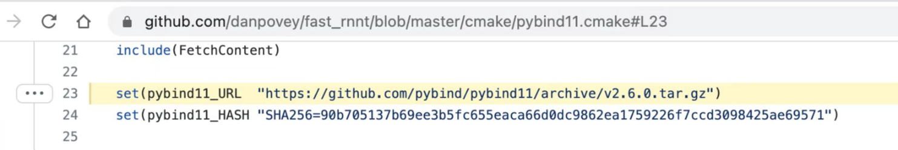

1. fast-rnnt本地安装
    你事先把 v2.6.0.tar.gz 下载下来，比如，你放到 /tmp/ 目录下，然后把
    ```
       set(pybind11_URL  "https://github.com/pybind/pybind11/archive/v2.6.0.tar.gz")
       修改成 
       set(pybind11_URL  "file:///tmp/v2.6.0.tar.gz")
    ```    
    

2. k2中的rnnt-loss
    k2 和 fast_rnnt, 都不需要 icefall 和 lhotse的依赖，可以单独抽出来使用