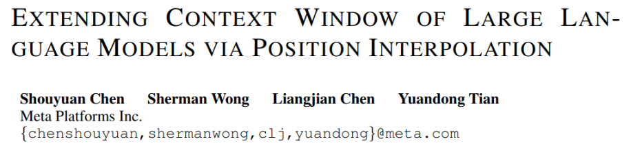
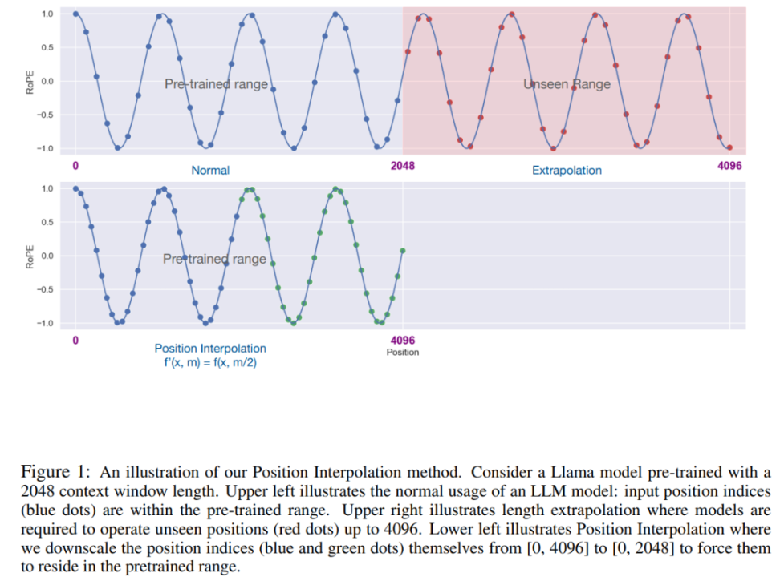
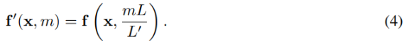
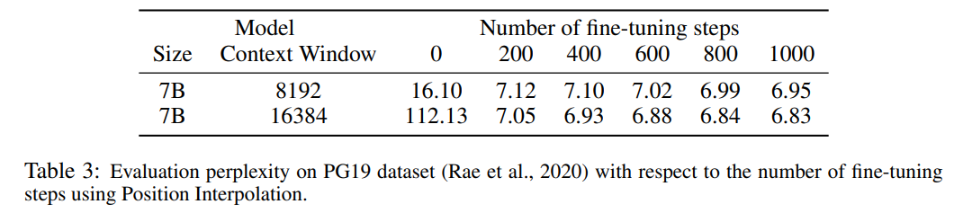

# 1. 论文

论文链接：
https://arxiv.org/pdf/2306.15595.pdf

# 2. 问题

- Meta AI 发布的 LLaMA 模型，其输入 token 大小必须少于 2048。
  从头开始训练具有较长上下文窗口的 LLM 需要很大的投入。

- 使用外推的方法，可能导致灾难性的数值。

- RoPE 中的注意力得分只取决于相对位置，但它的外推性能并不好。
  特别是，当直接扩展到更大的上下文窗口时，困惑度可能会飙升到非常高的数字 (即 > 10^3)。

# 3. 方法

Meta 的研究者引入了位置插值（Position Interpolation，PI）来对某些现有的预训练 LLM（包括 LLaMA）的上下文窗口进行扩展。
结果表明，LLaMA 上下文窗口从 2k 扩展到 32k，只需要小于 1000 步的微调。

将 RoPE f 替换为 f ′，得到如下公式

在位置编码上的转换称为位置插值。这一步将位置索引从 [0, L′ ) 缩减到 [0, L) ，
以匹配计算 RoPE 前的原始索引范围。因此，作为 RoPE 的输入，任意两个 token 之间的最大相对距离已从 L ′ 缩减到 L。
通过在扩展前后对位置索引和相对距离的范围进行对齐，减轻了由于上下文窗口扩展而对注意力分数计算产生的影响，
这使得模型更容易适应。

值得注意的是，重新缩放位置索引方法不会引入额外的权重，也不会以任何方式修改模型架构。

在 1000 个步骤时可以看到模型稳步改进，并取得了更好的困惑度。

# 参考
[1] 《田渊栋团队最新研究：不到1000步微调，将LLaMA上下文扩展到32K》, https://mp.weixin.qq.com/s/VC3Gz-1YuHXXgQdBVTLizyw