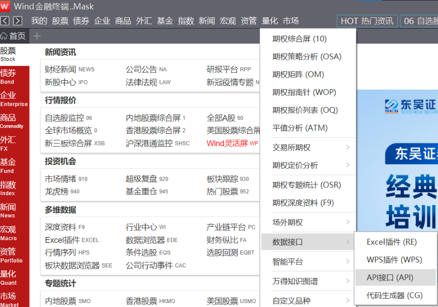

# 1. 简介
&emsp;&emsp;Wind提供各类金融数据，在业内最权威最专业，广泛应用于各类金融机构。
个人也可以使用，但是费用相对贵。聚宽和Tushare数据相对个人略便宜。

&emsp;&emsp;虽然网上存在大量数据免费获取的途径，但质量不够好。专业数据供应商
会对数据做大量专业清洗，且历史数据会随时被修复。因此，想要将策略应用于实践，还
需要保证有高质量的数据做基石。

优点：
* 各类机构广泛使用，业内最权威的数据，专业可靠，值得信赖
* 有丰富的各类信息，比如因子

缺点：
* 量化接口文档不详细，很多返回字段含义没有详细释义，很多数据查询的写法需要通过“代码生成器”手工单击去生成
* 单次调用量受限，如果对实时率要求高，且管理股票较多，可能存在问题 （也许有VIP版？）
* 如果想不受限的大批量查询数据，需要购买本地数据库
* 每个接口有单次数据查询量的限制，同时也有总下载量的限制，比如我下载了05-22年30个字段的数据，只下载了10
  支股票，7天的接口流量就用完了，需要等到7天以后，才能再次使用这个接口
* 由于合规问题，客户端只支持数据查询，不支持导出数据对应的中文表单，如行业分类列表、板块列表ID对应
的中文名称等，解决方法就是手抄列表对应关系

支持的因子类别包括：
* 股东因子
* 估值因子
* 风险因子
* 盈利预测因子
* 财务分析因子
* 技术指标因子
* 指数因子

# 2. 数据接口
&emsp;&emsp;如下图中，在菜单中->量化->数据接口->API接口


&emsp;&emsp;如下图所示，共支持6中编程接口


# 3. Python接口使用
案例大全：https://www.windquant.com/qntcloud/apiTemplateMenu/id-d1d00878-8e85-40d3-bf91-bde9401f0b8a

帮助文档：https://www.windquant.com/qntcloud/apiRefHelp/id-91573a98-70d5-4462-8c6f-546ab45c8652

# 3.1 系统要求
Wind Python接口对系统环境要求：
* Windows 系统，支持32位和64位系统；
* Python 2.6,2.7,3.3以上的环境；由于各版本对中文支持力度不同，用户需自行注意；
* Wind终端最新版；
* 安装时由于需要写注册表，因此需要系统管理员权限.

# 3.2 接口安装
&emsp;&emsp;注意：本安装仅需一次，之后每次使用无需重复执行安装操作。

&emsp;&emsp;确保达到上述安装要求，并关闭Python环境，以及用到控件的MATLAB/R /C++环境等；
打开Wind金融终端，点击“我的/插件修复”选项，出现下方的界面，点击“修复Python接口”，会弹出接口的相关说明；


修复开始


注： 修复完成后，可通过“配置详情”按钮查看具体修复了哪些Python。
若列表并没有需要使用的Python，可通过“添加路径”按钮修复指定的Python 
(添加路径格式可参考具体的提示)。

# 3.3 特殊安装WindPy方式
（本方式我没进行尝试和验证）  

* 确保达到WindPy接口对系统环境的要求，并确保关闭Python环境。

* 假设Wind终端安装在C:\Wind\WInd.NET.Client\WindNET目录（目录下有bin等等子目录），Python安装在C:\python28目录。
首先通过Windows进入cmd命令，然后输入如下命令即可：

```
C:\Python28\python.exe C:\Wind\Wind.NET.Client\WindNET\bin\installWindPy.py C:\wind\wind.net.client\windnet

```

* 按任意键WindPy安装过程结束。

# 3.4 测试使用

&emsp;&emsp;WindPy API接口可用于获取各类高质量的金融数据，在使用时可借助万矿或Wind终端的API代码生成器生成获取数据的函数代码，而无需记住各类繁杂的参数说明及函数手册。具体使用流程如下：

&emsp;&emsp;首先，用户必须加载WindPy，然后执行w.start()启动API接口：

from WindPy import w

w.start() # 默认命令超时时间为120秒，如需设置超时时间可以加入waitTime参数，例如waitTime=60,即设置命令超时时间为60秒  

w.isconnected() # 判断WindPy是否已经登录成功
可以使用如下命令停止WindPy：

w.stop() # 当需要停止WindPy时，可以使用该命令
          # 注： w.start不重复启动，若需要改变参数，如超时时间，用户可以使用w.stop命令先停止后再启动。
          # 退出时，会自动执行w.stop()，一般用户并不需要执行w.stop  
需要注意的是，程序退出时会自动执行w.stop()，因此一般用户并不需要执行w.stop()


# 3.5 详细使用

Wind的接口手册里有具体的使用说明，但是对具体的字段介绍和使用并不是非常详尽。Wind提供了一个代码自动生成器，
通过在列表中手动选择需要的数据自动生成代码，相对并不好用。

需要注意的坑：
* 单次请求的数据量有上限
* 部分列表，比如板块和板块代码的对应关系没有接口可以获取。只能在代码编辑器里手抄下来，或者截图后使用OCR转文本


比如，从上图中的代码生成器中可以选择分类中的具体股票，导入之后查看。
