# Win10 + GTX 1050 Ti + CUDA 10.2 + cuDNN 8.6

A personal Windows laptop or desktop with an NVIDIA GPU can be used as a small
deep-learning training machine. GPU training is usually dozens of times faster
than CPU-only training. This page shows how to configure a GPU and build a
deep-learning environment on a Windows PC.

Common GPU setup links. NVIDIA websites may be unstable from mainland China;
switching `.com` to `.cn` is often more reliable.

* CUDA and driver compatibility: https://docs.nvidia.com/cuda/cuda-toolkit-release-notes/index.html
* Driver download: https://www.nvidia.cn/geforce/drivers/
* CUDA download archive: https://developer.nvidia.cn/cuda-toolkit-archive
* CUDA 10.2 documentation: https://docs.nvidia.com/cuda/archive/10.2/
* cuDNN download: https://developer.nvidia.cn/zh-cn/cudnn
* cuDNN documentation: https://docs.nvidia.com/cuda/archive/10.2/

Deep-learning framework links:

* Official PyTorch page: https://pytorch.org/get-started/previous-versions/
* Historical PyTorch versions: https://pytorch.org/get-started/previous-versions/

# 1. Check GPU Status

## 1.1 Method 1: Device Manager

Right-click **This PC** on the desktop and choose **Manage**.

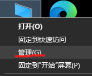

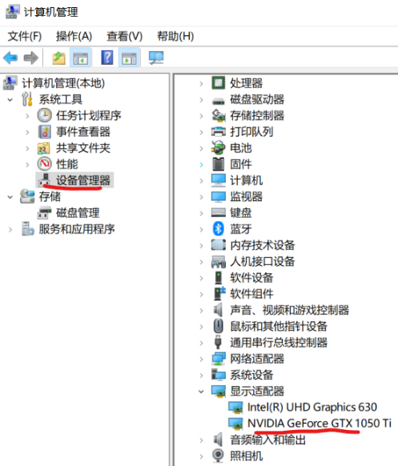

This machine has both an integrated GPU and a discrete GTX 1050 Ti GPU. In
initial tests, the integrated GPU may help keep the display usable while the
discrete GPU is used for training.

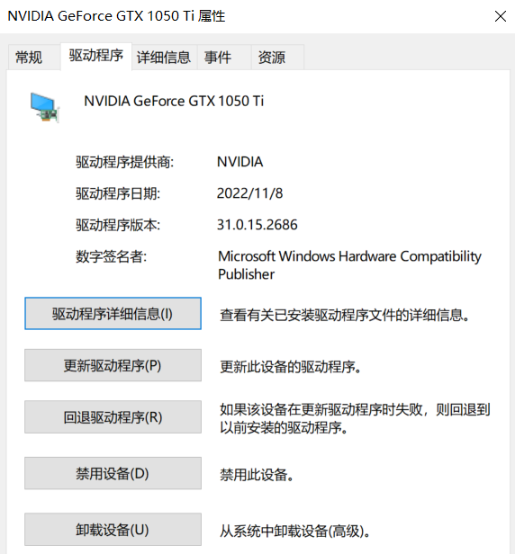

Right-click **NVIDIA GeForce GTX 1050 Ti**, choose **Properties**, and check the
driver information.

*** Notes:

1. The driver cannot usually be updated to the latest version from this screen.
   Download the latest driver from NVIDIA and install it manually.
2. Even if the latest driver is installed, the version shown here may not match
   the installer version. It may refer to a different driver component.

## 1.2 Method 2: NVIDIA Control Panel

Right-click the desktop and open **NVIDIA Control Panel**.

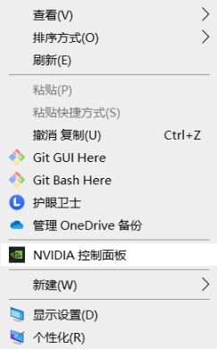

In NVIDIA Control Panel, choose **Help** -> **System Information** from the top
menu.

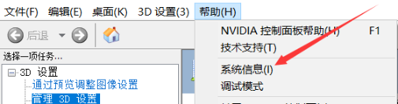

NVIDIA driver version information:

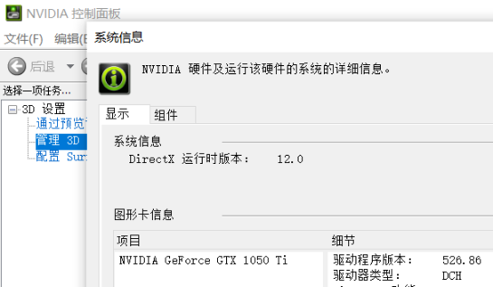

In the settings list, the `NVCUDA64.DLL` entry shows the CUDA version supported
by the current hardware and driver. On this machine it shows CUDA 11.1.

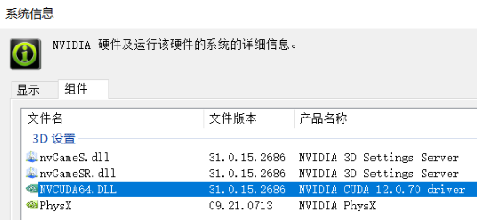

# 2. Update the GPU Driver

## 2.1 Driver and CUDA Compatibility

CUDA and NVIDIA driver versions have compatibility requirements. See:
https://docs.nvidia.com/cuda/cuda-toolkit-release-notes/index.html

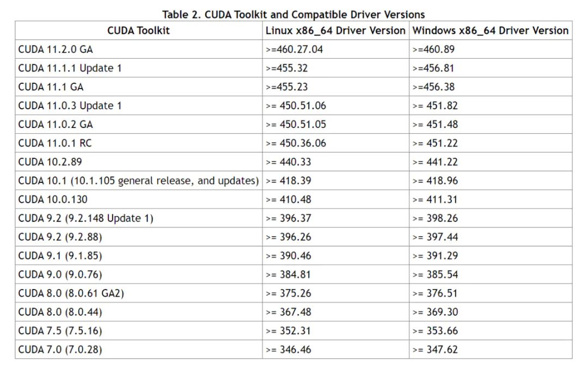

## 2.2 Method 1: Download from NVIDIA

Open the NVIDIA driver download page, https://www.nvidia.cn/geforce/drivers/,
and search for the driver manually.

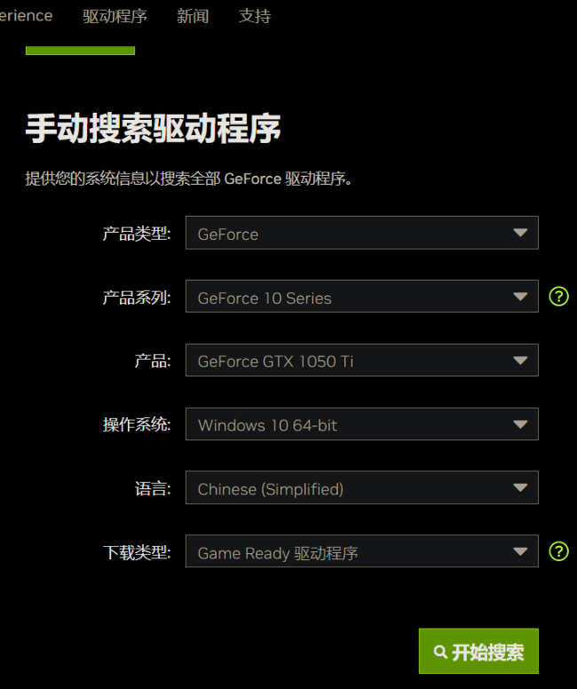

Download the latest driver, open the installer, and follow the installation
wizard.


# 2.3 Method 2: Upgrade from Local NVIDIA Software

If an NVIDIA driver was installed before, Windows may already have **GeForce
Experience**. You can use it to upgrade the driver online.

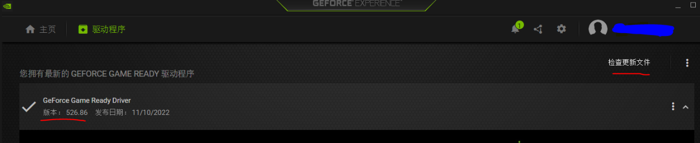

# 3. Install CUDA

## 3.1 Installation

* CUDA download archive: https://developer.nvidia.cn/cuda-toolkit-archive
* CUDA 10.2 documentation: https://docs.nvidia.com/cuda/archive/10.2/

Select the CUDA version you need. This example uses CUDA 10.2. Choose the
matching system configuration and installer type. The recommended installer is
`exe [local]`, which downloads an offline package and avoids network failures
during installation.

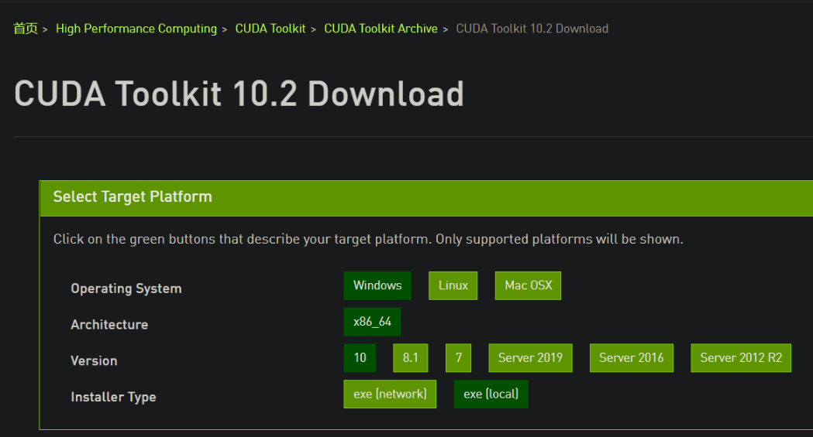

CUDA 10.2 includes one main installer and two patch packages. Download all of
them.

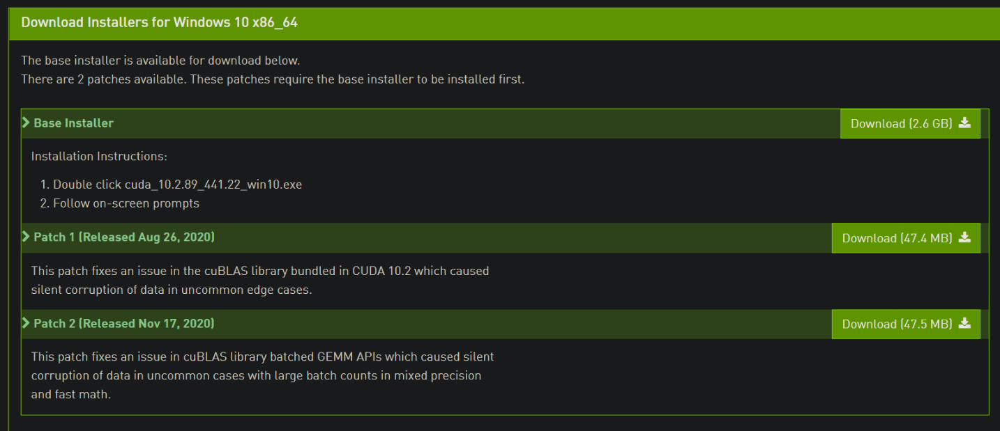

After downloading the `.exe` file, double-click it. The installer first asks for
a temporary extraction directory.

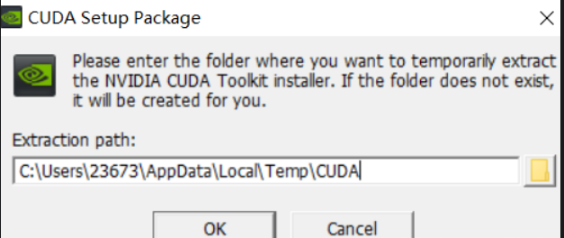

You can change the extraction path. Click **OK**, wait for the system check and
license screen, then choose **Custom installation**. Uncheck Visual Studio
components if they are not needed, because they can make installation fail.

Continue to the installation directory step, choose the target location if
needed, and wait for installation to finish.

## 3.2 Verify the Installation

### 3.2.1 Check CUDA

Open the Windows Start menu, type `cmd`, open Command Prompt, and run:

```bash
nvcc -V
```

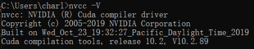

If CUDA version information is printed, CUDA was installed successfully.

### 3.2.2 Check GPU Status

Open Command Prompt and run:

```bash
nvidia-smi
```

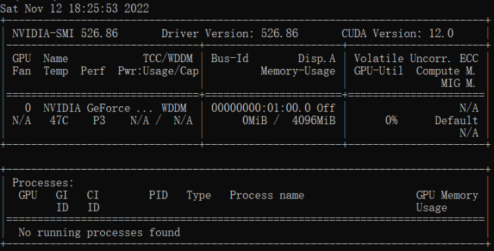

The output shows the driver version and the maximum CUDA version supported by
the driver. This version may be higher than the CUDA Toolkit version you
installed; it usually means the driver supports that CUDA version.

## 3.3 Configure Environment Variables

Desktop -> right-click **This PC** -> **Properties** -> search for
**Environment Variables** -> choose **Edit the system environment variables**.

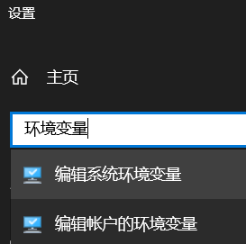

Click **Environment Variables**.

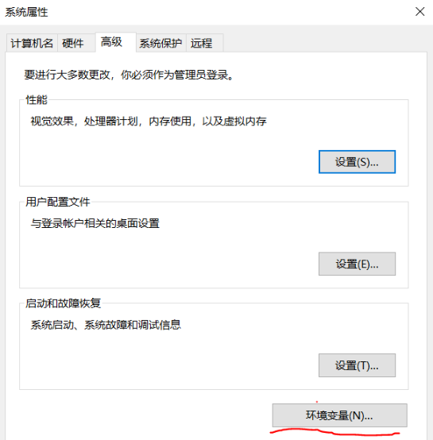

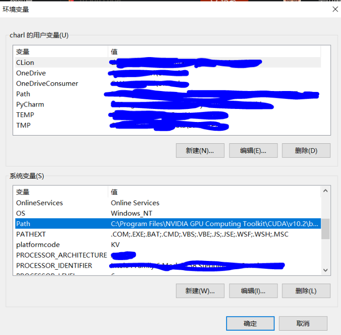

Select **Path** and click **Edit**.

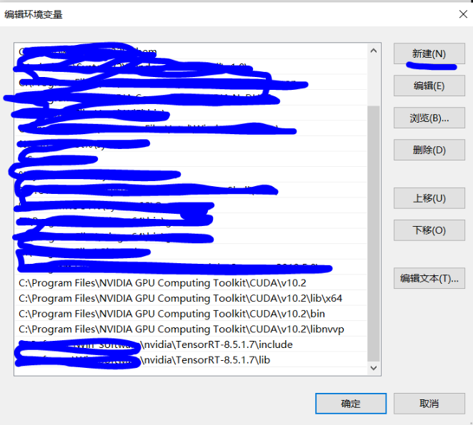

Add the following entries:

```bash
C:\Program Files\NVIDIA GPU Computing Toolkit\CUDA\v10.2
C:\Program Files\NVIDIA GPU Computing Toolkit\CUDA\v10.2\lib\x64
C:\Program Files\NVIDIA GPU Computing Toolkit\CUDA\v10.2\bin
C:\Program Files\NVIDIA GPU Computing Toolkit\CUDA\v10.2\libnvvp
```

# 4. Install cuDNN

You need an NVIDIA account to download cuDNN. Make sure the cuDNN version
matches your CUDA version.

* cuDNN download: https://developer.nvidia.cn/zh-cn/cudnn
* cuDNN documentation: https://docs.nvidia.com/cuda/archive/10.2/


Register or log in as guided by the website. After registration, click the cuDNN
download entry and choose the matching cuDNN package.

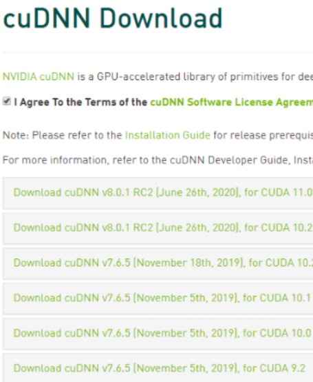

Extract the downloaded cuDNN archive. Copy the files inside each extracted
folder into the folder with the same name under the CUDA installation directory.
Do not replace the whole folders; copy the contents into the matching folders.

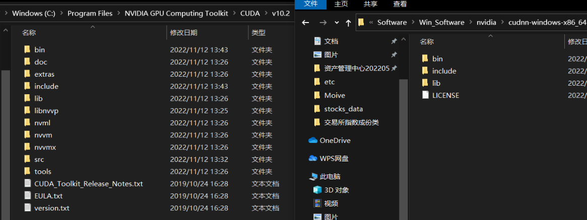

# 5. Install the GPU Version of PyTorch

## 5.1 Installation Steps

* Official page: https://pytorch.org/get-started/previous-versions/
* Historical versions: https://pytorch.org/get-started/previous-versions/

Select your environment on the website to get the installation command.

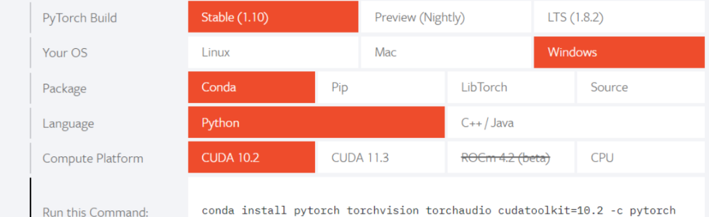

Open Command Prompt and run the command for the GPU or CPU version. The first
command below installs the CUDA 10.2 GPU build; the second command is kept as a
CPU-only option.

```bash
# CUDA 10.2
conda install pytorch==1.10.0 torchvision==0.11.0 torchaudio==0.10.0 cudatoolkit=10.2 -c pytorch

# CPU Only
conda install pytorch==1.10.0 torchvision==0.11.0 torchaudio==0.10.0 cpuonly -c pytorch
```

If Conda installation fails because of network issues, download the offline
wheel from https://download.pytorch.org/whl/torch_stable.html.

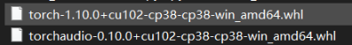

After downloading, open the download folder and choose **Open Windows
PowerShell** from the menu.

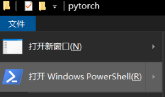

Run:

```bash
pip install .\torch-1.10.0+cu102-cp38-cp38-win_amd64.whl
```

## 5.2 Verify PyTorch

Open Command Prompt, start Python, and run:

```python
import torch
print(torch.cuda.is_available())
print(torch.cuda.device_count())
```

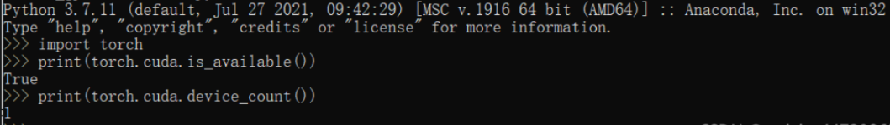

If CUDA is available, the installation is successful.

# References

1. https://blog.csdn.net/weixin_44739865/article/details/121460260
