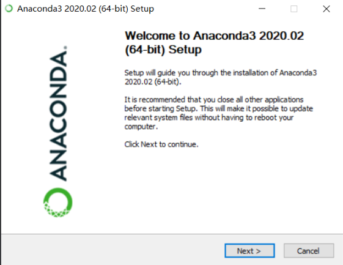
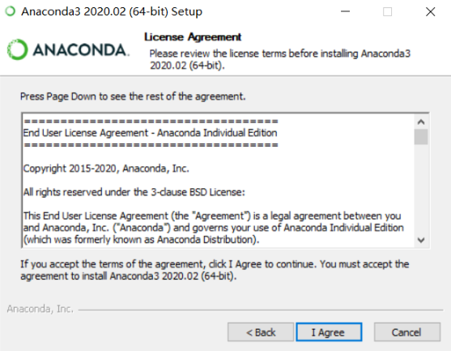
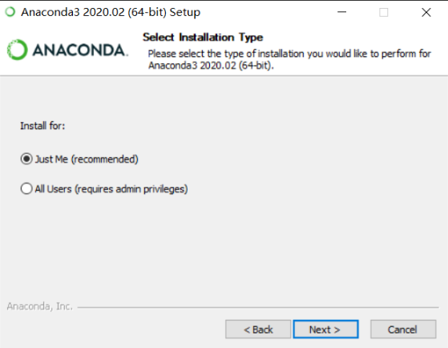
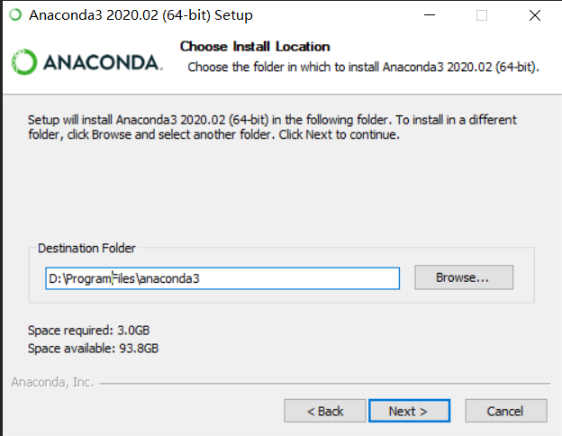
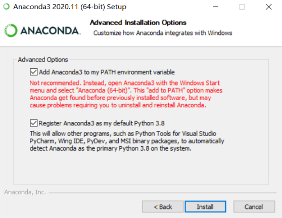
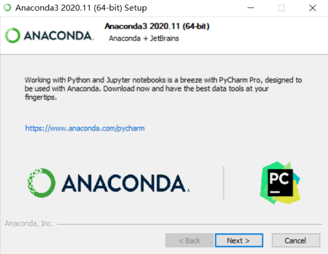
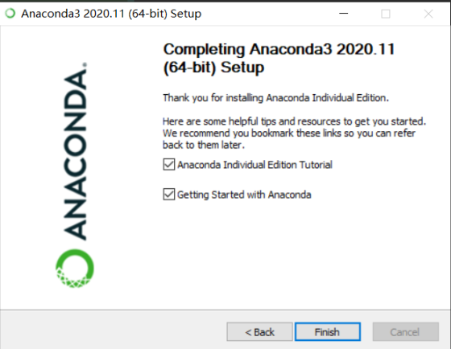

# 1. Download Links

* Official website: https://www.anaconda.com/products/distribution
* Historical releases: https://repo.anaconda.com/archive/

# 2. Install on Windows






Note: avoid spaces in the installation path. Conda may show a warning, and some
packages can behave incorrectly when the path contains spaces.



Note: select the first checkbox, otherwise the `conda` command may not be found
from the terminal.




# 3. Install on Linux

```bash
wget https://repo.continuum.io/miniconda/Miniconda3-latest-Linux-x86_64.sh
sh Miniconda3-latest-Linux-x86_64.sh
source ~/.bashrc
conda create -n funasr python=3.7 # Python 3.7 is recommended
conda activate funasr
```

For more Conda installation details, see
https://docs.conda.io/en/latest/miniconda.html.

# References

[1] FunASR Linux installation:
https://github.com/alibaba-damo-academy/FunASR/wiki/Linux%E7%8E%AF%E5%A2%83%E5%AE%89%E8%A3%85
