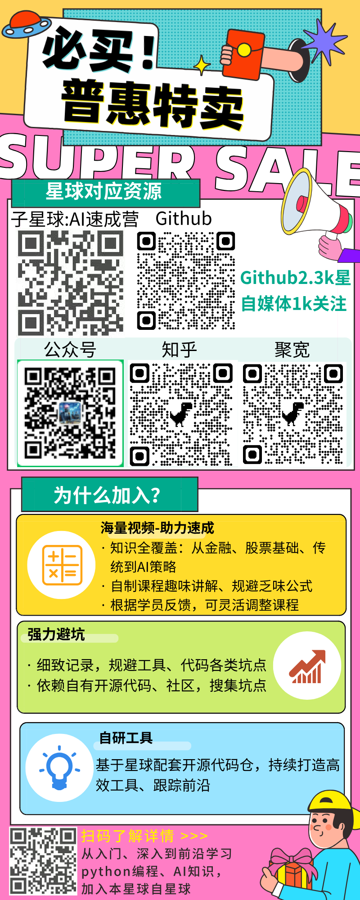
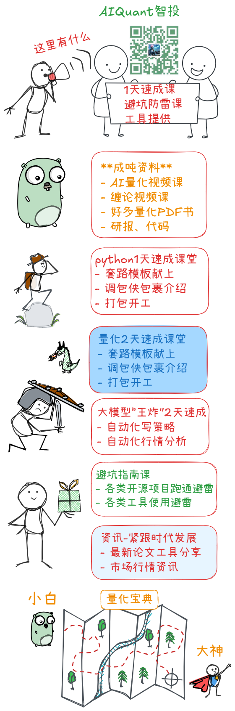

# Knowledge Planet Overview

AIQuant Knowledge Planet is a paid community for AI quantitative trading. It
provides practical Q&A, project walkthroughs, strategy discussions, research
notes, tools, and learning resources for members who want to build quantitative
trading systems.

The posters below are the original Chinese introduction materials.

