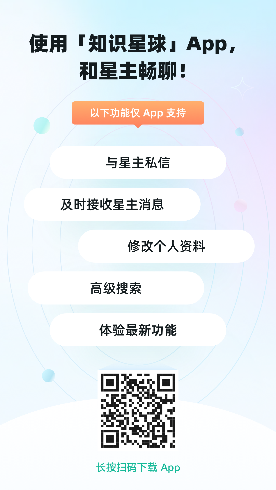
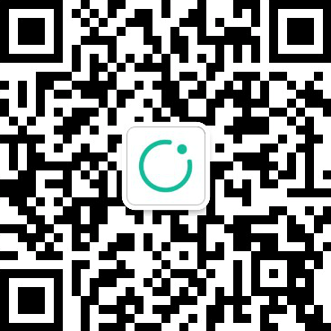

New members should read this first: **Knowledge Planet Survival Guide**.

Welcome to the community. Suggestions and feedback are encouraged so that we
can keep improving the service for everyone.

Note: this post has been pinned. You can collapse it if it affects your reading
of new messages.

# 1. What to Do First After Joining

## 1.1 Download the Knowledge Planet App

The first thing to do after joining is to download the **Knowledge Planet** app.
It helps you quickly return to the community, receive messages in time, and
avoid missing important updates.

## 1.2 Follow the Knowledge Planet Official Account

## 1.3 Other Login Methods

- Web version: https://www.zsxq.com
- iOS version: search for "知识星球" in the App Store.
- Android version: search for "知识星球" in your app store.
- WeChat service-account version: iOS users can log in and pay through the
  WeChat service account.
- WeChat mini-program version: iOS users can log in and pay through the WeChat
  service account.

# 2. Quick Guide to Using the Planet

## 2.1 Introduction and Usage

Knowledge Planet is a mobile community platform focused on professional
knowledge sharing and discussion. The planet owner provides content, and members
join with an annual fee. When the annual period ends, members can decide whether
to renew.

Members can share experience, ask questions, discuss topics, and interact with
others in the same field. Every user is both a knowledge receiver and a
potential knowledge creator and distributor. I hope everyone can share
knowledge, meet friends, learn together, and keep improving.

After logging in, you can view the community content. In Knowledge Planet, you
can:

- Read posts directly on the home page and download attachments from each post.
- Use topic columns to quickly find the category of knowledge you need.
- Ask administrators questions when you need help.

## 2.2 Required Software

The planet contains many resources, including Baidu Netdisk resources and text
materials such as Markdown documents.

Recommended software:

- Baidu Netdisk: many attachments are shared through Baidu Netdisk.
- Markdown reader: most written materials are authored in Markdown.
  - MarkText resources:
      - Open-source MIT-licensed editor on GitHub, with 48.3k stars. It is easy
        to use, supports online editing, and provides WYSIWYG preview.
      - GitHub: https://github.com/marktext/marktext
      - Download links:
          - Windows: https://github.com/marktext/marktext/releases/latest/download/marktext-setup.exe
          - macOS: https://github.com/marktext/marktext/releases/latest/download/marktext.dmg
          - Linux: https://github.com/marktext/marktext/releases/latest/download/marktext-x86_64.AppImage

# 3. Related Social Platforms and Resources

**WeChat Official Account**

Follow the latest updates in real time.

Search for "AI搞钱杂货铺".

---

- [Zhihu: 391 followers](https://www.zhihu.com/people/yi-dui-ji-mu-zai-kuang-xiang)
- [JoinQuant: 599 followers](https://www.joinquant.com/user/d7aafd0b8b767b735bfb6f3639c81a6c)

---

**Code Repositories**

AI Quant Trader:

- GitHub: https://github.com/charliedream1/ai_quant_trade
- Gitee mirror: https://gitee.com/charlie1/ai_quant_trade.git

AI LLM Pitfall Guide:

- GitHub: https://github.com/charliedream1/ai_wiki
- Gitee mirror: https://gitee.com/charlie1/ai_wiki.git
- Introduction: practical cases and frontier technology tracking across the AI
  stack, including large models, programming, machine learning, deep learning,
  reinforcement learning, graph neural networks, speech recognition, NLP, and
  computer vision.

# 4. Planet Introduction

### **Why This Planet Was Created**

The AIQuant Knowledge Planet was created because of a long-standing interest in
AI quantitative finance. Through years of practice and exploration, I found
that although quantitative finance and AI have strong prospects, many learners
take unnecessary detours because they lack professional guidance and a
systematic learning path.

This planet was created to help more learners get started efficiently, master AI
quantitative trading, and improve their practical ability. It aims to provide a
learning platform that combines theory with practice, shortens the learning
cycle, and improves learning efficiency.

### **How the Planet Helps Members**

- **Complete learning path**: from fundamentals to advanced skills, helping
  users quickly master core AI quantitative trading techniques and improve
  practical ability through hands-on cases.
- **Practical problem solving**: solutions for common industry pain points and
  difficult problems, helping users avoid common mistakes in quantitative
  trading.
- **Exclusive tools and resources**: proprietary quantitative development
  tools, large-scale learning resources, and latest paper interpretations to
  help users keep up with frontier developments.
- **Personalized support**: customized quantitative strategy services and Q&A
  support so each member can get targeted help.

### **Planet Benefits**

- **Three-day risk-free trial**: after joining, you get a three-day trial
  period. If you are not satisfied, you can request a full refund.
- **Direct Q&A**: members can communicate directly with the blogger, ask
  learning and practical questions, and avoid detours in quantitative trading.
- **Customized quant tools**: custom quantitative trading tool development to
  help turn personalized strategies into working systems.
- **Large learning-resource library**: hundreds of gigabytes of quantitative
  trading video courses, PDF documents, books, papers, and other learning
  materials.

### **Content Sharing Rules**

- **Allowed content**:
  - Learning resources and practical experience related to quantitative trading
    and AI applications.
  - Personal learning notes, trading strategies, and technical sharing.
  - Frontier papers and technical analysis.
  - Questions, discussions, and Q&A that help members grow together.

- **Prohibited content**:
  - Content unrelated to quantitative trading, such as pure advertising,
    promotion, or low-quality information.
  - Infringing, illegal, or non-compliant content, including unauthorized
    pirated materials.
  - False or misleading information.

- **Refund policy**: users may request a full refund within three days after
  purchase. Refunds are limited to first-time purchasers, and the user must not
  have downloaded the planet's core learning materials.

### **Other Incentives**

- **Referral reward**: members who invite friends to join can receive a referral
  reward after a successful referral.

# 5. Current Planet Resources

1. Video courses
    - Financial fundamentals
    - Chan theory system course
    - Su theory system course
    - Fundamental-analysis course
    - AI quantitative trading course

2. Books
    - About 40+ quantitative trading books
    - Many programming books
    - Many AI books

3. Research reports and papers
    - Financial research reports
    - Quantitative paper interpretations

4. Quantitative strategies
    - Many quantitative strategy shares

5. Quantitative tools
    - Quantitative tool tutorials

# 6. Future Plans

- Fast-track courses
- Pitfall-avoidance courses
- Detailed guides for different tools
- Quantitative strategy, tool, and platform development

# 7. Learning Path

- Quantitative fundamentals
- Quantitative programming
- Quantitative strategy development
- Quantitative tool usage
- Quantitative platform usage
- Practical quantitative trading

# 8. Summary

In the AIQuant Knowledge Planet community, we hope every member can find a
suitable learning path, master core AI quantitative trading skills, and keep
improving through practice. Whether you are just starting or already have some
background, the community provides resources and support to help you reach your
goals more efficiently. We sincerely hope every member gains knowledge, breaks
through personal limits, and goes further on the path of AI quantitative
finance.
