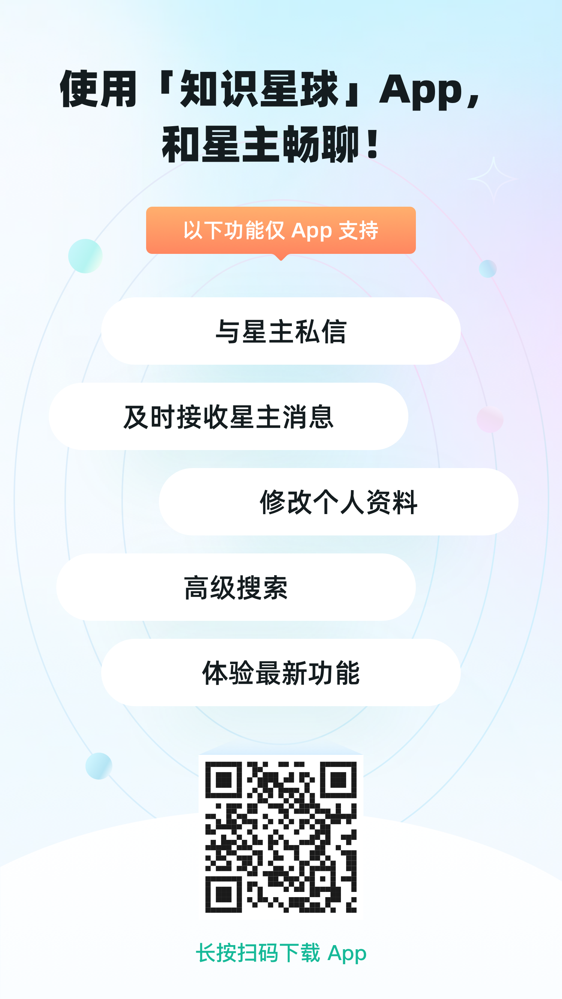

👉新人必看:【星球生存指南】

首先非常欢迎各位同学的加入，欢迎大家积极提出宝贵的意见，以便我们更好的服务大家！！！

注意：本条消息已选择置顶，可选择收起，以便不影响新消息的查看。

# 1. 加入星球首先要做的事

## 1.1 下载【知识星球APP】
加入星球后的第一件事，就是下载「知识星球」App，这样能快速找到回星球的路、第一时间收到我的消息，不会遗漏。

## 1.2 关注【知识星球公众号】

## 1.3 其它登录方式
- 网页版：https://www.zsxq.com
- 苹果版：可以在应用商店搜索"知识星球“进行下载
- 安卓版：可以在应用商店搜索"知识星球“进行下载
- 微信服务号版：苹果用户可以通过微信服务号进行登录访问及付费
- 微信小程序版：苹果用户可以通过微信服务号进行登录访问及付费

# 2. 星球使用快速指南

## 2.1 简介和使用
"知识星球"是一个专注于提供专业知识分享与交流的移动社区平台。星主提供内容，星球成员以年费形式加入，一年期满自由选择是否续期。

大家可以在星球中分享自己的经验、提出疑问，与其他成员进行讨论、交流互动，这是一个同行业学习交流的聚集地。每一位用户既是知识的接收者,同时也可能成为知识的创造者和传播者。祝大家都能在星球里分享知识认识朋友，共同学习、共同进步，一起变得更强！！！

登录后即可查看群内的知识。在知识星球中，你可以：
- 在主页直接查看，每个消息的附件课下载后查看，
- 星球中有专栏分类，其中可快速查找分类，找到自己需要的知识类别
- 有问题可以向管理员提问

## 2.2 必备软件

星球中包含大量的资料，有百度网盘资源，也有markdown之类的文本资源。

建议准备的软件：
- 百度网盘：附件中不少都是百度网盘资料，利用百度网盘下载
- 推荐使用markdown阅读器：资料中大多使用markdown编写
  - marktext资源地址：
      - Github开源MIT协议编辑器，48.3k星，非常好用，在线编辑，所见即所得
      - Github: https://github.com/marktext/marktext
      - 下载路径
          - Windows：https://github.com/marktext/marktext/releases/latest/download/marktext-setup.exe
          - masOS：https://github.com/marktext/marktext/releases/latest/download/marktext.dmg
          - Linux：https://github.com/marktext/marktext/releases/latest/download/marktext-x86_64.AppImage

# 3. 关注本星球关联【其它社交平台资源】

**微信公众号**

🔥最新资讯实时关注！！！

搜索"AI搞钱杂货铺"

---

- [知乎：391关注者](https://www.zhihu.com/people/yi-dui-ji-mu-zai-kuang-xiang)
- [聚宽：599关注者](https://www.joinquant.com/user/d7aafd0b8b767b735bfb6f3639c81a6c)

---

**代码仓**   
✨AI量化交易操盘手: 
- Github: https://github.com/charliedream1/ai_quant_trade
- Gitee（国内镜像）: https://gitee.com/charlie1/ai_quant_trade.git

✨AI大模型避坑指南：
- Github: https://github.com/charliedream1/ai_wiki
- Gitee（国内镜像）：https://gitee.com/charlie1/ai_wiki.git
- 简介：分享各种实用案例，追踪前沿技术发展，囊括 AI 全栈知识，涵盖大模型、编程技术、机器学习、深度学习、强化学习、图神经网络、语音识别、NLP 及图像识别等领域

# 4. 星球介绍

### **创立星球的初心**

创建“AI智投星球”的初心，源自于对AI量化金融领域深厚的兴趣。通过多年的实践与探索，我发现尽管量化金融和AI技术前景广阔，但很多人由于缺乏专业的指导和系统的学习路径，往往在起步时走了许多弯路。为了帮助更多的学习者高效地入门和精通AI量化交易，提升实战能力，特此创办这个星球，旨在为大家提供一个理论与实战相结合的学习平台，缩短学习周期，提升学习效率。

### **星球对于用户的帮助**

- **全面学习路径**：从基础知识到高级技能，帮助用户快速掌握AI量化交易的核心技巧，并通过案例实操提升实战能力。
- **解决实战难题**：结合行业中的难点与痛点，提供切实可行的解决方案，帮助用户避免量化交易中的常见坑点。
- **专属工具与资源**：提供独家研发的量化开发工具，结合海量的学习资源与最新的论文解读，帮助用户紧跟前沿动态。
- **个性化服务**：为每位用户提供量化策略定制、答疑解惑服务，确保每个人都能得到最具针对性的帮助。

### **星球福利**

- **3天无忧试用**：加入星球后，您可以享受3天的无忧试用期，如果不满意，可以申请全额退款。
- **专属互动答疑**：加入星球成员后，可以与博主直接交流，解答您的学习与实战问题，帮助您在量化交易的道路上少走弯路。
- **量化工具定制**：为用户提供定制化的量化交易工具开发服务，帮助您将个性化交易策略落地。
- **海量学习资源**：星球内包含数百GB的量化交易视频教程、PDF文档、书籍、论文等学习资料，确保学习没有任何障碍。

### **星球分享内容的规则**

- **允许分享的内容**：
  - 与量化交易、AI应用相关的学习资源和实战经验。
  - 个人的学习心得、交易策略、技术分享等。
  - 前沿论文和相关技术的解析。
  - 提问、讨论以及答疑，帮助成员共同成长。

- **禁止分享的内容**：
  - 与量化交易无关的内容（如纯粹的广告、推销、低质量的信息等）。
  - 侵权、违法、违规的内容（包括但不限于未经授权的盗版资料等）。
  - 散布虚假信息、误导他人的内容。

- **退款机制**：用户可在购买后3天内申请全额退款。退款仅限首次购买的用户，且用户需保证未下载星球的核心学习资料。

### **其他激励机制**

- **推荐奖励**：邀请好友加入星球的成员，推荐成功后可获得推荐费。

# 5. 当前星球资源梳理

1. 视频课程
    - 金融基础课程
    - 缠论系统学习课程
    - 素论系统学习课程
    - 基本面学习课程
    - AI量化交易课程

2. 书籍
    - 约40+量化书籍
    - 大量编程书籍
    - 大量AI书籍

3. 研报及论文
    - 金融研报
    - 量化论文解读

4. 量化策略
    - 大量量化策略分享

5. 量化工具
    - 量化工具使用教程

# 6. 后续计划

- 速成课程开发
- 避坑课程开发
- 各类工具详细使用指南
- 量化策略、工具及平台开发

# 7. 学习路径

- 量化基础知识
- 量化编程技术
- 量化策略开发
- 量化工具使用
- 量化平台使用
- 量化交易实战

# 8. 总结

在“AI智投星球”这个充满活力的社区中，我们希望每一位成员都能找到属于自己的学习路径，掌握AI量化交易的核心技能，并在实践中不断提升自我。无论你是刚刚起步，还是已经有一定基础，这里都会为你提供所需的资源与支持，帮助你更高效地实现目标。我们真诚地希望，每一位加入星球的伙伴都能学有所获，突破自我，在AI量化金融的道路上走得更远。一起加油，未来属于你！
