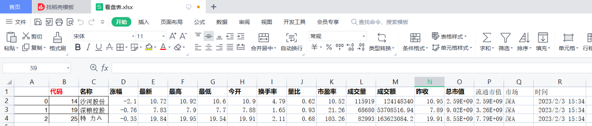
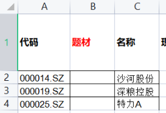

# 上班“摸鱼炒股”神器--超隐蔽“划水致富”

## 🤡 说些心里话，引发点共鸣

作为上班族的你，又要上班，又要炒股，是不是好心累啊~！

```
                 摸鱼词
    
    为什么会心累啊~~~
    还不就是像做贼一样，看股票，怕被发现吗！！！
    
    献上我的膝盖：摸鱼划水神器
    让领导以为你是一名从不摸鱼，好好工作的员工！！！

    哈哈哈，记得给我点赞哦，我会更有动力继续开发
    我会让你摸得更加如鱼得水，丝滑丝滑

    后续我会加入“人工智能”辅佐你哦
    敬请期待！！！
```

上班时，你是否担心一件事，你买的股票怎么样了啊🤨？  

一不小心错过了时机，痛心疾首，急得直跺脚。


可是，用手机看盘实在太小啊。但用电脑看盘，被领导发现，怎么办，
悄悄看盘时，吓得我的小心扑通扑通的跳啊


哈哈，现在好了，我想到了终极解决方案，让我来放大招吧。

```
       拿出神器：摸鱼炒股神器
```


```
     我的方案：
        使用Excel作为交互界面，在Excel里显示股票信息
        真是妙啊！！！哈哈哈
```

展示下效果好了



我提供了什么功能：

```
1. 自选股实时信息
2. 概念板块涨幅榜
3. 龙虎榜
4. 涨停板
5. 财联社新闻
6. 市场快讯
```

好了，介绍到这里，下面开始详细介绍如何使用以及技术细节吧

## 🚀如何使用

1. 安装依赖：

    qstock依赖的库有些大，请使用国内镜像，会更快
    
    ```
       pip install xlwings
       pip install qstock -i https://pypi.tuna.tsinghua.edu.cn/simple/ --trusted-host pypi.tuna.tsinghua.edu.cn
    ```

2. 把Excel模板里的“自选股”写上你心仪的股票

    在代码列和名称列写上你的想关注的股票信息
    
    

3. 把Excel模板放在和main.py同一个目录下

4. 启动程序

    ```
       python main.py
    ```
   
    


## ⛳原理介绍

开发这个系统，主要有3个难点：

- Excel如何在线修改并刷新
- 使用什么数据源
- Excel模板显示些什么

1. Excel如何在线修改并刷新？

    通过查阅了各种资料，几乎没有讲在线刷新Excel的。等我准备放弃时，我发现了一个方法，
    就是在Excel里写VBS，然后在通过VBS调用python。但我感觉真麻烦，且不想花时间研究
    VBS。等我打算放弃时，终于又发现一个方法，心情就像过山车，我忐忑这个方法会不会又
    不成功。
    
    
    
    通过xlwings实现在线刷新Excel
    
    ```python
       import xlwings as xw
       import pandas as pd
   
       wb = xw.Book(xlsx_file)  # 打开Excel表
       sht_num = len(wb.sheets)  # 获取Sheet数量
       
       # 打开第一个Sheet
       index = 1
       sheet = wb.sheets[index]
       
       # 获取行数和列数
       row_num = sheet.api.UsedRange.Rows.count
       col_num = sheet.api.UsedRange.Columns.count
       
       # 把sheet中的数据转成Dataframe数据格式
       #   (1,1)起始行列都是1，结束行列分别是(row_num, col_num)
       df_sht = sheet.range((1, 1), (row_num, col_num)). \
                options(pd.DataFrame, headers=True, index=False).value
       
       # 在线刷新Excel, 下面表示要刷新的区域
       #   (1,1)起始行列都是1，结束行列分别是(row_num, col_num)
       #   把dataframe的值赋值给sheet并动态刷新
       sheet.range((1, 1), (row_num, col_num)).value = df_sht
    ```
   
   如果你的Excel处在打开编辑状态，程序运行时，会自动打开另一个只读的副本。
   
2. 数据源

   如果你想获取高质量的数据，建议使用付费数据，如Wind、聚宽、东方财富及同花顺等。
   
   本代码主要考虑尽量使用相对可靠且免费的数据。本代码主要采用qstock库获取数据，
   qstock主要使用东方财富和同花顺的免费接口。
   
   - 东方财富免费接口可获取的数据内容有限，如果想获取更多信息，需要使用付费量化接口
     - 数据接口： https://data.eastmoney.com/bkzj/hy.html
   - 同花顺免费接口连接不稳定，如果想获取更多信息，需要使用付费量化接口
     - 数据接口：http://data.10jqka.com.cn/
   
   通过API获取数据，并转出dataframe格式输出：
   
   ```python
       #涨停股池
        def stock_zt_pool(date= None) :
            """
            获取东方财富网涨停板行情
            date:日期
            """
            if date is None:
                date=latest_trade_date()
            url = 'http://push2ex.eastmoney.com/getTopicZTPool'
            params = {
                'ut': '7eea3edcaed734bea9cbfc24409ed989',
                'dpt': 'wz.ztzt',
                'Pageindex': '0',
                'pagesize': '10000',
                'sort': 'fbt:asc',
                'date': date,
                '_': '1621590489736',
            }
            r = requests.get(url, params=params)
            data_json = r.json()
            if data_json['data'] is None:
                return pd.DataFrame()
            temp_df = pd.DataFrame(data_json['data']['pool'])
            temp_df.reset_index(inplace=True)
            temp_df['index'] = range(1, len(temp_df)+1)
            old_cols=['序号','代码','_','名称','最新价','涨跌幅','成交额(百万)','流通市值(百万)',
                '总市值(百万)', '换手率','连板数','首次封板时间','最后封板时间',
                '封板资金(百万)','炸板次数','所属行业','涨停统计',]
            temp_df.columns =  old_cols
            temp_df['涨停统计'] = (temp_df['涨停统计'].apply(lambda x: dict(x)['days']
                        ).astype(str) + "/" + temp_df['涨停统计']
                       .apply(lambda x: dict(x)['ct']).astype(str))
            new_cols=['代码','名称','涨跌幅','最新价','换手率','成交额(百万)','流通市值(百万)',
                '总市值(百万)','封板资金(百万)','首次封板时间','最后封板时间','炸板次数',
                '涨停统计','连板数','所属行业',]
            df = temp_df[new_cols].copy()
            df['首次封板时间'] = df['首次封板时间'].apply(lambda s:str(s)[-6:-4]+':'+str(s)[-4:-2])
            df['最后封板时间'] = df['最后封板时间'].apply(lambda s:str(s)[-6:-4]+':'+str(s)[-4:-2])
            df['最新价'] = df['最新价'] / 1000
           
            # 将object类型转为数值型
            ignore_cols = ['代码','名称','最新价','首次封板时间','最后封板时间','涨停统计','所属行业',]
            df = trans_num(df, ignore_cols)
            df[['成交额(百万)','流通市值(百万)','总市值(百万)','封板资金(百万)']]=(df[['成交额(百万)',
                '流通市值(百万)','总市值(百万)','封板资金(百万)']]/1000000)
            return df.round(3)

   ```

3. 代码实时刷新流程
   代码分为初始化加载和动态加载2部分。
   
   - 初始化加载：股票所属的行业和板块，可以仅加载一次，不每次都刷新，以加快刷新速度
   - 动态加载：股票实时信息，实时加载并刷新每一个Sheet
   
   ```python
        def real_time_update(self):
            self.query_static_info()
            while True:
                self.query_rt_info()
                time.sleep(self._refresh_wait_time)
    ```
   
## 🎏 最后

- 本方案目前仅是第一版，还不够灵活，Excel内容暂时不能灵活配置，如果要个人定制内容，只能自行改代码，
  后续会逐渐完善
- 后续会加入“人工智能”技术，给出辅助的预测结果和操盘建议