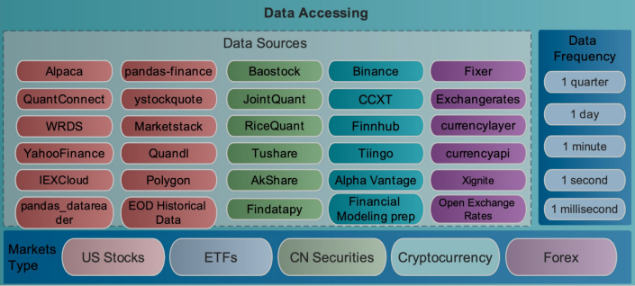

# 0. 简介

本目录提供各类金融数据获取样例，按数据类型分为以下大类文件夹：

| 大类 | 说明 | 包含样例 |
| --- | --- | --- |
| `股票/` | A股/美股/港股股票行情、官方披露、收费终端 | akshare, baostock, efinance, qlib, yfinance, qstock, tushare, pytdx, stooq, data_loader_framework, web_api, eastmoney, tencent, netease, cninfo, wind |
| `基金/` | 开放式基金净值、持仓、ETF | fund |
| `电子币/` | 加密货币行情 | ccxt, cryptocompare |
| `新闻/` | 财经新闻、舆情 | news, news_api, gdelt, finnhub, xueqiu |
| `期货/` | 期货行情 | futures |
| `宏观经济/` | 海外宏观经济指标 | fred, world_bank |

每个样例目录下均包含 `README.md`（说明）与 `requirements.txt`（依赖，版本已用 `==` 锁定）。
本目录根的 `requirements.txt` 为所有样例依赖的并集（总依赖）。

## 数据源数量统计

本目录共收录 **27** 个数据源样例，覆盖股票、基金、期货、加密货币、新闻舆情、宏观经济六大类。

**按数据类型统计：**

| 大类 | 数量 | 数据源 |
| --- | ---: | --- |
| `股票/` | 16 | akshare, baostock, cninfo, data_loader_framework, eastmoney, efinance, netease, pytdx, qlib, qstock, stooq, tencent, tushare, web_api, wind, yfinance |
| `新闻/` | 5 | finnhub, gdelt, news, news_api, xueqiu |
| `电子币/` | 2 | ccxt, cryptocompare |
| `宏观经济/` | 2 | fred, world_bank |
| `基金/` | 1 | fund |
| `期货/` | 1 | futures |
| **合计** | **27** | — |

**按收费模式统计：**

| 类型 | 数量 | 说明 |
| --- | ---: | --- |
| 完全免费 | 21 | 无需 API Key，开箱即用（akshare/baostock/qstock/efinance/ccxt/gdlt/fred 等） |
| 免费（需注册 API Key） | 4 | cryptocompare, finnhub, news_api, xueqiu（Cookie） |
| 部分免费 | 1 | tushare（免费额度有限） |
| 收费 | 1 | wind（机构首选） |

推荐源汇总：

# 1. 推荐使用数据源

1. 收费数据：
    - Wind数据(业内权威，机构首选数据)

2. 部分收费数据
    - Tushare（若免费使用，接口调用受限）
    - 聚宽

3. 免费数据：注意Baostock和AKShare需要定期升级到最新，否则可能出现无法下载问题
    - Baostock
    - qstock (主要基于东方财富和同花顺的免费接口)
    - AKShare (目前最全的免费金融数据接口库)
    - efinance (基于东方财富的免费数据获取库)
    - Qlib (微软开源AI量化框架，内置数据下载)
    - CCXT (加密货币交易所统一接口库)
    - CryptoCompare (加密货币行情聚合，需免费API Key)
    - FRED (美联储宏观经济数据)
    - World Bank API (全球经济数据)
    - 巨潮资讯网 (官方信息披露平台)
    - GDELT Project (全球新闻事件+情绪数据)
    - Finnhub (国际财经新闻+情绪分析)
    - NewsAPI.org (国际新闻聚合API)
    - 雪球网 (投资者社区舆情数据)

# 2. 股票数据

## 2.1 开源免费python库
&emsp;&emsp;免费数据足够研究使用，实盘使用，质量可能略微欠佳。
常见开源数据python库如下：

- qlib [https://github.com/microsoft/qlib](https://github.com/microsoft/qlib)
  * （*****）推荐使用
  * 微软开源AI量化框架，通过雅虎财经获取数据，可获取中国和美国区数据。该数据
  足够进行研究，但质量欠佳，实盘建议更换质量更高的数据。
  * [示例代码](股票/qlib/qlib_demo.py)

- [证券宝](www.baostock.com)
  * （*****）推荐使用
  * 免注册证券数据 (数据很丰富，qlib基于此获取数据)
  * [示例代码](股票/baostock/get_stock_data.py)

- akshare [https://github.com/akfamily/akshare](https://github.com/akfamily/akshare)
  * （*****）推荐使用
  * 非常完善的数据获取库，主要基于爬虫获取，覆盖股票/期货/期权/基金/外汇/债券/宏观经济等
  * [示例代码](股票/akshare/akshare_demo.py)

- efinance [https://github.com/Micro-sheep/efinance](https://github.com/Micro-sheep/efinance)
  * （*****）推荐使用
  * 非常完善的数据获取库，主要基于爬虫获取
  * 缺点: 没有大盘指数的接口
  * [示例代码](股票/efinance/efinance_demo.py)

- yfinance
  * （***）推荐使用 (貌似只能获取国外股票行情数据)
  * 前身是pandas_datareader，后来雅虎关闭api后，通过一些非官方方法获取数据
  * 优点是数据免费、可以获取分钟级数据
  * 支持A股/港股代码自动转换（600519->600519.SS, hk00700->0700.HK）
  * [示例代码](股票/yfinance/yfinance_data.py)

- pytdx (通达信)
  * （****）推荐使用
  * 免费、无需注册、直连行情服务器，支持实时行情
  * 支持日K线、分钟K线、实时行情、股票列表
  * 局限：仅支持沪深A股，不支持港股/美股/北交所
  * [示例代码](股票/pytdx/pytdx_demo.py)

- stooq
  * （***）推荐使用
  * 免费、无需 API Key、支持 CSV 直接下载
  * 可作为 yfinance 限流时的免密钥兜底数据源
  * 支持美股行情、全球指数、ETF历史数据
  * [示例代码](股票/stooq/stooq_demo.py)

- qstock
  * （****）推荐使用
  * 基于东方财富和同花顺的免费接口封装，使用简便
  * [说明文档](股票/qstock/README.md)

## 2.2 财经网API获取数据
- 新浪财经API
  * （***）推荐使用
  * 不确定调用量限制，另外，获取的数据是json格式，需要自行整理数据
  * 查询不了历史数据，只能获取实时数据
  * [示例代码](股票/web_api/demo_sina_data.ipynb)

- 东方财富API
  * （****）推荐使用
  * 无需注册，返回JSON，数据丰富（K线/实时/资金流）
  * 是akshare、efinance等库的底层数据源
  * [示例代码](股票/eastmoney/eastmoney_api.py)

- 腾讯财经API
  * （***）推荐使用
  * 数据较丰富，支持实时行情和历史K线
  * [示例代码](股票/tencent/tencent_api.py)

- 网易财经API
  * （***）推荐使用
  * 支持CSV下载，历史数据较长
  * [示例代码](股票/netease/netease_api.py)

- 雅虎财经API(已关闭，但通过一些python库仍能获取相关数据)

## 2.3 官方披露数据
- 巨潮资讯网 (CNINFO)
  * （****）推荐使用
  * 证监会指定法定信息披露网站
  * 提供上市公司公告、年报、季报等
  * [示例代码](股票/cninfo/cninfo_demo.py)

## 2.4 部分免费python库
&emsp;&emsp;该部分数据质量相对较好，但不完全免费，存在部分限制。

- Tushare [**https://tushare.pro/**](https://tushare.pro/)
  * （*****）推荐使用
  * 质量高，使用人数多。但存在很多限制，需要收费才能获取更多的数据。
  * 支持日线/分钟级行情、基本面指标、交易日历、股票列表
  * 提供轻量级 HTTP 客户端（无需 SDK）和标准化 OHLCV 输出
  * [示例代码](股票/tushare/tushare_demo.py)

## 2.5 收费股票数据
收费数据质量更高，更可靠。
- Wind: 几乎所有金融机构的首选，如果用于个人，费用可能有些小贵哦
  * [使用介绍](股票/wind/wind使用介绍.md) | [接口示例](股票/wind/各接口使用示例.ipynb) | [基础数据](股票/wind/basic_data/README.md)
- “三大矿”在线平台：如聚宽、米筐和优矿等。对于聚宽，费用对于个人还可以，
  其余2个平台，我还未进行调研。但聚宽上的行业分类，相比同花顺，感觉很久
  没有更新了，比较老，不知道VIP的接口获取的数据是否是不同的

# 3. 基金数据
- AKShare + efinance 基金接口
  * （*****）推荐使用
  * 覆盖开放式基金净值、基金业绩排行、基金持仓、ETF行情
  * 无需 API Key
  * [示例代码](基金/fund/fund_demo.py)

# 4. 电子币（加密货币）数据
- CCXT [https://github.com/ccxt/ccxt](https://github.com/ccxt/ccxt)
  * （*****）推荐使用
  * 支持100+加密货币交易所的统一接口
  * 公开行情数据无需API Key
  * [示例代码](电子币/ccxt/ccxt_demo.py)

- CryptoCompare
  * （****）推荐使用
  * 加密货币行情聚合，多交易所加权价格、市值排名、历史数据
  * 与CCXT互补：CCXT直连单交易所，CryptoCompare聚合全市场
  * 免费层需注册 API Key
  * [示例代码](电子币/cryptocompare/cryptocompare_demo.py)

# 5. 新闻与舆情数据
- AKShare 新闻接口
  * （*****）推荐使用
  * 覆盖个股新闻、财经快讯、新闻联播、微博舆情、新闻情绪指数
  * 无需 API Key，接口最全
  * [示例代码](新闻/news/news_demo.py)

- GDELT Project
  * （*****）推荐使用
  * 全球新闻事件数据库，1979年至今，每15分钟更新
  * 内置CAMEO事件编码和Tone情绪分数
  * 完全免费，无需 API Key
  * [示例代码](新闻/gdelt/gdelt_demo.py)

- Finnhub
  * （****）推荐使用
  * 国际财经新闻、公司新闻、新闻情绪分析
  * 免费层60请求/分钟，需注册 API Key
  * [示例代码](新闻/finnhub/finnhub_demo.py)

- NewsAPI.org
  * （****）推荐使用
  * 覆盖150,000+全球新闻源，55个国家，14种语言
  * 免费层100请求/天，需注册 API Key
  * [示例代码](新闻/news_api/newsapi_demo.py)

- 雪球网
  * （****）推荐使用
  * 国内领先投资者社区，帖子内容、阅读量、评论数
  * 需登录获取 Cookie（xq_a_token）
  * [示例代码](新闻/xueqiu/xueqiu_demo.py)

- 东方财富新闻+股吧
  * （****）推荐使用
  * 个股新闻搜索、股吧帖子、股吧热度
  * 无需 API Key
  * [示例代码](股票/eastmoney/eastmoney_news_guba.py)

# 6. 期货数据
- AKShare 期货接口（新浪财经）
  * （*****）推荐使用
  * 覆盖主力连续日K线、单合约历史K线、全市场主力合约列表
  * 无需 API Key
  * [示例代码](期货/futures/futures_demo.py)

# 7. 宏观经济数据
- FRED (Federal Reserve Economic Data)
  * （*****）推荐使用
  * 美联储免费宏观经济数据库，数据权威
  * 需免费注册获取API Key
  * [示例代码](宏观经济/fred/fred_demo.py)

- World Bank API
  * （****）推荐使用
  * 世界银行免费全球经济数据，覆盖200+国家
  * 无需API Key
  * [示例代码](宏观经济/world_bank/world_bank_demo.py)

# 8. 数据加载器框架

多数据源统一接口框架，支持 Protocol 接口定义、注册表、回退链、数据校验、重试机制。

- data_loader_framework
  * （*****）推荐在多数据源场景下使用
  * 统一 OHLCV 输出格式，多个数据源可互换使用
  * 自动降级回退：如 A股 -> akshare -> baostock -> tushare
  * 内置 OHLCV 数据校验、带预算的重试机制
  * 参考 Vibe-Trading 和 daily_stock_analysis 的架构模式
  * [示例代码](股票/data_loader_framework/data_loader_base_demo.py)

# 9. 数据源列表
## 9.1 免费
* Baostock - 免注册证券数据
* qstock - 基于东方财富和同花顺的免费接口
* AKShare - 最全免费金融数据接口库（含新闻/舆情/期货/基金接口）
* efinance - 基于东方财富的免费数据获取库
* Qlib - 微软开源AI量化框架
* CCXT - 加密货币交易所统一接口库
* FRED - 美联储宏观经济数据
* World Bank API - 全球经济数据
* 巨潮资讯网 - 官方信息披露平台
* GDELT Project - 全球新闻事件+情绪数据（1979年至今）
* 新浪、雅虎、东方财富网、腾讯、网易 - 财经网API
* 通达信 - 免费
* 历史数据 - 文档 | BigQuant - 免费

## 9.2 免费（需注册 API Key）
* CryptoCompare - 加密货币行情聚合（市值排名/历史数据）
* Finnhub - 国际财经新闻+情绪分析（60请求/分钟）
* NewsAPI.org - 国际新闻聚合API（100请求/天）
* 雪球网 - 投资者社区舆情数据（需Cookie）

## 9.3 部分免费
* TuShare - 中文财经数据接口包（免费额度有限）
* 聚宽 - 提供3个月免费本地数据服务
* 优矿、果仁、米筐 - 在线平台部分免费

## 9.4 收费
* Quandl - 国际金融和经济数据（部分免费）
* Wind资讯-经济数据库 - 收费
* 东方财富 Choice金融数据研究终端 - 收费
* iFinD 同花顺金融数据终端 - 收费
* 朝阳永续 Go-Goal数据终端 - 收费
* 天软数据 - 收费
* 国泰安数据服务中心 - 收费
* 锐思数据 - 收费
* 恒生API - 收费
* Bloomberg API - 收费
* 数库金融数据和深度分析API服务 - 收费
* Historical Data Sources - 一个数据源索引
* 预测者网 - 收费
* 通联数据商城 - 收费
* 聚合数据、数粮 、数据宝 - 收费