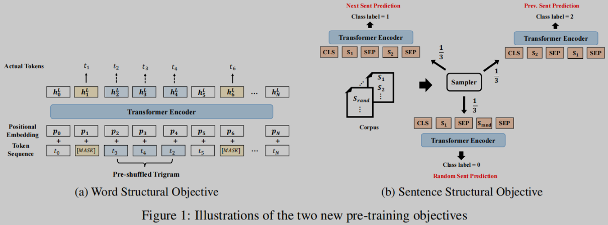
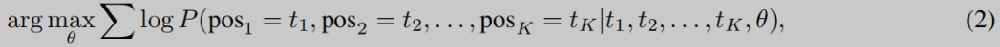
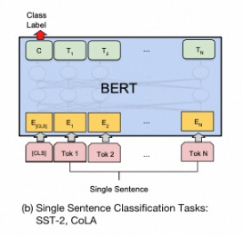
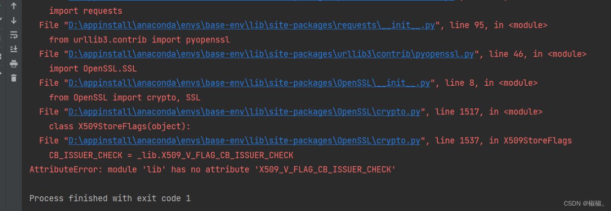

# 1. 简介

本代码主要实现了利用StructBERT对财经行文进行情绪分析，给出正面或负面的概率。

# 2. 安装指南

(1) 安装modelscope   

    ```
    pip install "modelscope[nlp]" -f https://modelscope.oss-cn-beijing.aliyuncs.com/releases/repo.html
    ```

    如安装过程存在问题，可参考本文第4部分的常见问题。

    如果如上安装存在联网问题，可参考如下网址，采取本地利离线安装

    ```
    https://modelscope.cn/docs/%E7%8E%AF%E5%A2%83%E5%AE%89%E8%A3%85
    ```

（2）安装qstock  

    ```
    pip install qstock
    ```

# 3. 使用说明

功能介绍：
- 使用qstock获取财联社新闻或市场快讯
- 使用modelscope提供的[StructBERT](https://modelscope.cn/models/damo/nlp_structbert_sentiment-classification_chinese-base/quickstart)
  模型进行情感分析
  
中文情感分类模型
- [StructBERT通用模型](https://modelscope.cn/models/damo/nlp_structbert_sentiment-classification_chinese-base/quickstart)
- [StructBERT通用大模型](https://modelscope.cn/models/damo/nlp_structbert_sentiment-classification_chinese-large/summary)

注意：
- 输入文本限制需限制在300个字符以内，如果需要更大，可需改配置文件

# 4. 原理讲解

## 4.1 简介
论文
- 名称：Structbert: Incorporating language structures into pre-training for deep language understanding
- 地址：https://arxiv.org/abs/1908.04577

BERT采用双向结构关注上下文信息（双向多层Transformer结构），同时基于上下文预测被掩蔽的词，以提取文本特征。BERT提出了
2中预训练任务：掩蔽的语言模型和预测下一句

StructBERT在BERT基础之上整合了结构化信息：词级顺序及句级策略。对预训练模型增加了2个目标函数，分别考虑句内和句间结构。

通过结构化预训练，StructBERT对词句的依赖关系能更好的建模
- 类似BERT，在掩蔽的语言模型之后，还对一定量的token打乱顺序，并预测正确的顺序
- 随机交换句子顺序，预测上一句和下一句，作为一个新的句子预测任务

通过以上方法，可以更好的构建句内和句间结构。

## 4.2 预训练



1. 输入
    - 输入由token构成，使用WordPiece将词拆解，使用子词作为建模单元
    - 输入可以是单个句子的，也可以是句子对
    - 输入和位置编码（512长度）相加
    - 每一句前加入一个[CLS]标志位，每一句后加一个[SEP]标志位
    - 随机掩蔽15%的token
    - 对没有掩蔽的token，5%的概率使用3-gram进行随机乱序以保证模型结构稳定
    
2. 输出
    - 输出的h送入softmax，预测原始的序列
    
3. 词结构目标函数  

   对一定量的token打乱顺序，并预测正确的顺序
   
    
    
4. 句结构目标函数
    
    BERT中预测下一句的准确率高达97-98%，因此，任务过于简单。
       
    因此，引入新的任务。随机交换句子顺序，预测上一句和下一句，作为一个新的句子预测任务。
    
    对于输入句子对(S1, S2), 任务分为：
    - 1/3时候预测S2是否是S1的下一句
    - 1/3时候预测S2是否是S1的上一句
    - 1/3时候随机挑选一句作为下一句

5. 训练
    - adam: 学习率1e-4, β1 = 0.9, β2 = 0.999, L2权重衰减0.01，总步数中的10%作为学习率预热，
      之后学习率线性衰减。
    - dropout设为0.1
    - gelu
    
    模型结构
    - StructBERTBase: L = 12, H = 768, A = 12, Number of parameters= 110M
    - StructBERTLarge: L = 24, H = 1024, A = 16, Number of parameters= 340M

## 4.3 微调

情感分类任务，通常为输入一段句子或一段话，返回该段话正向/负向的情感极性，在用户评价，观点抽取，意图识别中往往起到重要作用。

模型基于Structbert-base-chinese，在bdci、dianping、jd binary、waimai-10k四个数据集（11.5w条数据）上fine-tune得到。

使用预训练的StructBERT在情感分类数据集上进行微调。利用CLS位进行二分类。



# 5. 常见问题

1. AttributeError: module ‘lib‘ has no attribute ‘X509_V_FLAG_CB_ISSUER_CHECK‘
    
    - 报错
        
        
    - 原因：
        主要原因是系统当前的python和pyOpenSSL版本不对应
        
    - 解决方法：
      ```
        pip uninstall pyOpenSSL
        pip install pyOpenSSL
      ```
 
2. 兼容性问题

   安装modelscope完成后，注意可能会报存在不少不兼容的包，按照要求的版本进行安装
   
3. TypeError: __init__() got an unexpected keyword argument ‘allowed_methods‘
    
    升级2个安装包
    ```
    pip3 install --upgrade urllib3
    pip3 install --upgrade requests 
    ```   

# 参考
[1] StructBERT中文情感分类模型, 
    https://modelscope.cn/models/damo/nlp_structbert_sentiment-classification_chinese-large/summary