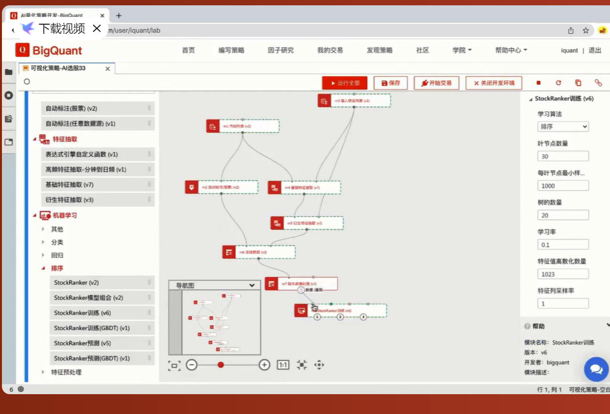

# 1. 概述
&emsp;&emsp;目前有不少优秀的免费在线投研平台，可以方便获取数据，进行
回测和实盘等。早期比较有名的主要是优矿、聚宽和米筐三巨头。

&emsp;&emsp;目前也涌现出不少新兴的投研平台，对代码零基础也非常友好，
仅通过已有的策略库进行配置就能实现快速回测，比如BigQuant、优矿和果仁。
其中，BigQuant显得更为简便友好，仅通过拖拖拽拽、连线就能实现一个自己的
策略。

BigQuant智能策略

&emsp;&emsp;自动量化策略生成平台，无编程基础也能用：
https://www.bladequant.com/

&emsp;&emsp;零代码的平台虽好，缺点就是大多是一个黑盒，你也不确定
内部的运作状态，无法很好的把控。

# 2. 量化平台列表
有些国外的平台、社区、博客如果连接无法打开，那说明可能需要“科学”上网
量化交易平台
国内在线量化平台：
* BigQuant - 你的人工智能量化平台 - 可以无门槛地使用机器学习、人工智能开发量化策略，基于python，提供策略自动生成器
* 镭矿 - 基于量化回测平台
* 果仁网 - 回测量化平台
* 京东量化 - 算法交易和量化回测平台
* 聚宽 - 量化回测平台
* 优矿 - 通联量化实验室
* Ricequant - 量化交易平台
* 况客 - 基于R语言量化回测平台
* Factors - 数库多因子量化平台
* 诸葛量化 - 量化交易平台
* 宽狗量化 - 回测量化平台
* 极宽（ziwang.com）-提供python工具的量化社区

* 国外量化平台：
    • Quantopian 研究、回测、算法众包平台

    • QuantConnect 研究、回测和投资交易

    • Quantstart 研究、回测和投资交易、数据科学网站

    • ASC 研究、交易平台

    • zulutrade 自动交易平台

    • quantpedia 研究、策略平台

    • algotrading101 策略研究平台

    • investopedia 可以股票、外汇模拟交易的财经网站

    • Amibroker 提供系统交易工具的一家公司

    • AlgoTrades 股票、ETF、期货自动交易系统

    • Numerai 数据工程师众包的一家对冲基金

    • WealthFront 财富管理平台

    • Betterment 个人投资平台

    • TradeLink 量化交易平台

    • ActiveQuant 基于JavaScript开源交易开发框架
相关平台：
    • 掘金量化 - 支持C/C++、C#、MATLAB、Python和R的量化交易平台

    • DigQuant - 提供基于matlab量化工具

    • SmartQuant - 策略交易平台

    • OpenQuant - 基于C#的开源量化回测平台

基于图表的量化交易平台     
* 文华赢智 、TB、金字塔、MultiCharts 中国版 - 程序化交易软件、MT4、TradeStation     
* Auto-Trader - 基于MATLAB的量化交易平台
* BotVS - 首家支持传统期货与股票证券与数字货币的量化平台

参考：https://zhuanlan.zhihu.com/p/26179943