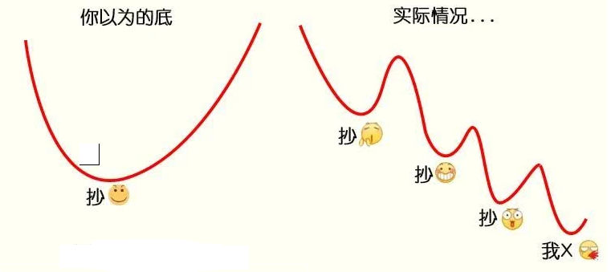
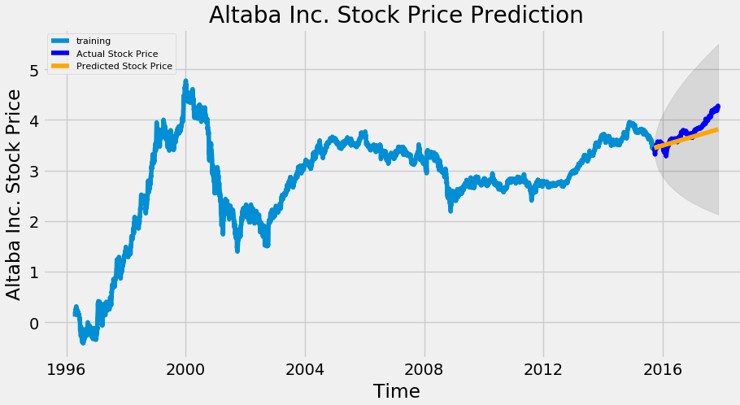
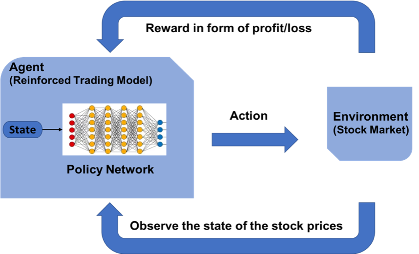
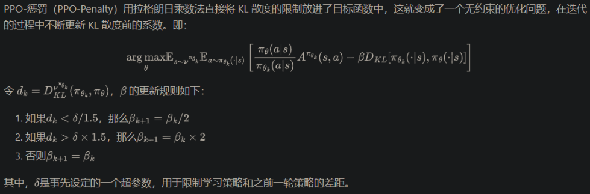
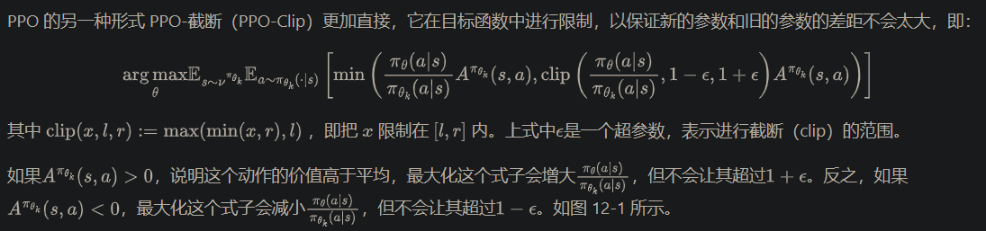
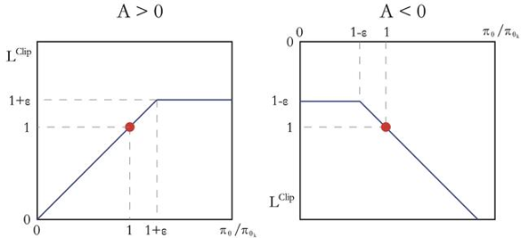
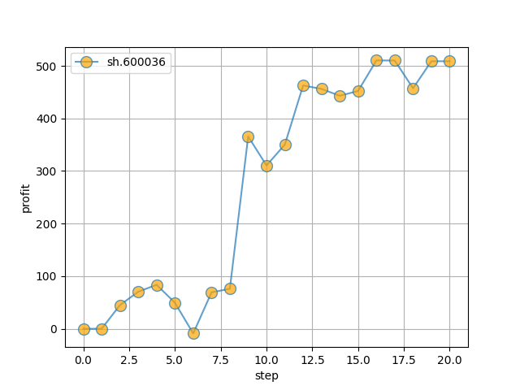
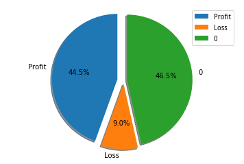
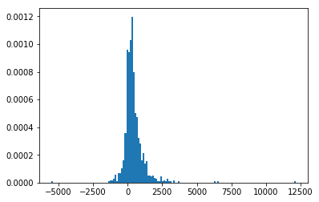

# 📈 如何用深度强化学习自动炒股

## ✨前言

- 本文代码路径 (Github 2.8k 星)：https://github.com/charliedream1/ai_quant_trade/tree/master/egs_trade/rl/a001_proto_sb3
- 本策略主要参考并从如下代码仓引用了大量代码：https://github.com/wangshub/RL-Stock

在原策略基础上主要做了如下优化：
- 升级最新的基于pytorch的强化学习工具库stable-baselines3
- 解决强化学习环境中Box精度警告
- 解决强化学习环境中self.cost_basis分母除0警告
- 重构主函数流程

## 💡 初衷

最近一段时间，受到新冠疫情的影响，股市接连下跌，作为一棵小白菜兼小韭菜，竟然产生了抄底的大胆想法，拿出仅存的一点私房钱梭哈了一把。

第二天，暴跌，俺加仓

第三天，又跌，俺加仓

第三天，又跌，俺又加仓...



一番错误操作后，结果惨不忍睹，第一次买股票就被股市一段暴打，受到了媳妇无情的嘲讽。痛定思痛，俺决定换一个思路：**如何用深度强化学习来自动模拟炒股？** 实验验证一下能否获得收益。
    
## 📖 监督学习与强化学习的区别

监督学习（如 LSTM）可以根据各种历史数据来预测未来的股票的价格，判断股票是涨还是跌，帮助人做决策。



而强化学习是机器学习的另一个分支，在决策的时候采取合适的行动 (Action) 使最后的奖励最大化。与监督学习预测未来的数值不同，强化学习根据输入的状态（如当日开盘价、收盘价等），输出系列动作（例如：买进、持有、卖出），使得最后的收益最大化，实现自动交易。



## 🤖 OpenAI Gym 股票交易环境

### 观测 Observation

策略网络观测的就是一只股票的各项参数，比如开盘价、收盘价、成交数量等。部分数值会是一个很大的数值，比如成交金额或者成交量，有可能百万、千万乃至更大，为了训练时网络收敛，观测的状态数据输入时，必须要进行归一化，变换到 `[-1, 1]` 的区间内。

|参数名称|参数描述|说明|
|---|---|---|
|date|交易所行情日期|格式：YYYY-MM-DD|
|code|证券代码|格式：sh.600000。sh：上海，sz：深圳|
|open|今开盘价格|精度：小数点后4位；单位：人民币元|
|high|最高价|精度：小数点后4位；单位：人民币元|
|low|最低价|精度：小数点后4位；单位：人民币元|
|close|今收盘价|精度：小数点后4位；单位：人民币元|
|preclose|昨日收盘价|精度：小数点后4位；单位：人民币元|
|volume|成交数量|单位：股|
|amount|成交金额|精度：小数点后4位；单位：人民币元|
|adjustflag|复权状态|不复权、前复权、后复权|
|turn|换手率|精度：小数点后6位；单位：%|
|tradestatus|交易状态|1：正常交易 0：停牌|
|pctChg|涨跌幅（百分比）|精度：小数点后6位|
|peTTM|滚动市盈率|精度：小数点后6位|
|psTTM|滚动市销率|精度：小数点后6位|
|pcfNcfTTM|滚动市现率|精度：小数点后6位|
|pbMRQ|市净率|精度：小数点后6位|

### 动作 Action

假设交易共有**买入**、**卖出**和**保持** 3 种操作，定义动作(`action`)为长度为 2 的数组

- `action[0]` 为操作类型；
- `action[1]` 表示买入或卖出百分比；

| 动作类型 `action[0]` | 说明 |
|---|---|
| 1 | 买入 `action[1]`|
| 2 | 卖出 `action[1]`|
| 3 | 保持 |

注意，当动作类型 `action[0] = 3` 时，表示不买也不抛售股票，此时 `action[1]` 的值无实际意义，网络在训练过程中，Agent 会慢慢学习到这一信息。

### 奖励 Reward

奖励函数的设计，对强化学习的目标至关重要。在股票交易的环境下，最应该关心的就是当前的盈利情况，故用当前的利润作为奖励函数。即`当前本金 + 股票价值 - 初始本金 = 利润`。

```python
# profits
reward = self.net_worth - INITIAL_ACCOUNT_BALANCE
reward = 1 if reward > 0 else reward = -100
```

为了使网络更快学习到盈利的策略，当利润为负值时，给予网络一个较大的惩罚 (`-100`)。

### 策略梯度

因为动作输出的数值是连续，因此使用基于策略梯度的优化算法，其中比较知名的是 [PPO 算法](https://arxiv.org/abs/1707.06347)，
在 2017 年被提出，OpenAI 和许多文献已把 PPO 作为强化学习研究中首选的算法。PPO 优化算法 Python 实现参考 
[stable-baselines](https://stable-baselines.readthedocs.io/en/master/modules/ppo2.html)。

PPO 的优化目标与 TRPO 相同，但 PPO 用了一些相对简单的方法来求解。具体来说，PPO 有两种形式，一是 PPO-惩罚，二是 PPO-截断。

1. PPO-惩罚
    
    
2. PPO-截断
    
    
    

## 🕵️‍♀️ 模拟实验

### 环境安装

1. 创建conda环境并安装需要的库
    ```
    # 虚拟环境
    conda create -n rl_stock python=3.8
    conda activate rl_stock
    # 安装库依赖
    pip install -r requirements.txt
    ```
    
    可以看到需要的库如下：
    ```
    baostock==0.8.8  
    stable-baselines3==1.6.2
    gym==0.21.0
    torch==1.13.1
    tensorboard==2.11.0
    ```
   
    * 数据源：股票证券数据集来自于 [baostock](http://baostock.com/baostock/index.php/%E9%A6%96%E9%A1%B5)，
      一个免费、开源的证券数据平台，提供 Python API。
      ```bash
        >> pip install baostock -i https://pypi.tuna.tsinghua.edu.cn/simple/ --trusted-host pypi.tuna.tsinghua.edu.cn
      ```
    * 强化学习库：采用最新的stable-baselines3，其依赖pytorch 1.11以上版本
    * 强化学习环境：基于gym构建，在quant_brain/rl/envs/StockTradingEnv0.py,
      基于开源代码https://github.com/wangshub/RL-Stock和
      https://github.com/notadamking/Stock-Trading-Environment
      
2. 如何运行：
   代码会自动在data目录下下载训练和测试数据，分别模拟单个股票和多个股票交易。
   ```bash
   python main.py
   ```

### 股票数据获取

股票证券数据集来自于 [baostock](http://baostock.com/baostock/index.php/%E9%A6%96%E9%A1%B5)，一个免费、开源的证券数据平台，提供 Python API。

```bash
>> pip install baostock -i https://pypi.tuna.tsinghua.edu.cn/simple/ --trusted-host pypi.tuna.tsinghua.edu.cn
```

数据获取代码quant_brain/data_io/baostock/get_stock_data.py，单独运行可执行如下命令：

```python
>> python get_stock_data.py
```

数据下载大约需要20分钟左右。

将过去 20 多年的股票数据划分为训练集，和末尾 1 个月数据作为测试集，来验证强化学习策略的有效性。划分如下

| `1990-01-01` ~ `2019-11-29` | `2019-12-01` ~ `2019-12-31` |
|---|---|
| 训练集 | 测试集 |

### 验证结果

**单只股票**

- 初始本金 `10000`
- 股票代码：`sh.600036`(招商银行)
- 训练集： `stockdata/train/sh.600036.招商银行.csv`
- 测试集： `stockdata/test/sh.600036.招商银行.csv`
- 模拟操作 `20` 天，最终盈利约 `400`



**多支股票**

选取 `1002` 只股票，进行训练，共计

- 盈利： `44.5%`
- 不亏不赚： `46.5%`
- 亏损：`9.0%`





## 🍜代码解读

### 1.数据获取：quant_brain/data_io/baostock/get_stock_data.py
1. 初始化
    ```python
    # 登录 baostock
    bs.login()
    # 设置下载字段
    self.fields = "date,code,open,high,low,close,volume,amount," \
                          "adjustflag,turn,tradestatus,pctChg,peTTM," \
                          "pbMRQ,psTTM,pcfNcfTTM,isST"
    ```

2. 获取股票列表
   按照结束查询日期，获取股票
   ```python
   stock_rs = bs.query_all_stock(date)
   stock_df = stock_rs.get_data()
   ```

3. 根据股票列表下载股票数据
    会下载指数以及大约4000+股票信息，按照股票列表遍历下载
    ``` python
        # 遍历下载
        for index, row in stock_df.iterrows():
            print(f'processing {row["code"]} {row["code_name"]}')
            # 下载股票数据
            df_code = bs.query_history_k_data_plus(row["code"], self.fields,
                                                   start_date=self.date_start,
                                                   end_date=self.date_end).get_data()
            # 一支股票保存成一个csv文件
            df_code.to_csv(f'{self.output_dir}/{row["code"]}.{row["code_name"]}.csv', index=False)
        bs.logout()  # 退出baostock

    ```

### 2. 股票交易环境
代码位于quant_brain/rl/envs/StockTradingEnv0.py，基于gym库构建

1. 获取观测数据
   读取股票的csv转换成pandas的dataframe格式，每一次获取一天的观测值，
   即遍历每日的股票行情数据，其中对股票数据进行了归一化处理

    ```python
        def _next_observation(self):
            obs = np.array([
                self.df.loc[self.current_step, 'open'] / MAX_SHARE_PRICE,
                self.df.loc[self.current_step, 'high'] / MAX_SHARE_PRICE,
                self.df.loc[self.current_step, 'low'] / MAX_SHARE_PRICE,
                self.df.loc[self.current_step, 'close'] / MAX_SHARE_PRICE,
                self.df.loc[self.current_step, 'volume'] / MAX_VOLUME,
                self.df.loc[self.current_step, 'amount'] / MAX_AMOUNT,
                self.df.loc[self.current_step, 'adjustflag'] / 10,
                self.df.loc[self.current_step, 'tradestatus'] / 1,
                self.df.loc[self.current_step, 'pctChg'] / 100,
                self.df.loc[self.current_step, 'peTTM'] / 1e4,
                self.df.loc[self.current_step, 'pbMRQ'] / 100,
                self.df.loc[self.current_step, 'psTTM'] / 100,
                self.df.loc[self.current_step, 'pctChg'] / 1e3,
                self.balance / MAX_ACCOUNT_BALANCE,
                self.max_net_worth / MAX_ACCOUNT_BALANCE,
                self.shares_held / MAX_NUM_SHARES,
                self.cost_basis / MAX_SHARE_PRICE,
                self.total_shares_sold / MAX_NUM_SHARES,
                self.total_sales_value / (MAX_NUM_SHARES * MAX_SHARE_PRICE),
            ])
            return obs
    ```

2. 执行的动作
    - 股票当日值，采用开盘和收盘价之间的随机数代替
    - 0为买入，1为卖出
    - 计算最大收益
    
    ```python
        def _take_action(self, action):
            # Set the current price to a random price within the time step
            current_price = random.uniform(
                self.df.loc[self.current_step, "open"], self.df.loc[self.current_step, "close"])
    
            action_type = action[0]
            amount = action[1]
    
            if action_type < 1:
                # Buy amount % of balance in shares
                total_possible = int(self.balance / current_price)
                shares_bought = int(total_possible * amount)  # todo: it might exceed balance?
                prev_cost = self.cost_basis * self.shares_held
                additional_cost = shares_bought * current_price
    
                self.balance -= additional_cost
                if (self.shares_held + shares_bought) != 0:
                    self.cost_basis = (
                        prev_cost + additional_cost) / (self.shares_held + shares_bought)
                self.shares_held += shares_bought
    
            elif action_type < 2:
                # Sell amount % of shares held
                shares_sold = int(self.shares_held * amount)
                self.balance += shares_sold * current_price
                self.shares_held -= shares_sold
                self.total_shares_sold += shares_sold
                self.total_sales_value += shares_sold * current_price
    
            self.net_worth = self.balance + self.shares_held * current_price
    
            if self.net_worth > self.max_net_worth:
                self.max_net_worth = self.net_worth
    
            if self.shares_held == 0:
            self.cost_basis = 0
    ```

3. 奖励值计算
    根据执行动作得到的收益，计算奖励值
    ```python
    def step(self, action):
        # Execute one time step within the environment
        self._take_action(action)
        done = False

        self.current_step += 1

        if self.current_step > len(self.df.loc[:, 'open'].values) - 1:
            self.current_step = 0  # loop training
            # done = True

        delay_modifier = (self.current_step / MAX_STEPS)

        # profits
        reward = self.net_worth - self.init_balance
        reward = 1 if reward > 0 else -100

        if self.net_worth <= 0:
            done = True

        obs = self._next_observation()

        return obs, reward, done, {}
    ```

### 3. 主函数
主函数中主要使用了stable-baselines3，类似sklearn的强化学习库，基于pytorch 1.11以上版本。
构建训练和测试流程如下：
    ````python
    class ProtoRLSb3:
        def __init__(self, init_account_balance):
            self.init_account_balance = init_account_balance
            self._model = None
    
        def train(self, stock_file):
            log.info('Start Training ...')
            df = pd.read_csv(stock_file)
            df = df.sort_values('date')
    
            # The algorithms require a vectorized environment to run
            env = DummyVecEnv([lambda: StockTradingEnv(df, self.init_account_balance)])
    
            self._model = PPO(MlpPolicy, env, verbose=0, tensorboard_log='./log')
            self._model.learn(total_timesteps=int(1e4))
    
        def test(self, stock_file):
            day_profits = []
    
            df = pd.read_csv(stock_file)
            df = df.sort_values('date')
    
            env = DummyVecEnv([lambda: StockTradingEnv(df, self.init_account_balance)])
            obs = env.reset()
            for i in range(len(df) - 1):
                action, _states = self._model.predict(obs)
                obs, rewards, done, info = env.step(action)
                profit = env.render()
                day_profits.append(profit)
                if done:
                    break
            return day_profits
    ```
`
## 👻 最后

- 本策略是一个最基础的强化学习原型，意在让读者快速熟悉和学习其基本结构和构成，许多地方并不完善
- 股票 Gym 环境主要参考 [Stock-Trading-Environment](https://github.com/notadamking/Stock-Trading-Environment)，对观测状态、奖励函数和训练集做了修改。
- 本代码难免存在错误，欢迎指正！
- 数据和方法皆来源于网络，无法保证有效性，**Just For Fun**！


## 📚 参考资料

- 强化学习炒股：https://github.com/wangshub/RL-Stock
- Y. Deng, F. Bao, Y. Kong, Z. Ren and Q. Dai, "Deep Direct Reinforcement Learning for Financial Signal Representation and Trading," in IEEE Transactions on Neural Networks and Learning Systems, vol. 28, no. 3, pp. 653-664, March 2017.
- [Yuqin Dai, Chris Wang, Iris Wang, Yilun Xu, "Reinforcement Learning for FX trading"](http://stanford.edu/class/msande448/2019/Final_reports/gr2.pdf)
- Chien Yi Huang. Financial trading as a game: A deep reinforcement learning approach. arXiv preprint arXiv:1807.02787, 2018.
- [Create custom gym environments from scratch — A stock market example](https://towardsdatascience.com/creating-a-custom-openai-gym-environment-for-stock-trading-be532be3910e)
- [notadamking/Stock-Trading-Environment](https://github.com/notadamking/Stock-Trading-Environment)
- [Welcome to Stable Baselines docs! - RL Baselines Made Easy](https://stable-baselines.readthedocs.io/en/master)
- 《动手学强化学习》
