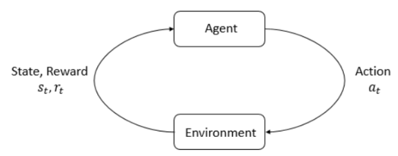
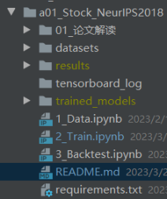

# 1. 安装所需库

- 主要依赖库
    - 策略库：[finRL强化学习库](https://github.com/AI4Finance-Foundation/FinRL)
    - 深度学习库：pytorch
    - 强化学习库：stable-baselines3
    - 以及其它一些辅助的库（详见requirements.txt）

- 安装
    ```shell
    pip install -r requirements.txt
    pip install git+https://github.com/AI4Finance-Foundation/FinRL.git
    ```   

- ElegantRL库安装
    - 是给一个强化学习库，比stable-baselines3更稳定，也可替换尝试这个库
    - 如果windows，且使用ElegantRL库，需要安装Microsoft C++ Build Tools (大约需要2.5G空间)    
      https://visualstudio.microsoft.com/visual-cpp-build-tools/   
      安装Microsoft Build Tools for Visual Studio，
      在 Build Tools 中，安装“使用C++的桌面开发”并确保安装详细信息的两项勾选：MSVC生成工具、windows SDK

# 2. 策略介绍

- 市场：道尔琼斯30支股票

- 策略：
    - 基线：传统策略，投资组合管理-最大化均值方差
    - 深度强化学习算法进行模拟交易，包括：A2C, DDPG, PPO, TD3, SAC
    
- 参考：
    - 策略：https://github.com/AI4Finance-Foundation/FinRL-Tutorials/tree/master/1-Introduction
    - 论文：本样例复现论文
        - Practical Deep Reinforcement Learning Approach for Stock Trading
        - https://arxiv.org/abs/1811.07522


- 相比原始notebook，主要修改：
    - 加入了大量中文的说明
    - 修改了部分无法跑通的bug

- 训练环境：
    - GPU：单卡大约需要15-30时间完成训练
    - CPU：因训练速度过慢，未进行测试

# 3. 使用介绍

1. 获取数据

   - （注意）从YahooDownloader下载美股数据，国内访问可能存在问题，因此可跳过此步骤，直接使用datasets文件夹下的数据
   - 运行 notebook: *1_Data.ipynb*. 会自动下载处理美股道尔琼斯30的OHLCV数据
   - 会生成2个文件：*train.csv*, *trade.csv* （在resources文件夹下提供）

2. 训练强化学习模型
    
    - 运行 notebook: *2_Train.ipynb*. 展示如何在OpenAI gym-style的环境中处理数据，以及训练DRL模型
    - 模型训练，共包含5个深度强化学习算法，A2C, DDPG, PPO, TD3, SAC
    - 生成训练好的强化学习模型.zip文件

3. 回测

    - 运行notebook: *3_Backtest.ipynb*
    - 回测模型，同时对比2个基线：最大化均值方差 和 道尔琼斯指数
    - 对资产变化进行绘图

# 4. 原理

## 4.1 原理介绍



强化学习核心部分包括“机器人”和“环境”。流程大致如下：
- 机器人和环境进行交互，观察到当前的条件，称为“状态”（**state**），并且可以执行“动作”（**action**）
- 机器人执行动作后，会进入一个新的状态，同时，环境给机器人一个反馈，叫奖励（**reward**）
  (通过数字反馈新状态的好坏)
- 之后，机器人和环境不停的重复交互，机器人要尽可能多的获取累计奖励

强化学习是一种方法，让机器人学会提升表现，并达成目标。

## 4.2 实现介绍

使用OpenAI gym的格式构建股票交易的环境。

state-action-reward的含义如下：

- **State s**: 状态空间表示机器人对环境的感知。就像人工交易员分析各种信息和数据。机器人从历史数据
  观察交易价格以及技术指标。通过和环境交互进行学习（一般通过回放历史数据）
  
- **Action a**: 动作空间代码机器人在每个状态可以执行的动作。例如，a ∈ {−1, 0, 1}, −1, 0, 1代表
  卖出、持仓、买入。当处理多支股票时，a ∈{−k, ..., −1, 0, 1, ..., k}, 比如，“买10股AAPL”或者
  “卖出10股AAPL”即10或-10。

- **Reward function r(s, a, s′)**: 奖励用于激励机器人学习一个更好的策略。例如，在状态s下执行动作a
  以改变投资组合值，并到达一个新的状态s', 例如，r(s, a, s′) = v′ − v, v′ 和 v 代表状态分别在s′ 
  和s时的投资组合总市值。
  
- **Market environment**: 道琼斯工业平均指数（DJIA）中30只成分股，包含回测时间段的所有交易数据。

代码中使用了波动率的指标，当波动率大于阈值时，空仓以规避风险。

主要依赖的代码：
- 环境：finrl/meta/env_stock_trading/env_stocktrading.py
- 模型：finrl/agents/stablebaselines3/models.py

# 5. 模型目录结构


# 6. 实验结果

实验策略
- 基线：最大化均值方差
- 深度强化学习策略A2C和SAC

训练环境:
- 单卡GPU进行训练，大约15-30分钟

账户状态：
- 初始化资金：1000000

实验结果：3个策略均实现很高的收益。


回测结果：
```
a2c:
Annual return          0.531267
Cumulative returns     0.761977
Annual volatility      0.207082
Sharpe ratio           2.168219
Calmar ratio           5.108832
Stability              0.913644
Max drawdown          -0.103990
Omega ratio            1.434179
Sortino ratio          3.603966
Skew                        NaN
Kurtosis                    NaN
Tail ratio             1.140148
Daily value at risk   -0.024308

 sac:
Annual return          0.229471
Cumulative returns     0.316038
Annual volatility      0.135545
Sharpe ratio           1.597028
Calmar ratio           2.503250
Stability              0.885632
Max drawdown          -0.091669
Omega ratio            1.300750
Sortino ratio          2.291562
Skew                        NaN
Kurtosis                    NaN
Tail ratio             1.029162
Daily value at risk   -0.016218
```

# 7. 潜在问题及不足

## 7.1 问题
1. 该策略的状态信息用到了收盘价/最高价/最低价，可能看到了未来

   - 参考Issue: https://github.com/AI4Finance-Foundation/FinRL/issues/938
   - 解释：不存在，因为不是机器学习的分类或预测问题，强化学习模型仅仅认为交易发生在收盘的最后一个时间点，
     使用该时刻的信息进行交易。当然，当前策略的这种假设较为简单，仅是一个相对简单的原理演示的策略。更加
     完善的股票环境可以产看FinRL-Meta: https://github.com/AI4Finance-Foundation/FinRL-Meta/tree/master/meta

2. 训练和测试不一致：测试中引入了波动率及阈值
    - 见Issue: https://github.com/AI4Finance-Foundation/FinRL-Tutorials/issues/50
    - 模型无法完全学到风控策略，因为股市崩盘数据很少，因此，需要加入一些人工策略，出现大的波动时，卖出所有股票

3. stable-baselines3的GPU环境下训练，调大batch size也没有加速
   
   - 可能sb3在GPU下优化不佳，可以尝试ElegantRL库

4. pytorch存在远程恶意代码执行风险

   - 使用>= 1.13.1的版本，以规避该漏洞

## 7.2 不足

模拟环境相对简单

1. 模拟环境中没有考虑滑点值
2. 模拟环境没有考虑股票停牌的信息

# 8. 常见问题
## 8.1. 无法复现论文结果
参考：https://github.com/AI4Finance-Foundation/FinRL-Tutorials/issues/43  

- 问题：论文中的结果无法复现，自己训得比网站给的预训练模型性能差很多  
- 原因：由于强化学习不稳定，建议调参，或者多训练几遍

## 8.2. 'numpy.float64' object has no attribute 'values'
读取训练数据，所有股票均混在了一个csv表里，格式如下
```
索引     日期          股票
 0      2009-01-02    苹果
 0      2009-01-02    亚马逊
 1      2009-01-05    苹果
 1      2009-01-05    亚马逊
```

注意：必须保持上述该格式，同样的索引下至少有2个数据，否则会报错，
原因：
  1. 在finrl/meta/env_stock_trading/env_stocktrading.py的
     _initiate_state函数中self.data.close.values.tolist()，
     在404行，要求self.data.close必须是二维数组
  2. 而finrl/meta/env_stock_trading/env_stocktrading.py的
     __init__的64行self.data = self.df.loc[self.day, :]，
     如果索引顺序排，0，1，2。。。，会导致只取到一个行数，一维
     数据传入导致第1点中所述的问题
     （因此，如果只有一支股票时，需要把索引全部改成一样的，当然
     这种情况几乎不存在，也可以暂时忽略）
     
解决方法：
1. 降低numpy版本
2. 把数据改成二维的，即（10，）-->（1，10） （改完是否存在回测不完整性，没有详细验证）
3. 保持最上方所示的数据格式（推荐）

## 8.3. "zipline.assets" not found

问题：  

    anaconda3\lib\site-packages\pyfolio\pos.py:26: UserWarning: Module "zipline.assets" not found; 
    mutltipliers will not be applied to position notionals.
      warnings.warn(
      
原因：

- pyfolio报出的错误，Quantopian's Zipline只支持3.7以下版本，不过zipline不是强制安装，可忽略。
- 参考1：https://github.com/quantopian/pyfolio/issues/654
- 参考2：https://github.com/AI4Finance-Foundation/FinRL/issues/313