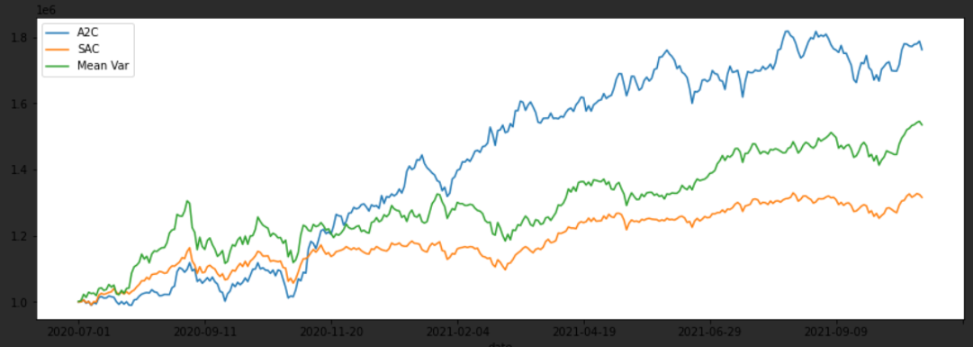

实验策略
- 基线：最大化均值方差
- 深度强化学习策略A2C和SAC

训练环境:
- 单卡GPU进行训练，大约15-30分钟

账户状态：
- 初始化资金：1000000

实验结果：3个策略均实现很高的收益。



回测结果：
```
a2c:
Annual return          0.531267
Cumulative returns     0.761977
Annual volatility      0.207082
Sharpe ratio           2.168219
Calmar ratio           5.108832
Stability              0.913644
Max drawdown          -0.103990
Omega ratio            1.434179
Sortino ratio          3.603966
Skew                        NaN
Kurtosis                    NaN
Tail ratio             1.140148
Daily value at risk   -0.024308

 sac:
Annual return          0.229471
Cumulative returns     0.316038
Annual volatility      0.135545
Sharpe ratio           1.597028
Calmar ratio           2.503250
Stability              0.885632
Max drawdown          -0.091669
Omega ratio            1.300750
Sortino ratio          2.291562
Skew                        NaN
Kurtosis                    NaN
Tail ratio             1.029162
Daily value at risk   -0.016218
```
